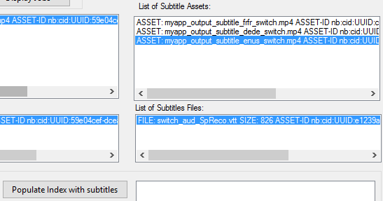

# Enhancing Online Training services with Azure Media Indexer, Cognitive Services and Microsoft Bot Framework

Microsoft teamed up with Mandarine Academy, a Microsoft's partner, delivering Massive Open Online Courses (MOOC).
As their number of customers is growing fast, Mandarine Academy is looking for a solution to :</p>
- automate the generation of multi-languages subtitles</p>
- reduce the time to publish the training courses videos</p>

Moreover, they want to personalize the journey for each user amongst the catalog of Online Training Courses.</p>

The solution relies on :</p>
- [Azure Media Services Indexer](https://docs.microsoft.com/en-us/azure/media-services/media-services-process-content-with-indexer2) : Used to generate the subtitles in the Speech language of the videos </p>
- [Cognitive Services - Text Translator APIs](https://azure.microsoft.com/en-gb/services/cognitive-services/translator-text-api/) : Used to translated the original subtitles in other languages subtitles</p>
- [Azure Search](https://azure.microsoft.com/en-us/services/search/) : Used to index subtitles in different languages</p>
- [Microsoft Bot Framework](https://dev.botframework.com/) : Used to implement Mandarine Academy Bot (called Mike) and supporting Web Chat and Skype connectors </p>
 

 


Mandarine's backend is currently based on:</p>
- Ubuntu virtual Machines running in Azure</p>
- Database: MySQL Server</p>
- Web Server: Apache, PHP, Symfony, Node JS</p>


**Core Team:** </p>
- Florent Petit - CTO, Mandarine Academy</p>
- Alain Damanti - Media Team Laeder, Mandarine Academy</p>
- Rachid Hammaoui - Engineering Team Leader, Mandarine Academy</p>
- Eddy Guerin - Software Engineer, Mandarine Academy</p>
- Fred Le Coquil - Technical Evangelist, Microsoft</p>
- Pierre-Louis Xech - Technical Evangelist, Microsoft</p>
- Benoit Le Pichon - Technical Evangelist, Microsoft</p>

 
 


## Customer profile ##

**Mandarine Academy**

 

 [Mandarine Web Site](https://mandarine.academy/en/)
 
Created in 2008, Mandarine Academy guides companies in their digital transformation. 35 full-time employees are currently working at headquarters in Roubaix, France. From free MOOC services to personalized corporate services, Mandarine Academy provides the best tailored services to train all the employees. The solution is based on a combination of the latest technologies, such as video conferencing, web conferencing, e-learning and machine learning. 
This hackfest is aligned with Mandarine strategic move operated earlier this year (Feb 2017), that led to the creation of a new logo, name, slogan and graphic interface that increased their visibility as a well-established player in the digital change and transformation arena. They also came with a reinforced teaching team, a broader range of solution and an international dimension with the opening of new offices in the United Kingdom, Poland, Canada and the United States. 

 
 
## Problem statement ##

Mandarine Academy has already published several hundred of videos, they would like to add subtitles (SRT, WEBVTT, TTML) for each video.
Azure Media Indexer V2 seems the best approach and easiest approach to generate the subtitles directly from the original video.
Once the native subtitles are available in the native language. it becomes possible  to generate subtitles in different languages by using Cognitive Services Text Translator API,.
Each MOOC Video will support up-to 8 subtitles languages. 
For the first phase of this project, Mandarine use Adaptive Streaming based on third-party platform and player. The MOOC Videos will be MP4 files delivered to the clients through the standard player.
Azure Media Services Streaming End Point won't be used during this phase, the application will only use Azure Media Services SAS Locator to deliver the videos.
As today the generation of subtitles can't be fully automated, after each step, the Mandarine operator needs to check the generated subtitles:
- subtitles generated with Azure Media Services Indexer V2
- subtitles generated with Cognitive Services Text Translator API  
After each step, the Manadarine operator must be able to update manually the subtitles if necessary '

Beyond the enhancement of their video content, Mandarine wants to improve the interactivity of their current Web Site. They want to personalize the journey of each user amongst the catalog of MOOCs. 
For instance, they want to automatically refine the profile of each user.
Their Bot (Project Name called Mike) will ask questions to complete the profile of each user.
The Bot will also send notifications to users for instance when they are about to complete a level of training. 
The Bot will address the subscribers connected to Mandarine Web Site and to Skype. 

 
## Solution and steps ##

### Overall Architecture

As the main objective of this initiative is to enhance the existing Mandarine services, the architecture of this deployment will take into account all the legacy components technologies used by Mandarine services.
For instance, the database server is based on MySQL Server and this server is hosted in Azure's datacenter. These training video files are hosted on a third-party streaming platform.</p>
On the technologies side, the servers are running Ubuntu, the Web Servers are based on Apache/PHP/Symfony. The backend services are developed using Node.js.The Web Servers will be hosted in Azure. 
The client application is actually a Web Application running in any browsers.</p>

Beyond those legacy components, the following Azure Serivces will be deployed:
1. Azure Azure Media Services </p>
2. Azure Cognitive Services Text Translator key</p>
3. Azure Search Services Account </p>
4. Azure Web App </p>
5. Microsoft Bot Framework (Node.js) </p>
6. Azure Virtual Machines running the Ubuntu and Apache/PHP/Symfony/MySQL. </p>

Below the architecture of Manadarine services using Azure:

 


## Technical delivery ##

### Subtitles generation 

#### Installing the backend services in Azure:

In order to generate the subtitles you need to install the Azure backend with all the services associated.
You can either use the [Azure Portal](https://portal.azure.com) to deploy manually all the Azure Services.</p>
or you can use directly this [Azure Resource Manager template](https://github.com/flecoqui/azure/tree/master/azure-quickstart-templates/101-media-search-cognitive) </p>

This template allows you to deploy  a Web App, an Azure Media Services Account, an Azure Search Account and an Azure Text Translator service in the same region as the resource group.
As Azure Media Services, Search Service and Cognitive Services are not deployed in all regions, it is recommended to use the following regions:
West US, West Europe,Southeast Asia,West Central US 
This template is associated with Windows Application which is used to generate automatically video subtitles in different languages fron an orginal video or audio file. Once generated the subtitles are stored in Azure Search to allow the users to find all the videos associated with a specific key word.
This Application called TestAzureMediaIndexer is available there:
[Source code of TestAzureMediaIndexer on github](https://github.com/flecoqui/azure/tree/master/Samples/TestAzureMediaIndexer) 


Using the two Azure CLI command lines below, you can deploy automatically all the Azure Services required for the Mandarine deployment: 

    azure group create testamsseacog northeurope
	azure group deployment create testamsseacog depiperftest -f azuredeploy.json -e azuredeploy.parameters.json -vv


Once the backend services are installed, the storage account where the video files and subtitles files will be stored needs to be manually configured to support CORS (Cross-Origin Resource Sharing) using the Azure portal:

Moreover, the media files will be streamed from SAS locators which returns "Accept-Ranges: bytes" in the http headers. This http header is mandatory to play MP4 video files or MP3 audio files over http with Chrome browser.

#### Testing the backend services with the applicaiton TestAzureMediaIndexer:

This template is associated with Windows Application which is used to generate automatically video subtitles in different languages fron an original video or audio file. Once generated the subtitles are stored in Azure Search to allow the users to find all the videos associated with a specific key word.
This Application called TestAzureMediaIndexer is available there:
[Source code of TestAzureMediaIndexer on github](https://github.com/flecoqui/azure/tree/master/Samples/TestAzureMediaIndexer) 

**Downloading the binary**
The binary associated with the application is available there:
[ZIP file with the Application](https://github.com/flecoqui/azure/master/Samples/TestAzureMediaIndexer/Releases/Latestrelease.zip)

1. You can download the zip file.</p>
2. Unzip the LatestRelease.zip file</p>
3. Run locally TestAzureMediaIndexer.exe</p>

## Using the application TestAzureMediaIndexer
This sample application is a basic Windows Application with one single page:


#### Connect the application to the Azure Backend
In order to use the application you need to provide the following parameters to establish a connection with your backend in Azure:
1. The Azure Media Services Account name</p>
2. The Azure Media Services Account key</p>
3. The Azure Cognitive Services Text Translator key</p>
4. The Azure Search Services Account name</p>
5. The Azure Search Services Account key</p>
6. The url of the Web Player application hosted on the Web site of your backend, the url should be close to this format: http://YourWebAppName.azurewebsites.net/player.html


You can retrieve all the parameters below from the [Azure Portal:](https://portal.azure.com) </p>
1. The Azure Media Services Account name</p>
2. The Azure Media Services Account key</p>
3. The Azure Cognitive Services Text Translator key</p>
4. The Azure Search Services Account name</p>
5. The Azure Search Services Account key</p>
6. The url of the Web Player application hosted on the Web site </p>

Once all the parameters are ready click on the button "Connect" to establish the connection with your backend:


#### Upload the audio and video assets
Once the application is connected, the first step consists in uploading video or audio assets on your backend in Azure.


1. Click on the **Add Asset** button</p>
2. Select the audio file or video file you want to upload</p>


3. Once the file is uploaded, a new asset and a new file is displayed in the lists below:</p>


#### Generate the subtitles from audio and video assets
Once the video or audio file is uploaded, you can generate the subtitles with Azure Media Services Indexer 


1. Select the spoken language of your audio or video file</p>
2. Click on the button **Generate subtitle** </p>


3. A Job to generate the subtitles is launched in Azure after few minutes, the new subtitle file is available.</p>


#### Update the generated subtitles with the Web Application 
Once the subtitle file is available, it's possible to update the subtitle file. The native format is WEBVTT, but it's still possible to convert a WEBVTT subtitle file into a TTML subtitle file.


1. Click on the button **Play Video/Subtitle** or **Play Audio/Subtitle** </p> 
The Windows Application launches the Web Player Application </p>


2. Your default browser on your computer running Windows is displaying a page playing the video or audio file along with the subtitles.</p>


3. As sometimes the generated subtitles file needs to be updated, you can update each subtitle. Click on the **Pause** button.</p>
4. Update the subtitle, click on the button **Save**.</p>


5. When all the subtitles are updated, you can save the subtitle file on your machine in WEBVTT or TTML format.</p>


6. Once the subtitle file is stored locally on your machine, you can update the subtitle file on Azure Storage when clicking on button **Update Subtitle**.</p>


#### Translate the generated subtitles with Cognitive Services Text Translator
Once the first subtitle file associated with your audio or video file are correct, you can generate more subtitle files in different languages.
 


1. Select the source subtitle in the list box **List of Subtitle Assets**.</p>
2. Select the language of your new subtitle file.</p>
3. Click on the button **Translate subtitle** </p>


4. After few seconds the new subtitle file is displayed in the list box **List of Subtitle Assets**</p>


5. If you click on the button **Play Video/subtitle** or **Play Audio/subtitle** , you can playback the new subtitles.</p>


6. Finally, you can download or display the new subtitle file.</p>


#### Using Azure Search to Index the subtitles files associated with the audio and video assets
Once all the subtitles associated with your video or audio files are generated, you can store the subtitles in the Azure Search service.</p>
 


1. First you need to create the Index associated with the subtitles. Click on the button **Create Index** to create the Index. This step is only required once. If you want to clear the Azure Search database you can click on **Delete Index** button.</p>


2. Once the Index is created, select the subtitle file you want to import and click on the button **Populate the Index with subtitles**. You can repeat this step for each subtitle file.</p>



3. Now you can test the Azure Search database, enter a word in the search edit box and click on the button **Search**.</p>


4. If this word is present in any subtitle, the search list box is populated with all the subtitle where this word has been pronounced.</p>
5. Select the subtitle in the list box and click on the button **Play Search**.</p>


6. The Web Player will play the audio or video files along with the subtitles when the word has been pronounced.</p>


### Mandarine Bot

#### Installing the Mandarine backend associated with Mandarine Bot and Mandarine Web Site in Azure:

The current Mandarine Web Site is hosted in Ubuntu virtual machines running Apache/PHP .
The Mandarine Web Site will be extended to:
- support a Web Chat control connected to the Mandarine Bot,
- support a link to add the Mandarine Bot to your Skype contacts.

In order to activate the Mandarine Bot Service, you need first to register your bot on Bot Framework Web Site https://dev.botframework.com/ and then install the Azure Bot backend with all the services associated.
You can either use the Azure Portal to deploy manually all the Azure Services:

[Azure Portal](https://portal.azure.com)
 
or you can use directly the Azure Resource Manager template available there:

[Azure template used to deployed the Bot framework backend](https://github.com/flecoqui/azure/tree/master/azure-quickstart-templates/101-samplebot-webchat)

This template allows you to deploy  Deploy a Web App hosting a sample Bot with Web Chat and Skype channels and a Virtual Machine running Linux (debian, ubuntu, centos, redhat) and an Apache/PHP server with Web Chat control and a link to Skype. All those resources will be deployed in the same region as the resource group.


This template allows you to deploy a simple VM running: </p>
- Debian (version 8): Apache and php with Web chat control and link to Skype,
- Ubuntu (version 16.04): Apache and php with Web chat control and link to Skype, 
- Centos (version 7.2): Apache and php with Web chat control and link to Skype,
- Red Hat (version 7.2): Apache and php with Web chat control and link to Skype.

 You can launch the deployment with the Azure portal clicking on the button below: 

<a href="https://portal.azure.com/#create/Microsoft.Template/uri/https%3A%2F%2Fraw.githubusercontent.com%2Fflecoqui%2Fazure%2Fmaster%2Fazure-quickstart-templates%2F101-samplebot-webchat%2Fazuredeploy.json" target="_blank">
    
</a>


### SDKs ###

The different components used for this deployment are based on the following SDKs:

- [Azure SDK for PHP](https://github.com/Azure/azure-sdk-for-php)
- [Azure Search REST API](https://docs.microsoft.com/fr-fr/rest/api/searchservice/?redirectedfrom=MSDN)
- [Cognitive Services REST Text Translator API](http://docs.microsofttranslator.com/text-translate.html)
- [Bot Builder SDK for Node.js](https://docs.microsoft.com/en-us/bot-framework/nodejs/bot-builder-nodejs-quickstart#install-the-sdk)

### Azure Media Services APIs ###

WEBVTT subtitles:
The Azure Media Services are used to generate WEBVTT subtitles files from input video files (MP4 files) or input audio files (MP3 files).
As the Azure Media Player supports natively the WEBVTT subtitles, this format is used a pivot format for subtitles.

From this format it's possible to generate TTML subtitle file.

- [Check the DisplayVTTSource on github](https://github.com/flecoqui/azure/blob/master/Samples/TestAzureMediaIndexer/AzureWebPlayer/assets/js/loadplayer.js#L458)
- [Check the DisplayTTMLSource on github](https://github.com/flecoqui/azure/blob/master/Samples/TestAzureMediaIndexer/AzureWebPlayer/assets/js/loadplayer.js#L472)


Below an extract of a WEBVTT file:


        WEBVTT
           00:00.100 --> 00:12.020
        I am delighted we could share in the serenity and joy of this beautiful day as we come together to celebrate the commitment of the sort of mind moving your enormous phone you mean enormously awesome Galaxy.
        
        00:13.230 --> 00:15.300
        Search one 


Below an extract of a TTML file: 


        <?xml version="1.0" encoding="utf-8"?>
        <tt xml:lang="en-us" xmlns="http://www.w3.org/ns/ttml" xmlns:tts="http://www.w3.org/ns/ttml#styling" xmlns:ttm="http://www.w3.org/ns/ttml#metadata">
        <head>
        <metadata>
         <ttm:title>switch_aud_SpReco</ttm:title>
         <ttm:copyright>Copyright (c) 2013 Microsoft Corporation.  All rights reserved.</ttm:copyright>
        </metadata>
        <styling>
         <style xml:id="Style1" tts:fontFamily="proportionalSansSerif" tts:fontSize="0.8c" tts:textAlign="center" tts:color="white" />
        </styling>
        <layout>
        <region style="Style1" xml:id="CaptionArea" tts:origin="0c 12.6c" tts:extent="32c 2.4c" tts:backgroundColor="rgba(0,0,0,160)" tts:displayAlign="center" tts:padding="0.3c 0.5c" />
        </layout>
        </head>
        <body region="CaptionArea">
        <div>
         <p begin="00:00:00.100" end="00:00:12.020">I am delighted we could share in the serenity and joy of this beautiful day as we come together to celebrate the commitment of the sort of mind moving your enormous phone you mean enormously awesome Galaxy.</p>
         <p begin="00:00:13.230" end="00:00:15.300">Search one </p>
	     .
	     .
	     .
        </div>
        </body>
        </tt>


Once generated the subtitles file and the input video/audio file are stored on a SAS (Shared Access Signature) locator in the Azure Storage Account associated with the Azure Media Services Account.
As Mandarine's deployment doesn't require Adaptive Streaming, it's not necessary to use the Azure Media Services Streaming End Point.
In order to play correctly a MP4 video file or MP3 audio file over http with a Web Application running in Chrome, the server hosting the MP4 file needs to return the http header "Accept-Ranges: bytes".
It's the case if you store your MP4 files or MP3 files in a SAS locator.

If necessary the WEBVTT subtitle file will be updated on store in the same SAS locator.

- [Check the WEBVTT Web Player/Editor on github](https://github.com/flecoqui/azure/tree/master/Samples/TestAzureMediaIndexer/AzureWebPlayer)


### Cognitive Services APIs ###

The component which translates the subtitle in different languages relies on Cognitive Services Text Translator	API:

The request uri is 	https://api.microsofttranslator.com/V2/Http.svc/Translate 

Information about the method here:

http://docs.microsofttranslator.com/text-translate.html#!/default/get_Translate 


As the size of the input text must not exceed 10000 characters, the subtitles are translated one by one.
Once the input WEBVTT file has been parsed, each subtitle is transmitted to the Cognitive Service as an input text.

Below a sample code in C# which calls the Translator service for each subtitle:


        async Task<string> GetTranslatedWEBVTT(string uri, string inputLanguage, string outputLanguage)
        {
            string translatedContent = string.Empty;
            if (!string.IsNullOrEmpty(uri) && !string.IsNullOrEmpty(inputLanguage) && !string.IsNullOrEmpty(outputLanguage))
            {
                string content = await GetContent(uri);
                if (!string.IsNullOrEmpty(content))
                {
                    TextBoxLogWriteLine("Original Subtitles downloaded");
                    List<SubtitleItem> SubtitleList = ParseWEBVTT(content);
                    if (SubtitleList.Count > 0)
                    {
                        TextBoxLogWriteLine("Original Subtitles parsed");
                        translatedContent += "\xFEFF";
                        translatedContent += "WEBVTT\r\n";
                        SubtitleItem newItem = new SubtitleItem("", "", "");
                        bool bError = false;
                        foreach (SubtitleItem item in SubtitleList)
                        {
                            newItem.startTime = item.startTime;
                            newItem.endTime = item.endTime;
                            if (!string.IsNullOrEmpty(item.subtitle))
                            {
                                newItem.subtitle = await _ttc.Translate(item.subtitle, inputLanguage, outputLanguage);
                                if (!string.IsNullOrEmpty(newItem.subtitle))
                                {
                                    translatedContent += newItem.ToString();
                                }
                                else
                                {
                                    bError = true;
                                    break;
                                }
                            }
                        }
                        if (bError == true)
                            TextBoxLogWriteLine("Error while translating subtitles at " + newItem.startTime);
                        else
                            TextBoxLogWriteLine("Translating subtitles done:" + translatedContent);
                    }
                }
                else
                    TextBoxLogWriteLine("Error while downloading subtitles: subtitle string empty");
            }
            return translatedContent;
        }


The same source code is available there on  github:

https://github.com/flecoqui/azure/blob/master/Samples/TestAzureMediaIndexer/TestAzureMediaIndexer/Subtitle.cs#L205 

### Azure Storage and SAS locator ###

As mentioned before, the media files (audio, video and subtitle file) are streamed from SAS locators which returns "Accept-Ranges: bytes" in the http headers. 
This http header is mandatory to play MP4 video files or MP3 audio files over http with Chrome browser.

The SAS locators are created using the Azure Media Services SDK for a period of time.

        try
        {
            tempLocator = _context.Locators.Create(LocatorType.Sas, asset, AccessPermissions.Read, TimeSpan.FromHours(DurationinHours));
            tempAsset = asset;
        }
        catch (Exception ex)
        {
            TextBoxLogWriteLine(string.Format("Exception when creating a SAS Locator for asset Id: '{0}' Exception: {1} ", asset.Id, ex.Message), true);
            tempAsset = null;
        }


As so far the application will only play MP4, MP3 and subtitle files (WEBVTT), it's not necessary to activate the Azure Media Services Streaming End Point, the files will be streamed directly from the SAS locator which improve the business model associated with the application.


### Azure Search APIs ###

Once the subtitles are translated in the different languages, it's valuable to use Azure Search to index all the subtitles files in the different languages.

The following fields have been indexed:

1. The name of the input video or audio file
2. The url of the input video or audio file in the SAS locator
3. A flag which indicates whether the content is an audio file in order to use the audio player instead of Azure Media Player
4. The url of the subtitle file in the SAS locator
5. The language of the subtitle File
6. The start time of the Subtitle
7. The end time of the Subtitle
8. The subtitle

Sample source code below in C#:


        var definition = new Microsoft.Azure.Search.Models.Index()
        {
             Name = "media",
             Fields = new[]
             {
               new Microsoft.Azure.Search.Models.Field("keyId", Microsoft.Azure.Search.Models.DataType.String)                       {   IsKey = true  },
               new Microsoft.Azure.Search.Models.Field("mediaId", Microsoft.Azure.Search.Models.DataType.String)                       {   IsFilterable = true,  IsSortable = true  },
               new Microsoft.Azure.Search.Models.Field("mediaName", Microsoft.Azure.Search.Models.DataType.String)                     { IsFilterable = true,  IsSortable = true },
               new Microsoft.Azure.Search.Models.Field("mediaUrl", Microsoft.Azure.Search.Models.DataType.String)                       { IsFilterable = true},
               new Microsoft.Azure.Search.Models.Field("isAudio", Microsoft.Azure.Search.Models.DataType.Boolean)                       {IsFilterable = true},
               new Microsoft.Azure.Search.Models.Field("subtitleUrl", Microsoft.Azure.Search.Models.DataType.String)                       { IsFilterable = true},
               new Microsoft.Azure.Search.Models.Field("subtitleLanguage", Microsoft.Azure.Search.Models.DataType.String)                   { IsFilterable = true},
               new Microsoft.Azure.Search.Models.Field("subtitleStartTime", Microsoft.Azure.Search.Models.DataType.String)                   { IsSortable = true},
               new Microsoft.Azure.Search.Models.Field("subtitleEndTime", Microsoft.Azure.Search.Models.DataType.String)                   { IsSortable = true},
               new Microsoft.Azure.Search.Models.Field("subtitleContent", Microsoft.Azure.Search.Models.DataType.String)                   { IsSearchable = true}
              }
        };

        try
        {
             var response = _searchContext.Indexes.CreateWithHttpMessagesAsync(definition);
             if (response != null)
             {
                  response.Wait();
                  if ((response.Result != null) && (response.Result.Response != null))
                  {
                      if (response.Result.Response.StatusCode == System.Net.HttpStatusCode.Created)
                      {
                         _indexClient = _searchContext.Indexes.GetClient("media");
                         result = true;
                      }
                  }
             }
        }
        catch (Exception ex)
        {
            TextBoxLogWriteLine("Exception while creating Azure Search Index: " + ex.Message + " " + ex.InnerException.Message, true);
        }


With Azure Search the application offers the following use case to the operator:
The operator search for a specific in the subtitle database, the service will return all the subtitles where this word has been pronounced.
The information returned by the service:
1. The url of the input video or audio file in the SAS locator
2. The url of the subtitle file in the SAS locator
3. The start time of the Subtitle
allow the operator to play the video or audio file at the timestamp when the word has been pronounced.


### Microsoft Bot Framework ###

The [script](https://github.com/flecoqui/azure/blob/master/azure-quickstart-templates/101-samplebot-webchat/install-software.sh) used to install and configure the Virtual Machine running Apache/PHP server is called from the Azure Resource Manager Template.
This script is called with 3 parameters:
- the first parameter is the machine hostname
- the second parameter is the Web Chat secret key associated with the bot.
- the third parameter is the App ID associated with the bot.

```
    # Parameter 2 Bot WebChat Secret 
    webchat_secret=$2
    webchat_url=https://webchat.botframework.com/embed/mynewsamplebot?s=$webchat_secret
    # Parameter 3 Bot Application ID 
    skype_appid=$3
    skype_url=https://join.skype.com/bot/$skype_appid
```

The second parameter the Web Chat secret key is used to embed the Web Chat control in the PHP page.
The third parameter the App ID is used to embed the link to the Skype page to add the bot to your Skype contats.


```
    <p>This is the home page of a VM running on Azure</p>
    <p>Below the WebChat page for the Bot: </p>
	<iframe src="$webchat_url"></iframe>
    <p></p>
    <p></p>
    <p></p>
    <p>Below the link to add the Bot to your Skype contacts: </p>
	<a href="$skype_url">
	
	</a>
```

### Learnings from the Mandarine's team  

Florent Petit Mandarine's CTO: *With Azure Media Services and Cognitive Services Text Translator API, we decreased dramatically the time to publish our online training courses for our customers!*  


## Conclusion ##

The main objective of this project was to automate the generation of subtitles associated with training courses videos in order to:
- increase the reach of Mandarine's services (up-to 8 subtitle languages per video)
- improve the time to publish the videos 

Beyond those legacy components, the architecture of this deployment is based on the following Azure's components:
1. Azure Azure Media Services </p>
2. Azure Cognitive Services Text Translator key</p>
3. Azure Search Services Account </p>
4. Azure Web App </p>
5. Microsoft Bot Framework (Node.js) </p>
6. Azure Virtual Machines running the Ubuntu and Apache/PHP/Symfony/MySQL. </p>


**Measurable impact/benefits resulting from the implementation of the solution:**</p>
With Azure Media Services Indexer V2 and Cognitive Services Text Translator the generation of subtitles has been almost automated, which has decreased dramatically the time to publish the videos.
Thanks to the usage of ARM template, the Mandarine IT team can redeploy the Backend Services in few minutes.

**General lessons:**</p>
Azure was flexible enough to interoperate with legacy services (existing on premises database, third party video streamer)
As the Azure Media Player doesn't support playback of audio files (MP3, WMA), the solution supports not only subtitles with Video files (MP4, WMV) but also with Audio files (MP3, WMA) using the [Web Player](https://github.com/flecoqui/azure/tree/master/Samples/TestAzureMediaIndexer)  
Regarding Mike the Mandarine's Bot, it's too early to get any insights as the service will be online by the end of June.


**Opportunities going forward**</p>
This project was the first step of the enhancement of Mandarine services. 
Below a list of services which could improve Mandarine's services:
1. The Mandarine's Web Site could be extended to propose to each user the most appropriate MOOC based on his journey on the Web Site. A recommendation service based on Azure Machine Learning could improve the user experience.</p>
2. During Live events, Mandarine would like to enhance their Live MOOC videos with live subtitles as well. The support of this feature will require the developpment of a specific component based on Azure Media Services.</p>
3. Following the Build 2107 announcement and the support of Skype for Business connector with Microsoft Bot Framework, Mandarine's services could address all the users using Skype For Business.


## Additional resources ##
Below a list of links to resources used by the team:
- Azure Media Services Explorer:</p>
https://github.com/Azure/Azure-Media-Services-Explorer </p>
- Azure ARM template to deploy Azure Media Services, Cognitive Services - Translator Text API, Azure Search: </p>
https://github.com/flecoqui/azure/tree/master/azure-quickstart-templates/101-media-search-cognitive </p>
- Sample Application to generate automatically subtitles files in several languages from an original video or audio file using Azure Services:</p>
https://github.com/flecoqui/azure/tree/master/Samples/TestAzureMediaIndexer </p>
- Speech-To-Text UWP Sample Application:</p>
https://github.com/flecoqui/Windows10/tree/master/Samples/SpeechToTextUWPSampleApp </p>
- Text Translator UWP Sample Application:</p>
https://github.com/flecoqui/Windows10/tree/master/Samples/TranslatorTextUWPSampleApp </p>
- Speech-To-Text Javascript Sample Application:</p>
https://github.com/davrous/BingSpeech </p>
- PHP Text Translation Sample </p>
https://github.com/MicrosoftTranslator/HTTP-Code-Samples </p>