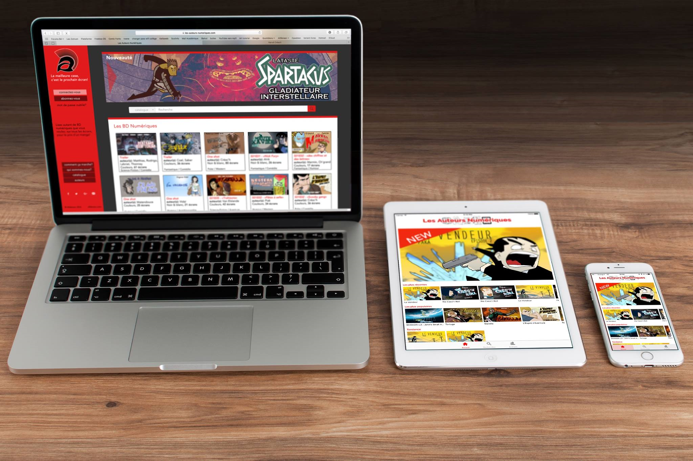
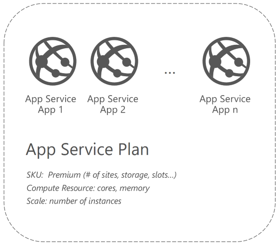
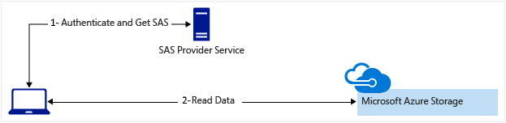
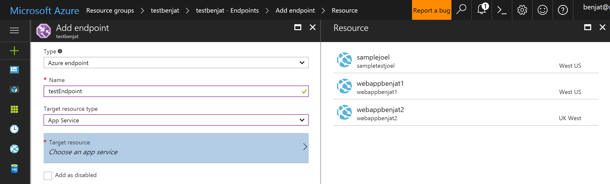
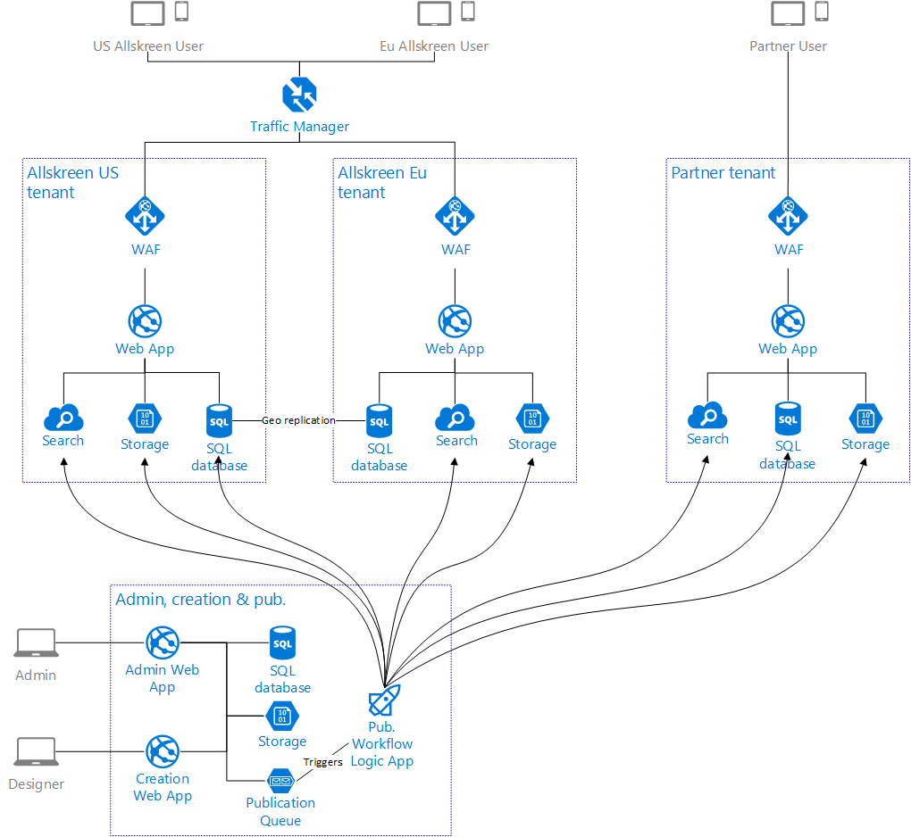

# Building a global and secure cloud architecture for the comics creation and distribution platform Allskreen #

[Allskreen](https://allskreen.fr/) is a French startup founded in 2016 to tackle some challenges in the digitalization of the Comics industry. Member of Euratech, one of the French biggest startups accelerators and partner of the [BizSpark Plus](https://bizspark.microsoft.com/about/plus) program, they have jumped at the opportunity to partner with Microsoft and found the help needed to get to the next level.

In order to work closely with Microsoft experts, to discover the latest technologies available that best suited their project and to accelerate the conception of their platform on Microsoft Azure, Microsoft and Allskreen have organized a three-days hackfest.

From Azure App Service to host PHP based applications to Azure Traffic Manager with some pieces of Azure Logic Apps to build business workflows, we're going to see how Microsoft Azure services has been used in this Open Source Software world.

Hackfest, a  Participants List:

- Frédéric Detez de la Dreve, CEO, Allskreen
- Cédric Derue, Architect, Altran, Microsoft Most Valuable Professional - [@cderue](https://twitter.com/cderue)
- Julien Corioland, Technical Evangelist, Microsoft France - [@jcorioland](https://twitter.com/jcorioland)
- Benjamin Talmard, CTO in Residence Microsoft Accelerator Paris, Microsoft France - [@benjiiim](https://twitter.com/benjiiim)
- Joel Amoussou, Technical Evangelist Intern, Microsoft France

## Customer profile ##

Design for all screens, ensure the secure distribution of digital comics and analyze the reading behaviors are some of the new challenges in the comics industry. [Allskreen](https://allskreen.fr/) has been created to bring solutions to these challenges by providing tools and services for content creators:
- Work with a content designer to structure and adapt the comic's content with digital consumption in mind.
- Provide a worldwide, robust and secure distribution platform, designed to work on all type of devices, from smartphones to TVs
- Give deep insight about the reading behaviors to create an improvement loop.
- Enable new business models such as subscriptions or trials.
- Thanks to their high-performance graphism system and deisgn tools, they can either create original content or adapt existing comics.



In addition to digital comics, Allskreen also offers content for promotional support and business brochures.

To distribute the content, Allskreen is building its own platform on a dedicated website [Les Auteurs Numériques](https://les-auteurs-numeriques.com) and its corresponding mobile applications: [LesAutNum on iPhone and iPad](https://itunes.apple.com/fr/app/lesautnum-lite/id1164044010) and [LesAutNum on Android](https://play.google.com/store/apps/details?id=com.lesauteursnumeriques.lanlite). A Windows version with support from the phone to the Xbox including tablets will come later.
They are also able to build dedicated white label platforms for the professionals who want to build a custom and branded experience for their users.

## Problem statement ##

To answer its business objectives, Allskreen has to keep in mind the following constraints when building their platform:
- Performance, to provide a great experience for users all around the world, even from a mobile device with a limited connection.
- Security, to be sure that the content is consumed by authorized users, especially when the content is not free.
- Manageability, to be able to manage the platform without having to hire infrastructure engineers.

Last but not least, based on the developers' skillset, the team has chosen to develop the backend services with plain PHP (no framework) and is expecting a great compatibility between this Open Source PHP ecosystem and their Cloud provider.

## Solution, steps, and delivery ##

To achieve these objectives, the team has decided to work on several subjects during the hackfest:
- Using Azure App Service to host the multiple web applications written in PHP
- Store the assets in Azure Storage and contribute to the Microsoft Azure Storage SDK for PHP to be able to generate Shared Access Signatures
- Design a global architecture to be able to meet the performance goals
- Create a publication workflow to automate and orchestrate the tasks needed to publish a new asset to the platform

Let's explain each part of the solution in more details.

### Using Azure App Service to host the multiple services of the application ###

The solution is composed of 3 main services or sub-applications:
- The public facing web application, used by end-customers to subscribe to the service or to browse the comics' catalog.
- The creation web application, designed for the content creators (publishing of new comics, reporting, pricing, ...).
- The admin web application, for Allskreen's team to handle administrative tasks.

To host these applications, the choice has been made to use Azure App Service, in order to work with a Platform-as-a-Service service, and not have to manage complex infrastructure tasks. With Azure App Service, resiliency, scalability, performance, security and so on are managed by Azure and the developers can focus on what matters for them: the code.

Furthermore, Azure App Service has a notion of App (Web App, Mobile App and API App) which represents the logical boundaries of an application and the notion of App Service plan, which represents the collection of physical resources used to host apps (the virtual machines).  
One advantage of this model is that you can run multiple apps in one plan, in order to share the resources defined by it allowing you to save cost.



During the hackfest, Azure App Service on Linux, the flavor of App Service designed to enable customers to run their web apps natively on a Linux platform, was still in Preview and was not yet ready to host applications in production.  
When it is going to be released with a production SLA and official support, the team will evaluate the opportunity to migrate, as the value proposition for PHP developers resonated well with them.

### Improving the Microsoft Azure Storage Library for PHP to handle security requirements ###

Azure Storage and the Blob Storage feature was the natural solution to store the comics' files and to distribute them to users.  
However, this has to be done with security in mind, as an user has to prove she or he is allowed to access a file before having Azure Storage serves it (Does a user has got a valid subscription for example).  
That is exactly why the shared access signatures (SAS) feature is available in Azure Storage: provide a way to grant limited access to objects in a storage account to other clients, without exposing the account key.

To implement this mechanism, the PHP application must be able to verify the user identity before generating a temporary SAS for the client. The PHP application is becoming the SAS Provider Service. The client (internet browser or mobile application) will then be able to use the SAS to access the file in Azure Storage.



As the application is written in PHP, the use of the [Microsoft Azure Storage Library for PHP](https://github.com/Azure/azure-storage-php) was the best way to interact with Azure Storage. However, generating shared access signatures was not yet implemented in the library.  
To go forward, the team had two choices:
- Generate SAS in the PHP application by using the Azure Storage REST API directly
- Contribute to the open source library to implement the feature and allow other users to use it.

To unblock the situation and being able to work on other topics, the team decided to go for the first choice  and used the Storage REST API from PHP to be able to generate the shared access signature.

Here is an example of code that allows to do that:

```php
<?php

/**
 * Generates a shared access signature for Microsoft Azure storage
 * cf. https://docs.microsoft.com/en-us/rest/api/storageservices/fileservices/constructing-an-account-sas 
 *
 * @param (accountName) The name of the Microsoft Azure storage account
 * @param (storageKey) The access key of the Microsoft Azure storage account
 * @param (signedPermissions) Required. Specifies the signed permissions for the account SAS
 * @param (signedService) Required. Specifies the signed services accessible with the account SAS
 * @param (signedResourceType) Required. Specifies the signed resource types that are accessible with the account SAS.
 * @param (signedStart) Optional. The time at which the SAS becomes valid, in an ISO 8601 format. 
 * @param (signedExpiry) Required. The time at which the shared access signature becomes invalid, in an ISO 8601 format.
 * @param (signedIP) Optional. Specifies an IP address or a range of IP addresses from which to accept requests.
 * @param (signedProtocol) Optional. Specifies the protocol permitted for a request made with the account SAS.
 * @param (signedVersion) Required. Specifies the signed storage service version to use to authenticate requests made with this account SAS
 * @return The shared access signature encoded as base64
 */

function generateSharedAccessSignature($accountName, 
    $storageKey, 
    $signedPermissions, 
    $signedService, 
    $signedResourceType, 
    $signedStart, 
    $signedExpiry, 
    $signedIP, 
    $signedProtocol, 
    $signedVersion){

    if(empty($accountName)){
        trigger_error("The account name is required.");
        return;
    }

    if(empty($storageKey)){
        trigger_error("The account key is required.");
        return;
    }

    if(empty($signedPermissions)){
        trigger_error("The permissions are required.");
        return;
    }

    if(empty($signedService)){
        trigger_error("The services are required.");
        return;
    }

    if(empty($signedResourceType)){
        trigger_error("The resource types are required.");
        return;
    }

    if(empty($signedExpiry)){
        trigger_error("The expiration time is required.");
        return;
    }

    if(empty($signedVersion)){
        trigger_error("The service version is required.");
        return;
    }

    // generate the string to sign
    $_toSign = urldecode($accountName) . "\n" . 
            urldecode($signedPermissions) . "\n" . 
            urldecode($signedService) . "\n" . 
            urldecode($signedResourceType) . "\n" . 
            urldecode($signedStart) . "\n" .
            urldecode($signedExpiry) . "\n" .
            urldecode($signedIP) . "\n" .
            urldecode($signedProtocol) . "\n" .
            urldecode($signedVersion) . "\n";

    // sign the string using hmac sha256 and get a base64 encoded version_compare
    $_signature = base64_encode(hash_hmac("sha256", utf8_encode($_toSign), base64_decode($storageKey), true));

    return $_signature;
}

function getBlobUrlWithSharedAccessSignature($blobUri,
    $signedVersion,
    $signedService,
    $signedResourceType,
    $signedPermissions,
    $signedStart,
    $signedExpiry,
    $signedIP,
    $signedProtocol,
    $signature) {

    /* Create the signed query part */
    $_urlParts = array();
    $_urlParts[] = "sv=" . $signedVersion;
    $_urlParts[] = "ss=" . $signedService;
    $_urlParts[] = "srt=" . $signedResourceType;
    $_urlParts[] = "sp=" . $signedPermissions;
    $_urlParts[] = "st=" . $signedStart;
    $_urlParts[] = "se=" . $signedExpiry;
    $_urlParts[] = "spr=" . $signedProtocol;
    $_urlParts[] = "sig=" . urlencode($signature);

    $_blobUrlWithSAS = $blobUri . "?" . implode("&", $_urlParts);

    return $_blobUrlWithSAS;
}

$_storageKey = "STORAGE_ACCOUNT_KEY";
$_accountName = "STORAGE_ACCOUNT_NAME";
$_signedPermissions = "r";
$_signedService = "b";
$_signedResourceType = "o";
$_signedStart = "2017-02-23T00:00:00Z";
$_signedExpiry = "2017-03-05T00:00:00Z";
$_signedIP = "";
$_signedProtocol = "https";
$_signedVersion = "2015-12-11";

// generate the signature
$_signature = generateSharedAccessSignature($_accountName, 
    $_storageKey, 
    $_signedPermissions, 
    $_signedService, 
    $_signedResourceType, 
    $_signedStart, 
    $_signedExpiry, 
    $_signedIP, 
    $_signedProtocol, 
    $_signedVersion);

echo "SIGNATURE = " . $_signature;
echo "<br /><br />";

$_blobUrl = getBlobUrlWithSharedAccessSignature("https://STORAGE_ACCOUNT.blob.core.windows.net/CONTAINER/BLOB",
    $_signedVersion,
    $_signedService,
    $_signedResourceType,
    $_signedPermissions,
    $_signedStart,
    $_signedExpiry,
    $_signedIP,
    $_signedProtocol,
    $_signature);

echo "BLOB URL = " . $_blobUrl;
echo "<br /><br />";

?>
```

As the code was written, it became obvious that it would be valuable for other PHP developers in the world. That's why the team chose to spend the time needed to contribute to the Open Source Azure Storage Library for PHP to include this feature.  
The collaboration with the developers maintaining the library has been really useful to set the bar high enough by respecting the code guidelines and the requirements. After a few days of work, the [Pull Request](https://github.com/azure/azure-storage-php/pull/68) has been merged and generating a shared access signature with the SDK is now as simple as that:

```php
// create a shared access signature helper instance with storage account name and key
$sasHelper = new SharedAccessSignatureHelper($accountName, $accountKey); 

$actualSignature = $sasHelper->generateAccountSharedAccessSignatureToken(
                                  $signedVersion,
                                  $signedPermissions,
                                  $signedService,
                                  $signedResourceType,
                                  $signedExpiracy,
                                  $signedStart,
                                  $signedIP,
                                  $signedProtocol
                              );

```

### Architecture the solution for global usage ###

In order to provide the best performance for all their users globally (with Europe and the US in priority), the team has chosen to deploy their application in 2 Azure regions (examples: West Europe and West US), in 2 different Azure geographies (Americas and Europe).  
Being able to use the same technologies and services to deploy the same application in 2 different continents is a great differentiator of Azure versus on premise technologies or traditional hosting providers. However, the right mechanisms have to be used in order to make that option a reality, especially in two domains: traffic management and data synchronization.

When a customer is using the solution (through the public facing application or through one of the mobile applications), the system has to detect which deployment will give the best performance, based on the customer location and the expected latency from this location.  
This behavior is one of those supported on Azure Traffic Manager, a global service using Domain Name System (DNS) to direct requests to the most appropriate endpoint, based on some traffic-routing methods. The "Performance" traffic routing method is the one which choose the "closest" endpoint in terms of the lowest expected network latency.  
Thanks to this mechanism, a customer using the application in the US will be redirected to the deployment in the US and a customer using the application in France will be redirected to the deployment in Europe.

Moreover, Azure Traffic Manager is deeply integrated with Azure App Service and configuring Traffic Manager with an App Service endpoint is as simple as choosing a service in a list:



With this kind of architecture, the main challenge is to be sure that the data is synchronized on all the deployments. Even if this must not to be real time, a user in the US has to be able to browse the same catalog than in Europe.  
Some of the services used by Allskreen have built-in features for that, such as Azure SQL Database with its active geo-replication feature. It enables the configuration of up to four readable secondary databases in the same or different Azure regions. For Allskreen, a readable copy is enough as the majority of the SQL transactions are read-only.  
Other services don't have this kind of features (Azure Storage, Azure Search, ...) and you have to develop your own synchronization mechanisms. That's one of the purpose of the publication workflow we're going to describe in the next section. 

### Create a publication workflow ###

Before being available for an end-user in one of the public applications (Les Auteurs Numériques or one of the white-label platform), the designer has to trigger the publication of a comic in the creation web application.  
The publication consists of several technical and functional steps:
- Insert in the platforms' databases the information regarding the comic (author, description, price, ...)
- Copy the asset itself in every Azure Storage accounts needed
- Index the new comic in the search system (Azure Search)
- Send an email to subscribers to announce the publication of a new comic
- Publish a tweet in the right Twitter accounts
- ...

Instead of implementing these steps with code, it has been decided to use Azure Logic Apps, a fully managed iPaaS (integration Platform as a Service) providing a way to implement scalable workflows in the cloud.  
A Logic App workflow can be built using easy to understand design tools, built-in workflow concepts (conditional logic, loops, triggers, ...) and some of the many connectors available in the platform. These connectors connect your workflow with on-premises systems, other Azure services (Azure Functions, Azure SQL Database, Azure DocumentDB, ...) or popular Cloud services (Twitter, Salesforce, SendGrid, ...).  
Most of the steps needed for Allskreen to publish a new comic were available as connectors. For the others, the PHP code needed to implement the solution has been published as Azure Functions.



## Conclusion ##

Performance, security, manageability, and compatibility with the technologies they chose to use were the main Allskreen's requirements when choosing Microsoft Azure.  
Thanks to the features chosen and the architecture designed during the hackfest, the team has been able to meet all of them. 

Nowadays, an application architecture is never done. It evolves constantly, as new features are needed, as scale goals change or as technologies evolve. On the Azure side, two new features might help Allskreen in the future: Azure App Service on Linux, which is currently in Preview, and the upcoming fully managed MySQL service. These two services are going to bring a more native experience for the PHP developers and will be another proof that Microsoft Azure is the cloud of choice for Open Source technologies.

Working with Allskreen's team during a few days to design and implement this architecture was key for them. In their own words: "Thanks to the hackfest, we were able to discover and directly implement the latest azure features which saved us several weeks in development."


## Additional resources ##

You will find below some pointers to additional resources that will help you to deeply understand the concepts and technologies we discussed in this article:

- [Azure App Service on Linux](https://docs.microsoft.com/en-us/azure/app-service-web/app-service-linux-intro)
- [Azure regions](https://azure.microsoft.com/en-us/regions/)
- [Microsoft Azure Storage Library for PHP](https://github.com/Azure/azure-storage-php)
- [Configure the performance traffic routing method in Azure Traffic Manager](https://docs.microsoft.com/en-us/azure/traffic-manager/traffic-manager-configure-performance-routing-method)
- [Azure SQL Database replication](https://docs.microsoft.com/en-us/azure/sql-database/sql-database-geo-replication-overview)
- [Custom code for logic apps through Azure Functions](https://docs.microsoft.com/en-us/azure/logic-apps/logic-apps-azure-functions)