# Using Power BI Embedded, AVANTI-Technologies has migrated theis Telerik reports to Power BI Embedded.

**AVANTI-Technologies** is a French company founded in 1999 and specialized in the events sector.  
One of their product, **AgoraEvent**, is an online platform designed to create and manage any type of event, allowing their customers to create an highly customizable website for their events.  
This product is built using Microsoft **ASP.NET 4.5 Web Forms** and **Telerik UI framework**.   
Microsoft partenered with Avanti Technologies during a hackfest to create a new system of visualization, replacing **Telerik UI framework** with **Power BI Embedded**.

Here is the list of the hackfest participants :  
**Core team:**
- Sébastien Pertus ([http://www.twitter.com/sebastienpertus](@sebastienpertus) – Technical Evangelist, Microsoft.
- Franck Mercier ([http://www.twitter.com/FranmerMS](@FranmerMS)) – Technical Evangelist, Microsoft.  
- Farid Tazi – .NET Engineer, AVANTI-Technologies.
 
## Customer profile ##

The main mission of **AVANTI-Technologies** is to better understand the organizational processes of companies in order to provide them with event management solutions matching their needs.

AVANTI-Technologies in numbers :
- Created in 1999, 18 years of experience
- Over 250 references around the world
- More than 1 million euro of turnover in 2016

### Products
**AVANTI-Technologies** created several softwares to help our customers in their activity. **AgoraEvent** will be the first software of **AVANTI-Technologies** using **Power BI Embedded** by Microsoft.

**AgoraEvent** ([http://www.agoraevent.fr](http://www.agoraevent.fr)) is a highly customizable online platform for managing and organizing events. This product is in constant evolution with the regular addition of new functionalities. It is made for all event organizers, whether they are event agencies, communication agencies, large companies or small businesses...


**AgoraEvent** will allow or customers to: manage registration to their events, create a web portal, gather customized information during registration process, do mailing campaign etc…

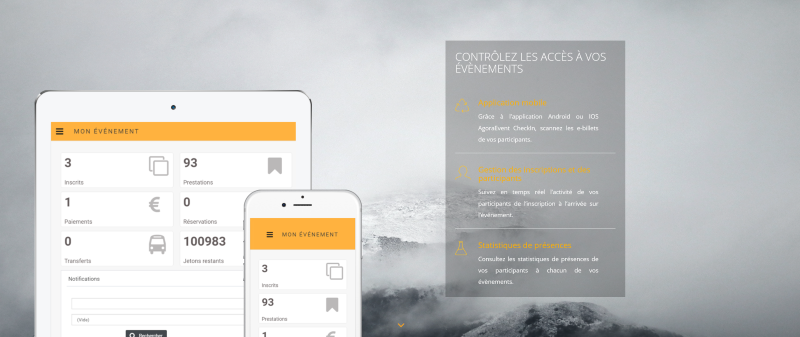

 
## Problem statement ##

As an events management platform, **AgoraEvent** must provide to their customers some advanced statistics related to their events.  
Current statistic reports are made using **Telerik UI** controls and provide basic interactions between data with the ability to export some of them.  
However, building these reports is an **expensive time-consuming task** and **AVANTI-Technologies** rapidly reached the limits of the controls framework they used. 
With the increasing demand of different and dynamic reports, **AVANTI-Technologies** faced a technical and a time optimization problem.  
 
## Solution, steps, and delivery ##

### Introduction

**AgoraEvent** uses an **Azure SQL Database**. Thus, implementing **Power BI** was easy and intuitive.  
This **Azure SQL Database** contains all the informations needed to create rich and dynamic reports.  
The main goal was to first convert all of the existing web reports to **Power BI** reports to be able, later, to improve them, make them more detailed and user friendly.  

Here is an architecture diagram, describing how the solution is built :  
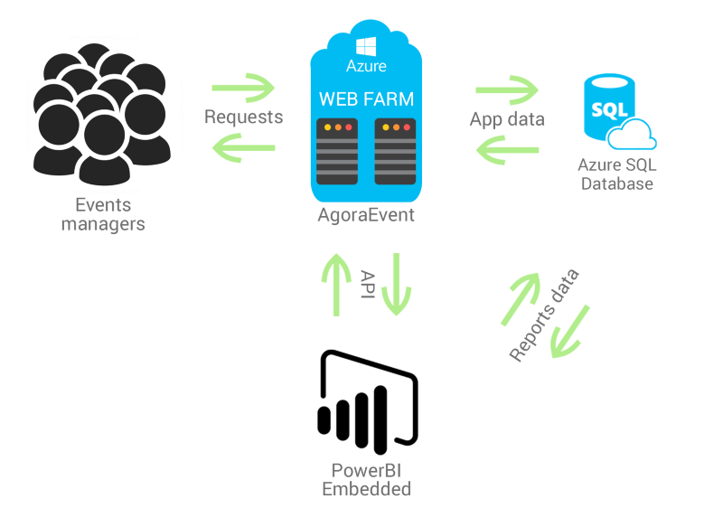


For this particular case, we decided to convert two of their reports :  

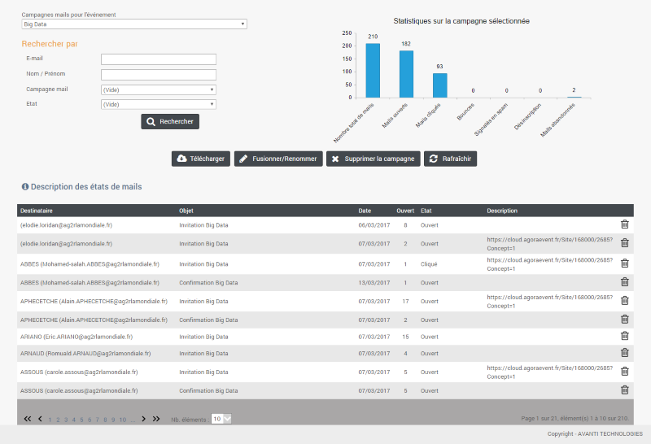  
_Mail campaign report_

  
_Stats regarding participants and selling_

### Creating the Power BI reports

We started implementing this solution by creating new reports in **Power BI Desktop**.  
As our use case required it, we connected to **AgoraEvent Azure SQL Database** using the **DirectQuery** mode and started picking the necessary tables and fields from our database.  

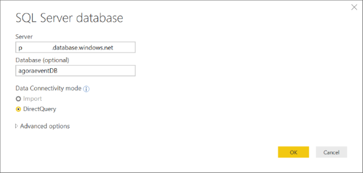  
_Connecting to SQL Azure Databse using the DirectQuery mode_

Unfortunately, we face a pretty common error, due to the Azure **Firewall rules**.  

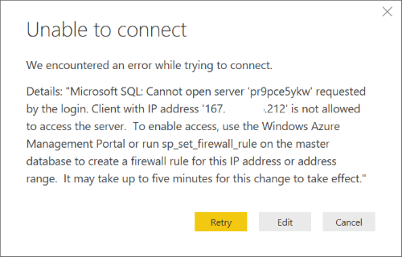  
_Error prompted by Power BI Desktop due to connection issue_

As the frontend using the **SQL Azure Database** is hosted by **App Services**, we had to :

- Allow access to Azure services.
- Open Firewall for local developers.

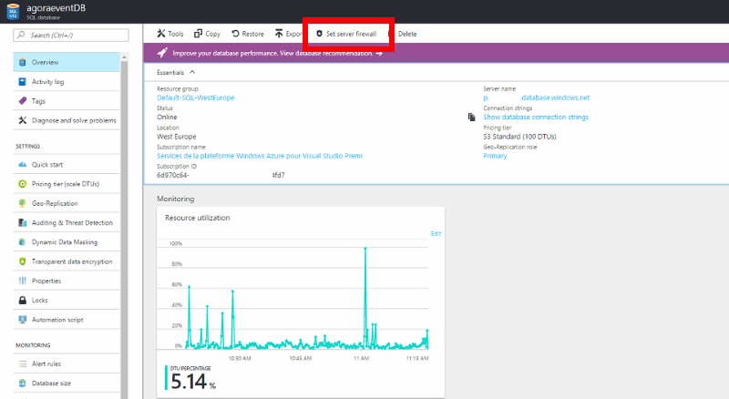  

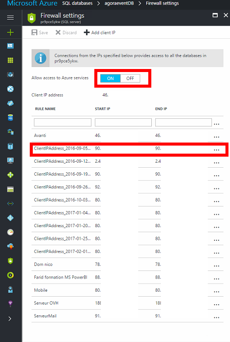  

We finally manage to connect our report to SQL Azure Database and modeling our database diagram.  
Here are two screenshots of the final database schema and the result in Power BI Desktop:

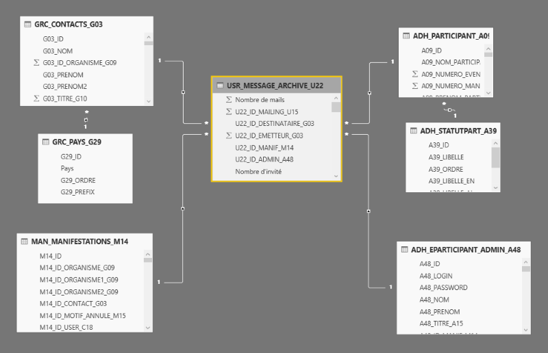   
_Final snowflake schema integrated in Power BI Desktop_

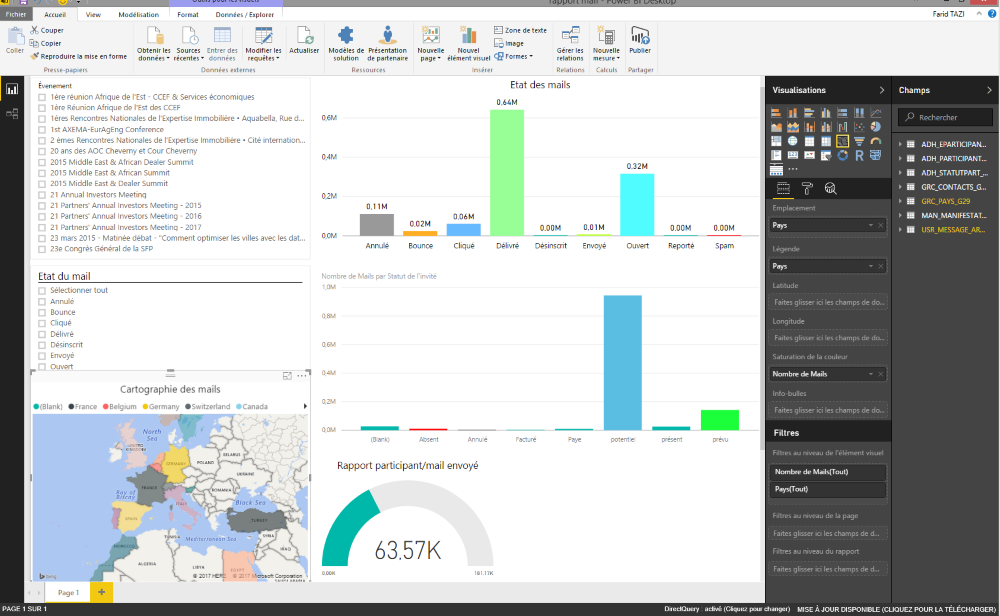   
_Final report in Power BI Desktop_

Since all customers are hosted by the same **Azure SQL database**, we had to go a bit deeper by using the “**Row Level Security**” provided by Power BI to ensure each user only access to his own data.  
Each of our user have a unique ID to which every data can be linked to.  
All we had to do was to filter the event list depending on the user ID. Since the ID is an integer, we had to wrap the USERNAME() variable with the VALUE function :

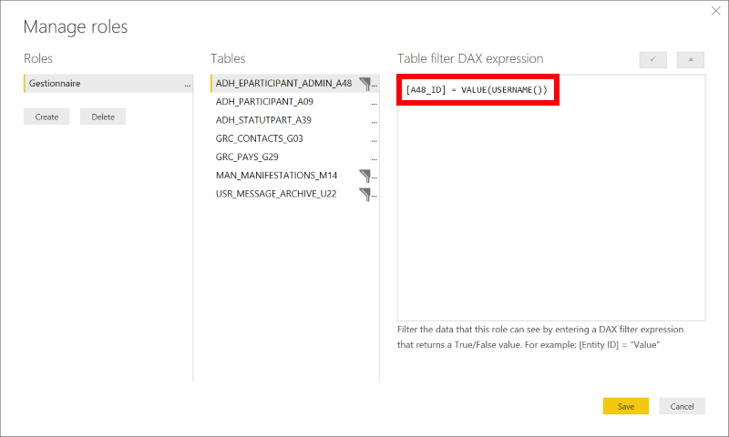   
_filtering rows with the USERNAME() variable_


### Problem faced: Azure SQL Database performance issue

During the creation of our first report, we noticed an important amount of loading time. Changing the filters on the report caused a delay of more than **10 seconds** which was not acceptable.  
We checked the **indexes** on the tables which were used for the report but before doing this, we took a quick look on our Azure platform and we noticed the following message:  

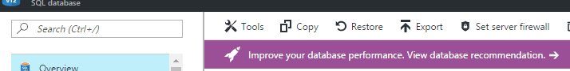   
_Improve database performance. Recommendations link in the SQL Azure Database dashboard_

Clicking on this message leads you to the Performance recommendation page which analyzes your database to suggest improvements for your Azure SQL database :  

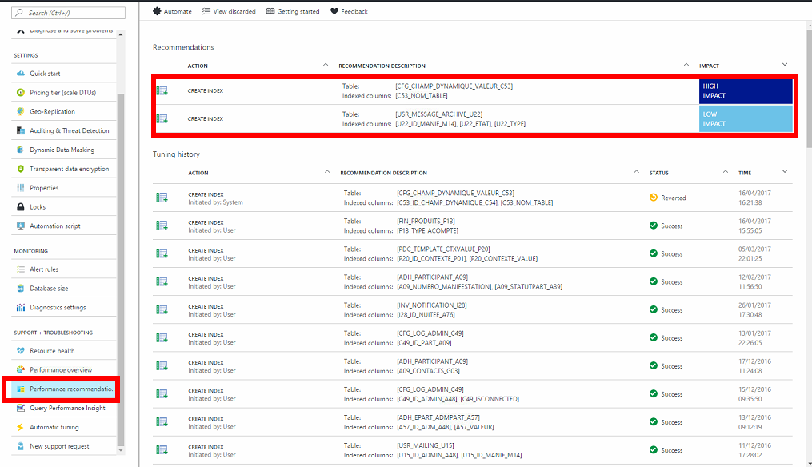   
_Improve database performance. indexes recommendations and impact_

Here is an overview of the performance gain :

|          | Without indexes | With indexes applied | % Performance gain |
|----------|-----------------|----------------------|--------------------|
| Report 1 | + 12sec         | ~ 1.5 sec            | 85%                |

### Configuring the Azure environment

After creating the reports, we need to import them in Azure.  
To do so we decided to use the **Power BI command line tool** through a npm install.  

If you want more information about the Power BI Command line tool, check the official Github Repository here: [https://github.com/Microsoft/PowerBI-Cli](https://github.com/Microsoft/PowerBI-Cli)  


The first step was to create a new **Power BI workspace**:    
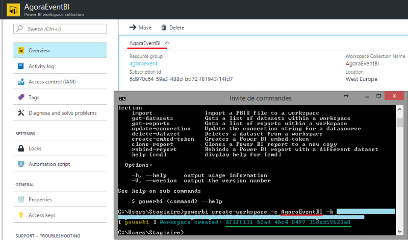     

From here, we can import our pbix file into the Azure workspace using the following command:  
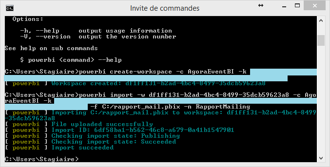     

An important step now was to **update the dataset** of the report with the **credentials of our Azure SQL Database**.  
To do so, we first needed to grab the dataset id of the report with the **get-datasets** command.   
We then used **update-connection** to set it up as shown on the following two screenshots :  

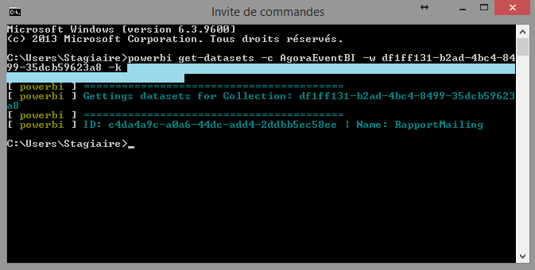  

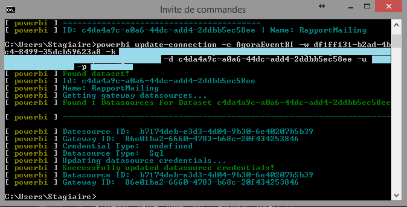  

We now have our report uploaded into our Azure Power BI workspace collection! We can start the code implementation.

### Code implementation

**AgoraEvent** is a project done in **VB.Net** and using **ASP.NET WebForms**. Thus, our code will be divided in two part, one part will be in VB.Net and the other one in JavaScript.
First thing first, we had to install the dependencies needed to use **Power BI Embedded** in our ASP.NET project:  

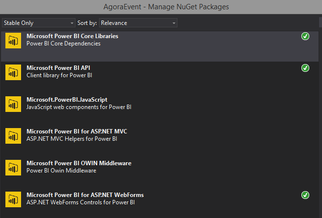 
_Installing Power BI Embedded dependencies via NuGet Package Manager_

```xml
<add key="powerbi:AccessKey" value="XXXXXXXXXXXXXXXXXXXXXXXXXXXXXXXXXXXXXXXx" />
<add key="powerbi:ApiUrl" value="https://api.powerbi.com" />
<add key="powerbi:WorkspaceCollection" value="AgoraEventBI" />
<add key="powerbi:WorkspaceId" value="df1ff131-xxxx-xxxx-xxxx-35dcb59623a8" />
```  
_ASP.NET Setting values_

#### Server side code

The goal here is to get the report id based on its name, to generate a **token**, and to arrange the embed URL of the report. Once all those variables are set we call our JavaScript function to load the report in the client-side.  
We can notice the “**Gestionnaire**” role name is being passed to the function **CreateReportEmbedToken**.  
The **RLS_Param** will be the variable grabbed by the **USERNAME()** function used in Power BI Desktop :  

```vb
Private workspaceCollection As String = GetWebPref("powerbi:WorkspaceCollection", "")
Private workspaceId As String = GetWebPref("powerbi:WorkspaceId", "")
Private accessKey As String = GetWebPref("powerbi:AccessKey", "")

Private Function PowerBI_CreateClient() As IPowerBIClient
    Dim credentials = New TokenCredentials(accessKey, "AppKey")

    Dim client = New PowerBIClient(credentials) With { _
        .BaseUri = New Uri(GetWebPref("powerbi:ApiUrl", "")) _
    }

    Return client
End Function

Public Sub PowerBI_LoadReport(ReportName As String, RLS_Param As String)
    Using client = Me.PowerBI_CreateClient
        Dim reportsResponse = client.Reports.GetReportsAsync(Me.workspaceCollection, Me.workspaceId)
        Dim report = reportsResponse.Result.Value.FirstOrDefault(Function(r) r.Name = ReportName)

        If report Is Nothing Then
            'Log error
            Exit Sub
        End If

        Dim embedToken = CType(Session("PBIToken"), PowerBIToken)

        If embedToken Is Nothing OrElse (embedToken.Expiration.HasValue And embedToken.Expiration.Value < DateTime.Now) Then
            If Not embedToken Is Nothing Then
                'Token renew
            End If

            embedToken = PowerBIToken.CreateReportEmbedToken(Me.workspaceCollection, Me.workspaceId, report.Id, RLS_Param, New String() {"Gestionnaire"})
            Session("PBIToken") = embedToken
        End If

        PowerBI_accessToken = embedToken.Generate(accessKey)
        PowerBI_reportID = report.Id
        PowerBI_embedURL = "https://embedded.powerbi.com/appTokenReportEmbed?reportId=" + report.Id

        ScriptManager.RegisterStartupScript(Me, Me.GetType(), "Load_PowerBI_Report", "Load_PowerBI_Report();", True)
    End Using
End Sub
```

#### Client side code

The client side consists of a simple **JavaScript function** calling the **powerbi.embed()** function to add the report to an html div element :  
```javascript
var report;
function Load_PowerBI_Report()
{
    var reportContainer = $('#PowerBI_report')[0];

    if (reportContainer != null) {
        var txtAccessToken = $('#<%= txtAccessToken.ClientID%>').val();
        var txtEmbedUrl = $('#<%= txtEmbedUrl.ClientID%>').val();
        var txtEmbedReportId = $('#<%= txtEmbedReportId.ClientID%>').val();

        var embedConfiguration = {
            type: 'report',
            accessToken: txtAccessToken,
            embedUrl: txtEmbedUrl,
            id: txtEmbedReportId,
            settings: {
                filterPaneEnabled: false,
                navContentPaneEnabled: false
            }
        };

        report = powerbi.embed(reportContainer, embedConfiguration);

        $("#PowerBI_report iframe").height($(window).height() - 130)
    }
    else
    {
        console.error("Please create a div with the ID 'PowerBI_report' to load your report.")
    }
}
```

Here is the final screenshots of the new report platform now available in the **AgoraEvent** dashboard:  

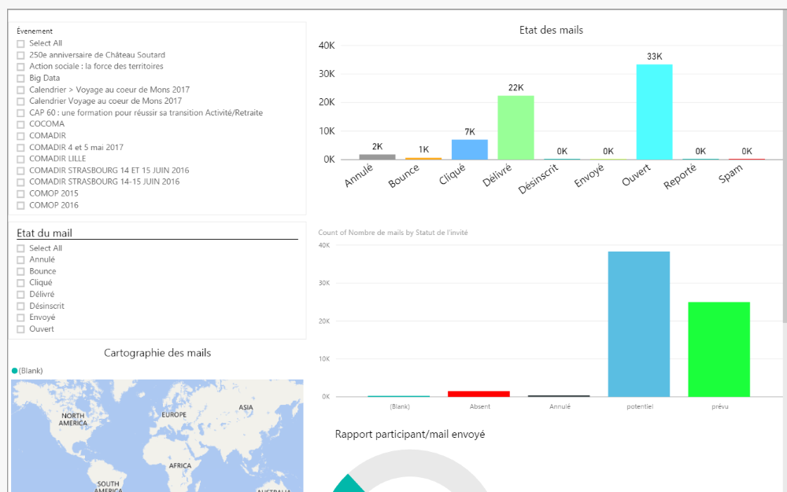  
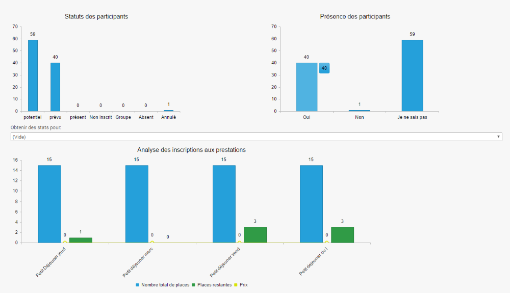  
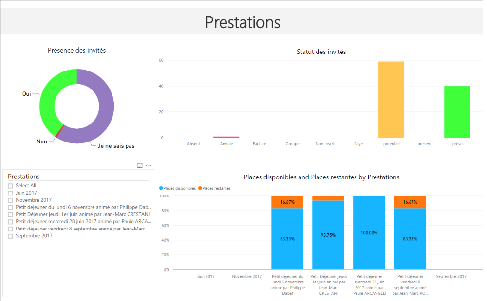  
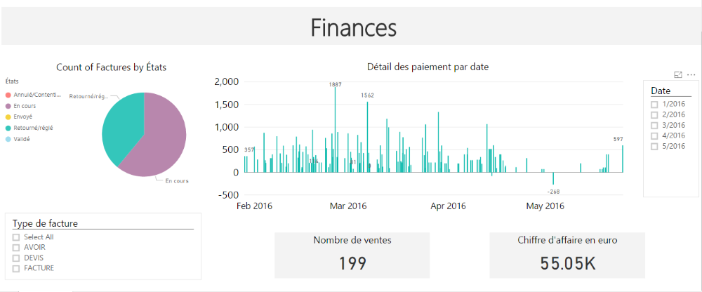  


## Interview ##

The **Power BI** integration is a game changer for all of the **AVANTI-Technologies** customers. 
**Power BI Embedded** is one the key success of the **AgoraEvent** platform.
Here is the very first feedback from one of their historical client, EDF :  

"We organize on our site several events per year with more or less participants (from a dozen to 3000).   
Our goal was to simplify and automate the management of registrations in one hand, and to provide to the guests a simple registration service available 24-hours. 
Thus, we searched for a registration management tool.  
After having tested several solutions, we choosed AgoraEvent for its ease of use, its compatibility with our IT systems, its level of customization and its cost.

We have already used the platform for several events and AgoraEvent help us to optimize all the aspect related to the management of our events. Finally, we can change our settings or view the status of our registrations at any time and anywhere."

**Edith FIOLLEAU** – *Communication department – Head of mission at EDF*


## Conclusion ##

The interactivity brought by **Power BI Embedded** is a real **game changer** for **AVANTI-Technologies**'s customers to clearly identify how they can improve their events.  
It will also reduce the amount of specific report’s requests made by their customers and **drastically reduce the time spent in creating new reports** thanks to Power BI Desktop and its simplicity.  


For now **AVANTI-Technologies** uses Power BI Embedded for only two of their reports, but the hackfest experience and the super easy integration of Power BI Embedded, thanks to the SDK simplicity, convinced them to move forward. In the next months, they plan to convert and create additonnal reports to switch to **100% Power BI reports**.