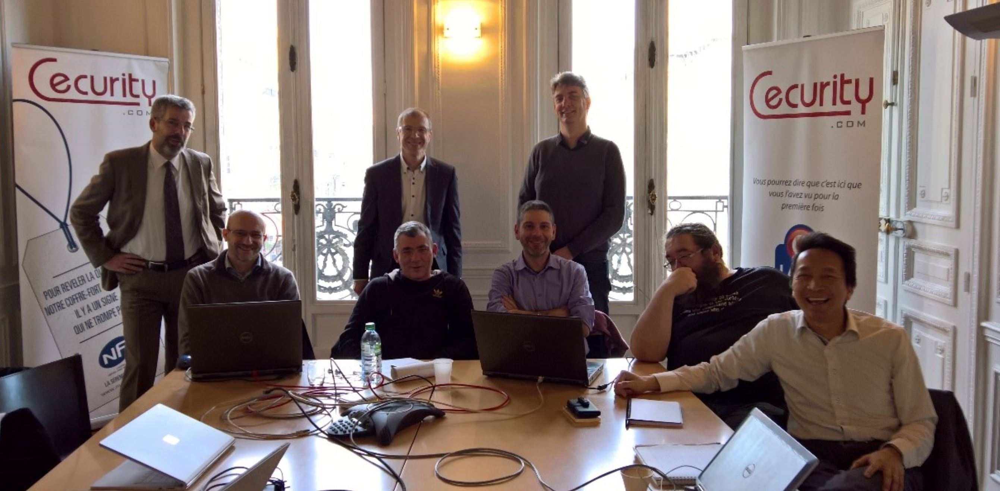

# Partnering with Cecurity.com to extend and migrate their existing PEA software (Proof, Exchange & Archiving) from an on premise software to a Microsoft Azure online service.

The PEA electronic archiving software developed by Cecurity.com is a solution for electronic archiving with probative value. A joint team from Cecurity.com and Microsoft worked to define the best architecture to migrate the existing code towards Microsoft Azure, focus on any technical point resulting from the evolution of the architecture and prepared the automation of the provisioning and configuration of the corresponding application new infrastructure.

## The Project ##

The project is a migration and extension of the existing PEA (Proof, Exchange & Archiving) software from Cecurity.com. This software is a Java solution for electronic archiving with probative value. It combines several technologies (Tomcat Java Web App, C++ sockets server, SQL Server as a backend) and had not been initially thought for being delivered as a service : it uses local storage, it communicated through sockets with a single server. Its migration towards Microsoft Azure requires to rethink architecture so that it takes profit from Cloud patterns to offer a highly available multi-tenant service. In order to maximize the value of Azure, Cecurity.com has decided to use our PaaS offering, so on a pure technical perspective, this project is mainly an Azure App Service migration and this document explains which architecture migration decisions were taken, and how was implemented the corresponding evolution (provisioning and configuration, data injection automation, and Java code evolution).

Core team:

- Arnaud Belleil - Cecurity.com
- Michel Gumilar - Cecurity.com
- Stephane Clinckemaillie - Cecurity.com
- Fabian Webb - Cecurity.com
- Viet-anh Nguyen - Cecurity.com
- Didier Couderc - Cecurity.com
- Nicolas Clerc - Technical Evangelist, Microsoft
- Stéphane Goudeau - Technical Evangelist, Microsoft



In this report, we describe what we did during this hackfest, including:
- Architecture definition
- Deployment Automation
- Data management
- Results of the technical engagement

## Customer profile ##

Cecurity.com is a trusted independent software vendor specialized in the publication of software designed for secure exchanges and electronic documents archiving. The company is a major player on the digitization and digital trust market thanks to its connected electronic safe, the first software to be certified for data privacy compliance by the French Data Protection Authority (CNIL), and its PEA electronic archiving system.

The Cecurity.com PEA features an end-to-end array of functions for managing the archive lifecycle and administering archival system profiles, as well as advanced functionality for managing the retention period, including freeze and unfreeze features, advanced searches, metadata extraction, format conversions, and so on. It is able to absorb large volumes of streams to be archived. It can process several million transactions per day, or tens of billions of recordings a year, often with retention times over 10 years. It is optimized to meet several hundreds of thousands of consultations and searches per day. It may be sold as a SaaS solution or as a software deployed on customers datacenters. 

## Architecture ##

### Problem statement ###

The existing application is a combination of several technologies (Tomcat Java Web App, C++ sockets server, SQL Server as a backend). It does not natively implement certain Cloud patterns. Cecurity.com main objective was to move the current application to Microsoft Azure. Cecurity.com also wanted to leverage the platform as a service (PaaS) architecture and reuse the existing database.

### Original architecture study ###

The PEA solution original architecture consists of several components:
- Front end :
The PEA product front end is composed of two Java Web App and one Java Web Services, based on Apache Tomcat. The Apache Tomcat open source software implementation of the Java Servlet and JavaServer Pages technologies is “built in” for Azure App Service. So it was a natural way to leverage App Service for these three components of the solution.
- Scheduled and on-demand background task :
The PEA product also integrates a Java application which purpose is to allow the management of the content files stream acquisition and archiving. This application was a natural candidate for an implementation as an Azure Function.
- Storage Layer :
The PEA product uses a C++ socket server, which offers a hardware abstraction for accessing different storage  hardware systems (WORM: Write Once, Read Many). This was the first item that was not directly reusable in Azure App Service and that was the cause of intensive Architecture discussions between Cecurity.com and Microsoft team.
- Storage :
Another concern that Cecurity.com expressed was about the content files that were persisted locally in the file system of each node of the on premise solution. Azure Storage was the “logical” target for an evolution of PEA Product to the Cloud, but it required a code migration so we had also to investigate this point.
- SQL backend :
The PEA product uses SQL Server to host its database. Thanks to SQL Azure Database, the component evolution towards Azure was quite easy. Still, there were performance points to consider, and data injection mechanisms to adapt to the usage of this service.

### Architecture definition ###

At the end of our architecture discussion, considering the constraints (essentially the C++ socket server and the requirement for reviewing PEA original storage mechanism towards the Azure Storage usage), we ended up with two different topologies as shown in the following figures.


First architecture supposes a migration of the existing C++ socket server as a java abstraction library directly running on each of Java Web applications node. It also requires the use of REST API for using Azure Storage instead of local file system. This architecture has an impact on existing code (migrating the C++ code to java and using the Java Azure Storage SDK to replace any call to java PEA components that interacted with files that required to be persisted).


Second architecture also needs the usage of REST API for using Azure Storage and so requires replacing file systems calls that need to be persisted with Java Azure Storage SDK. But the existing C++ socket server may be kept without any update by being deployed on a virtual machine. This solution requires a VNET Integration in order to enable access from the java web apps to this Socket Server running on a virtual machine in an Azure virtual network and call it through a private non-internet routable address. While it supposes a bit more complex infrastructure, this solution may be quite easily configured, since the App Service networking UI has the capability to do it by simply selecting “Create New Virtual Network” so a VNET with a dynamic routing gateway and a Point to Site VPN would be pre-configured. 

However, Cecurity.com team decided to opt for the first architecture, even if it implied more code transformation. The motivation for the “Frontend Azure App Services” choice was related to advanced features such as automatic load balancing, backup, auto scaling, or site slots for staged deployments. But the “full PaaS” decision was mostly due to the level of operational management delegation and the usage simplicity offered by App Service. Indeed, Azure App Service uses regular PaaS Cloud Services Guest OS (http://azure.microsoft.com/en-gb/documentation/articles/cloud-services-guestos-update-matrix) and as such takes profit from their support lifecycle (http://support.microsoft.com/gp/azure-cloud-lifecycle-faq), which means zero day vulnerability, because all corresponding VMs are patched as soon as possible. There is also a “Bring your own Runtime” support for bringing a specific version of the Java middleware runtime to app service, with a quarterly update of these versions.

## Deployment automation ##

Azure Resource Manager enables to deploy, manage these resources in a single, coordinated operation and monitor them as a group rather than handling them individually. With Azure Resource Manager, it is possible to define dependencies between these resources, in order to deploy them in the correct order. Moreover, Role-Based Access Control (RBAC) is integrated into the management platform. Azure Resource Manager also offers the ability to build templates and easily leverage them to deploy and manage resources on Azure. It is a very efficient way to deploy an Azure topology and that is why this mechanism was recommended to Cecurity.com. 
In Cecurity.com PEA context, several kinds of resources were considered: 
- Storage Account 
``` json
["type": "Microsoft.Storage/storageAccounts"]
``` 
- Web Site
``` json
["type": "Microsoft.Web/sites"]
``` 
- App Service Plan
``` json
[ "type": "Microsoft.Web/serverfarms"]
``` 
Each of these resources had to be configured with the required parameters in the Cecurity.com context:
``` json
      "resources": [
          {
            "apiVersion": "2015-08-01",
            "name": "web",
            "type": "config",
            "dependsOn": [ "[concat('Microsoft.Web/sites/', variables('webAppName'))]" ],
            "properties": {
              "javaVersion": "1.7",
              "javaContainer": "TOMCAT",
              "javaContainerVersion": "8.0"
            }
          }
``` 
Result of the deployment could be checked with the Azure Resource Explorer tool (https://resources.azure.com)

## Data Management ##
The Cloud Cecurity.com PEA solution will use Azure SQL Database and Azure Storage. This needs to configure Azure SQL Database to get the required performances while minimizing costs, to define a data injection mechanism in SQL Database and to update the existing java code so it can read or write files directly in the Azure storage.

### Level of performances sizing ###

Azure SQL Database service tier and performance level are based on the Database Throughput Unit (DTU) concept. DTUs provide a way to describe the relative capacity of a performance level of Basic, Standard, and Premium databases. DTUs are based on a blended measure of CPU, memory, reads, and writes. As DTUs increase, the power offered by the performance level increases. As presented to Cecurity.com, one way to have the best sizing possible is to run the following request on Azure SQL Database so the behavior of the system can be directly monitored:

``` sql
SELECT 
    ((COUNT(end_time) - SUM(CASE WHEN avg_cpu_percent > 80 THEN 1 ELSE 0 END) * 1.0) / COUNT(end_time))*100 AS 'CPU Fit Percent'
    ,((COUNT(end_time) - SUM(CASE WHEN avg_log_write_percent > 80 THEN 1 ELSE 0 END) * 1.0) / COUNT(end_time))*100 AS 'Log Write Fit Percent'
    ,((COUNT(end_time) - SUM(CASE WHEN avg_data_io_percent > 80 THEN 1 ELSE 0 END) * 1.0) / COUNT(end_time))*100 AS 'Physical Data Read Fit Percent'
    ,((COUNT(end_time) - SUM(CASE WHEN avg_memory_usage_percent > 80 THEN 1 ELSE 0 END) * 1.0) / COUNT(end_time))*100 AS 'Memory Usage Fit Percent'
FROM sys.dm_db_resource_stats 
``` 

The other way is to use the DTU calculator (http://dtucalculator.azurewebsites.net). This calculator may help to determine the number of DTUs for Cecurity.com database(s) as well as a recommendation of the minimum performance level and service tier needed before PEA migration to Azure SQL Database.
The Cecurity.com PEA solution will also use columnstore indexes, to get significant data compression and query performance (reduced IO and storage, only referenced columns to be fetched, efficient data processing).

### Data injection automation ###

The PEA product includes a scheduled and on-demand background mechanism implemented in a Java application which purpose is to allow the management of the content files stream acquisition and archiving, and the database synchronization.
The solution we proposed to replace this java application was to implement it as an Azure Function. This service is quite well adapted to long-running tasks that run in a background thread, or for any tasks that run on a schedule.


One of the tasks that has to be implemented by Azure Function was the recurrent call of a bcp job. First requirement was to have to respect the Azure SQL Database bcp utility syntax (https://azure.microsoft.com/fr-fr/blog/bcp-and-sql-azure):
- Login SQL : @server name
- Security : private encrypted connection : bcp -t
- bcp AdventureWorksLTAZ2008R2.SalesLT.Customer out C:\Users\user\Documents\GetDataFromSQLAzure.txt -c -U username@servername -S tcp:servername.database.windows.net -P password

In order to use bcp, this utility had first to be uploaded via Kudu (this could be also automated through ARM deployment template).

The bcp.exe file and its dependencies were copied into the “D:\home\site\wwwroot\xxx” folder:

``` sql
Directory of D:\home\site\wwwroot\xxx
01/26/2017  09:33 PM    <DIR>          Resources
01/26/2017  09:31 PM           114,264 bcp.exe
01/26/2017  09:13 PM               223 function.json
01/27/2017  09:26 AM               316 run.bat
Directory of D:\home\site\wwwroot\xxx\Resources
01/26/2017  09:34 PM    <DIR>          1033
01/26/2017  09:33 PM    <DIR>          en-US
01/26/2017  09:32 PM            18,008 SqlLocalDB.rll
Directory of D:\home\site\wwwroot\xxx\Resources\1033
01/26/2017  09:33 PM            26,200 bcp.rll
01/26/2017  09:33 PM            13,588 license_SQLCMD.txt
01/26/2017  09:34 PM            33,880 SQLCMD.rll
Directory of D:\home\site\wwwroot\xxx\Resources\en-US
01/26/2017  09:33 PM            27,224 SqlLocalDB.rll.mui
``` 

The call of bcp was included in an Azure Function based on the experimental template « BlobTrigger with Batch ». The corresponding code was the following:

``` bash
echo OFF
FOR /F "usebackq" %%i IN ('%inputBlob%') DO set size=%%~zi
echo ----------- 
echo Executing BCP for file %inputBlob%
bcp -v
bcp ccrtdb.dbo.matable in %inputBlob% -c -U niclerc@ccrtdemo -S ccrtdemo.database.windows.net -P XXXXXXX
echo -----------
echo Blob trigger function Processed, blob size:%size% bytes
``` 

### Storage Azure request from Java code ###
In order to enable each Cecurity.com PEA component of the solution to read or write files directly in the Azure storage, the existing Java code had to be updated. A representative sample based on https://docs.microsoft.com/en-us/azure/storage/storage-java-how-to-use-blob-storage was quickly implemented by the Cecurity.com team.


## Results of the technical engagement ##

During the technical engagement between Microsoft and Cecurity.com, we leveraged the skills from our both companies to define a new PEA architecture based upon Azure App Service, Azure SQL Database and Azure Storage. This new architecture will use the autoscaling feature of Azure App Service and will take profit of the scalability of the Azure Storage combined with the high resiliency of Azure SQL Database.

Cecurity.com development team is now in the process of migrating the existing PEA code in order to comply with this new architecture.
The Cloud Cecurity.com PEA SaaS application should be of great help for any company that wish to implement an Electronic Archiving System (EAS).

>“Thanks to Azure App Services, Cecurity.com PEA enables to provide a solution of electronic archiving with probative value, compliant with the requirements of AFNOR NF 42-013 and ISO 14641-1 standards.”<br />
– Arnaud Belleil - Partner of Cecurity.com


As shown this picture, for years to come, Cecurity.com and Microsoft are looking together resolutely towards the Cloud…