COMERSO is a French start-up created in 2013 whose ambition is to contribute to the fight against food wastage. They are the first French digital and logistic operator of unsold goods and provide an easy and secure donation management solution for the supermarkets and the agri-food industry. 
Their solution was running on a single virtual machine managed by a third-party company, and Comerso wanted to take control back on it. Doing so, they aimed at being able to manage it themselves, without taking care about the underlying infrastructure and by using platform services like **Azure App Service**, **Azure SQL Database**, **Azure Storage** or **Azure Redis Cache**.

The figure below describes the architecture of the application as it was before the hackfest:


 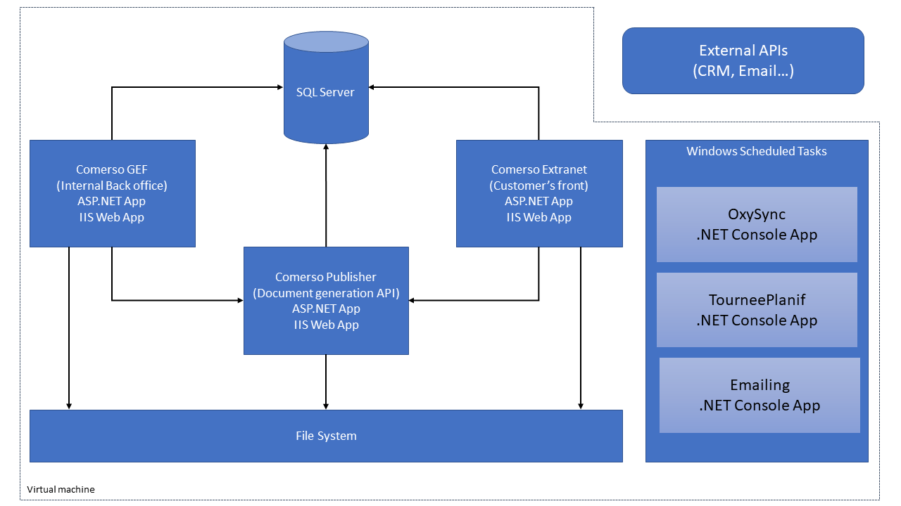


 As you can see, the solution was made of:

 - 3 web applications running on a IIS server
 - 3 console applications running through the Windows task scheduler
 - 1 SQL Server database

All applications were developed using .NET 4.5.2 and use Entity Framework or basic ADO.NET APIs to discuss with the SQL Server database.

The three-day-long hackfest was dedicated to the move (lift & shift) of this solution into Microsoft Azure.

Here is the list of the hackfest participants:

- Steeve Le Dréau, CTO, Comerso
- Julien Corioland, Technical Evangelist, Microsoft France
- David Coppet, Azure App Consult Program Lead EMEA, Microsoft France
- Benjamin Talmard, CTO in Residence Microsoft Accelerator Paris, Microsoft France

 
## Customer profile ##

**COMERSO: UNSOLD GOODS HAVE A VALUE**


Roughly one third of the food produced in the world for human consumption every year — approximately 1.3 billion tons — gets lost or wasted.

**COMERSO** is a turnkey solution to fight against the food wastage. Our objective is to use advantages of new technologies to serve a concrete social mission: *"Provide fresh foods on a daily basis to people in need, avoiding products destruction"*.

The start-up offers a solution managing administrative, fiscal, organizational and logistical aspects related to the donation of perishable goods to charitable organizations.


The company directly manages and rationalizes each step of the food collection and delivery, with a comprehensive offer addressing both supermarkets and charitable organizations’ needs.

From an IT perspective, Comerso offers:
- Food pick-up (for supermarkets) and delivery (for charities) forecast and management
- Easy access to related official administrative documents (“Cerfa”) and easy declaration (for fiscal purpose)
- Real-time follow-up of food pick-up and distribution.

 
## Problem statement ##

Comerso’s main goal was to take the control back on the way they host their solution, and to be able to manage it without taking care of the underlying infrastructure. Platform services like Azure App Services perfectly matched for such requirements: in fact, you just need to deploy your code and Azure handles everything, from the network infrastructure to continuous deployment and auto-scaling.

However, there were a few points to be careful about when moving a solution from an on premises/traditional infrastructure to a platform service.

In the case of Comerso, we used a lift and shift approach. We did not want to rewrite the entire solution that has several years of development behind, and we had to adapt some part to be fully compatible with the cloud.

We started the hackfest by a design thinking session. It is during this time that we identified the different points we have to take care of, while moving the application to Microsoft Azure.


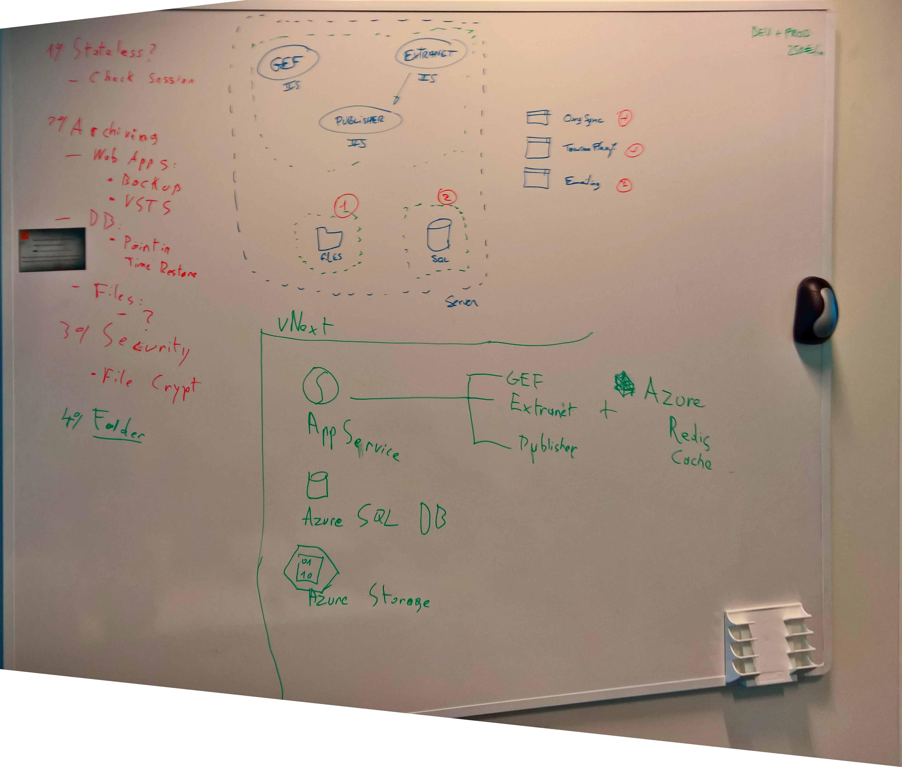 


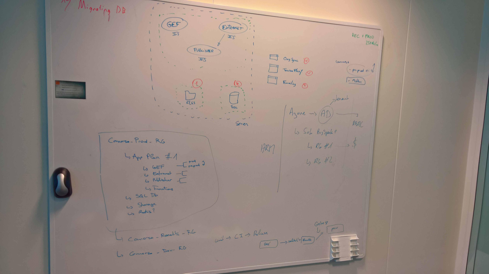 


Here are the main points identified:

**Documents, images, attachments etc. were stored on the virtual machine, using the classic .NET file system APIs.**

When using Azure App Service, persistent files should not be stored directly on the machine, because Azure does not guarantee that it is always the same machine, and you can also have multiple machines. A best practice consists to externalize all the storage, using Azure Storage, for example.
This is the first problem we had to resolve: make the solution work with Azure Storage blob.

**Web applications are running on only one virtual machine**

The reliability was based on the fact that this machine never went down. One thing you can be sure is that a single machine will always eventually goes down. Moreover, with platform like Azure App Service, it is so easy to scale out and have more than one machine. Here is the second problem we had to resolve: the applications are using in memory sessions which is not a good practice in a Cloud environment with potentially multiple machines. We moved the session state into Azure Redis Cache.

**Moving the data history to the Cloud**

As this is not a new application, Comerso already had a lot of data, some of them are simple files on the file system some other in a SQL Server database. We had to deal with this history.

**Culture and Globalization issues**

Culture and globalization should be addressed seriously in modern application, even more when they are running in managed services in the Cloud, as you cannot configure the time zone of the machine. One issue we identified in the Comerso solution is that they were not working with UTC date and time.

**Continuous Deployment**

The last pain point that Comerso had with its existing solution was the deployment. It took hours to deploy a new version of the application because they had no special process / tools to do that. They just had a basic continuous integration build. During the hackfest, we helped them create a full CI/CD pipeline using Visual Studio Team Services, from the creation of the environments using Azure Resource Manager templates to the deployment of the three web applications and a release workflow between the environments.

## Solution, steps, and delivery ##

### Architecture Design Session

After we identified all the issues to be addressed before moving Comerso's solution to Azure, we started to discuss about the target architecture. Our goal was to move the solution from a single virtual machine to the following architecture:

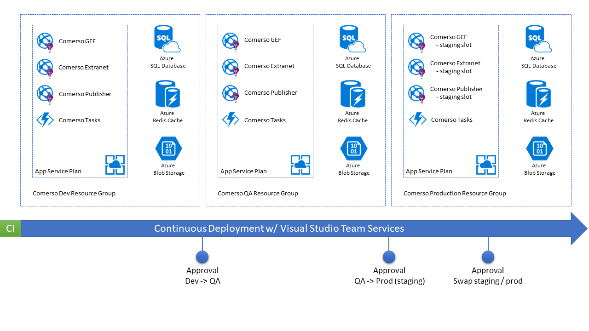 


Comerso did not want to manage the infrastructure so we only used platform services to design the solution, which is composed of several environments (Development, QA and Production).

The production will run 3 web applications, in the same application plan. All the applications will have a staging slot in order to allow to boot, execute smoke tests and be able to swap a new version into production very quickly, thanks to [Azure App Services slots](https://docs.microsoft.com/en-us/azure/app-service-web/web-sites-staged-publishing).

There is also an Azure SQL Database for the application data, an Azure Storage account for file blobs, and an Azure Redis Cache service to maintain state between the different machines running in the application plan.

*During the architecture design session we take time to explain how [Azure App Service plans](https://docs.microsoft.com/en-us/azure/app-service/azure-web-sites-web-hosting-plans-in-depth-overview) are working and how they are central in the lifecycle of a web application published into Azure App Services, how they are responsible for the number of running instances, what the levels of service are, and that they are the billable entity in Azure App Service.*

Finally, we wanted it to be easy to move a new version from one environment to another so we decided to use Visual Studio Team Services release definition to setup a continuous deployment pipeline that can handle both environment creation and application deployment.

We had then a clear idea of what we wanted to implement. So, we started by defining all the resources using the Microsoft Azure portal (for the production environment):

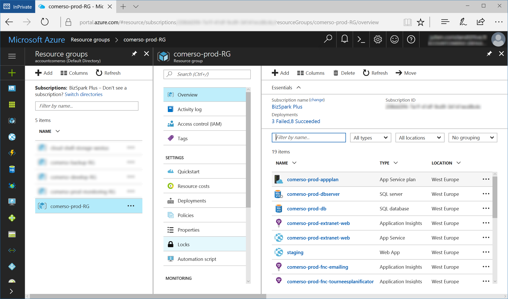 

As Comerso's CTO was using Microsoft Azure for the first time, creating the whole infrastructure using the portal was really easy and allowed to upskill and understand very quickly.

### Working on the Azure Resource Manager templates

Once we had created the infrastructure in the portal, we used the automation script section of the resource group to extract an Azure Resource Manager template. After a bit of work we could integrate it into the source control, with two scripts:

- One for Production environment
- One for Dev/QA (etc.) environments

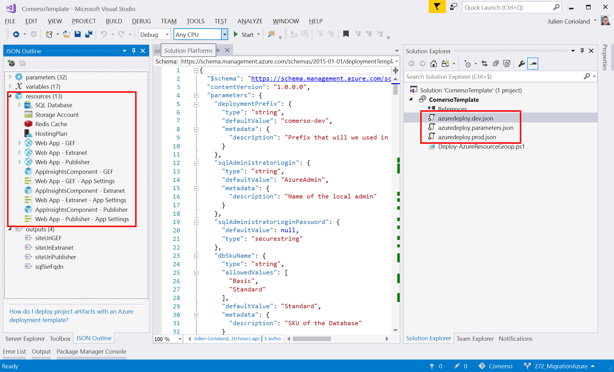 

The main differences between production and other dev environments is that web application have staging slots in production, and we limited some SKUs to use in parameters of the development environment.

Those templates are now source controlled in Comerso's GIT repository on Visual Studio Team Services, so we will be able to use them in a release pipeline, as described later.

An interesting thing to underline about Azure Resource Manager templates is the possibility to directly get information about services that have been created and inject that information into the Connection Strings and Application Settings section of the web apps. Here, the template is creating resources like Application Insights, Redis Cache, Azure Storage or SQL Database. It is possible to directly retrieve all the connection string and access keys to inject them into the settings, as you can see in the JSON extract below:

**Application Settings**

```JSON
{
  "type": "Microsoft.Web/sites/config",
  "name": "[concat(variables('WebAppNameGef'), '/appsettings')]",
  "apiVersion": "2015-08-01",
  "dependsOn": [
    "[resourceId('Microsoft.Web/sites', variables('WebAppNameGef'))]",
    "[concat('microsoft.insights/components/', variables('WebAppNameGef'), '-ai')]"
  ],
  "tags": {
    "displayName": "Web App - GEF - App Settings"
  },
  "properties": {
    "APPINSIGHTS_INSTRUMENTATIONKEY": "[reference(concat('microsoft.insights/components/', variables('WebAppNameGef'), '-ai')).InstrumentationKey]",
    "GEFURL": "[concat('https://', variables('WebAppNameGef'), '.azurewebsites.net')]",
    "GEFEXTRANET": "[concat('https://', variables('WebAppNameExtranet'), '.azurewebsites.net')]",
    "IsProductionMode": "[parameters('appsettings_IsProductionMode')]",
    "Environnement": "[parameters('appsettings_Environnement')]"
  }
},
```

**Connection Strings**

```JSON
{
  "apiVersion": "2016-03-01",
  "type": "config",
  "name": "connectionstrings",
  "dependsOn": [ "[variables('WebAppNameGef')]" ],
  "properties": {
    "DefaultConnection": {
      "value": "[concat('Server=tcp:', reference(concat('Microsoft.Sql/servers/', variables('DBserverName'))).fullyQualifiedDomainName, ',1433;Initial Catalog=', variables('DBname'), ';Persist Security Info=False;User ID=', parameters('sqlAdministratorLogin'),';Password=', parameters('sqlAdministratorLoginPassword'), ';MultipleActiveResultSets=False;Encrypt=True;TrustServerCertificate=False;Connection Timeout=30;')]",
      "type": "SQLAzure"
    },
    "ExtranetConnection": {
      "value": "[concat('Server=tcp:', reference(concat('Microsoft.Sql/servers/', variables('DBserverName'))).fullyQualifiedDomainName, ',1433;Initial Catalog=', variables('DBname'), ';Persist Security Info=False;User ID=', parameters('sqlAdministratorLogin'),';Password=', parameters('sqlAdministratorLoginPassword'), ';MultipleActiveResultSets=False;Encrypt=True;TrustServerCertificate=False;Connection Timeout=30;')]",
      "type": "SQLAzure"
    },
    "ComersoEntities": {
      "value": "[concat('metadata=res://*/ComersoDB.csdl|res://*/ComersoDB.ssdl|res://*/ComersoDB.msl;provider=System.Data.SqlClient;provider connection string=', variables('SingleQuote'), 'Server=tcp:', reference(concat('Microsoft.Sql/servers/', variables('DBserverName'))).fullyQualifiedDomainName, ',1433;Initial Catalog=', variables('DBname'), ';Persist Security Info=False;User ID=', parameters('sqlAdministratorLogin'), ';Password=', parameters('sqlAdministratorLoginPassword'), ';MultipleActiveResultSets=False;Encrypt=True;TrustServerCertificate=False;Connection Timeout=30;application name=EntityFramework', variables('SingleQuote'))]",
      "type": "Custom"
    },
    "AzureFileStorage": {
      "value": "[concat('DefaultEndpointsProtocol=https;AccountName=', variables('StorageAccountName'), ';AccountKey=', listKeys(resourceId('Microsoft.Storage/storageAccounts', variables('StorageAccountName')), providers('Microsoft.Storage', 'storageAccounts').apiVersions[0]).keys[0].value ,';EndpointSuffix=core.windows.net')]",
      "type": "Custom"
    },
    "RedisConnectionString": {
      "value": "[concat(variables('RedisCacheName'),'.redis.cache.windows.net,abortConnect=false,ssl=true,password=', listKeys(resourceId('Microsoft.Cache/Redis', variables('RedisCacheName')), '2015-08-01').primaryKey)]",
      "type": "Custom"
    }
  }
}
```
 
By doing this, each time Comerso will deploy a new environment, configuration settings for the web applications will be automatically populated at deployment time. We also allowed to override some settings by using [template parameters](https://docs.microsoft.com/en-us/azure/azure-resource-manager/resource-group-authoring-templates#parameters).


### Continuous Deployment

Because we wanted to be able to use it during the hackfest each time we updated a feature in the application code, we started to implement a basic continuous deployment pipeline as soon as the Azure infrastructure was up and running.

This pipeline was simple at first: once a commit is done on the source code repository, we build the web applications and push them into the staging slot of each Azure Web Apps.

The build workflow is also simple. It builds the Visual Studio solution, then publishes the output in a **drop** artifacts directory, and the ARM templates in an **arm-templates** directory:

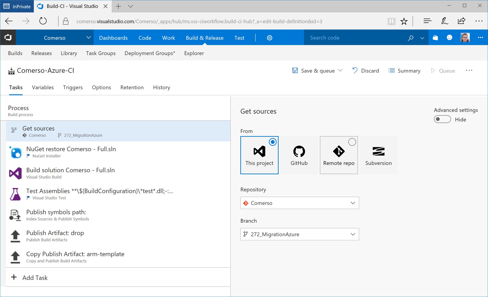


The first version of release definition we created is composed by two environments: Preprod (staging) and Production.

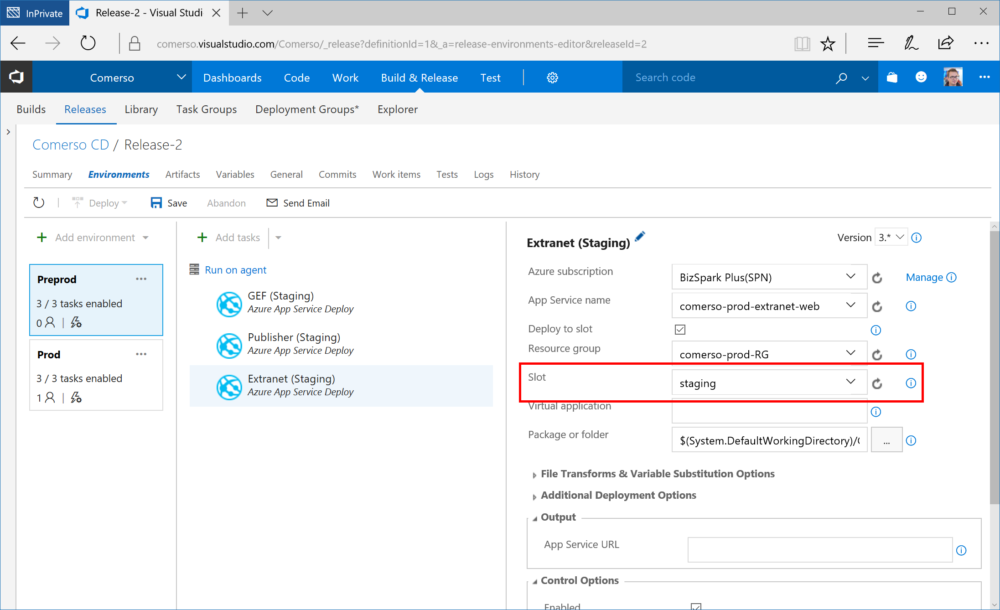


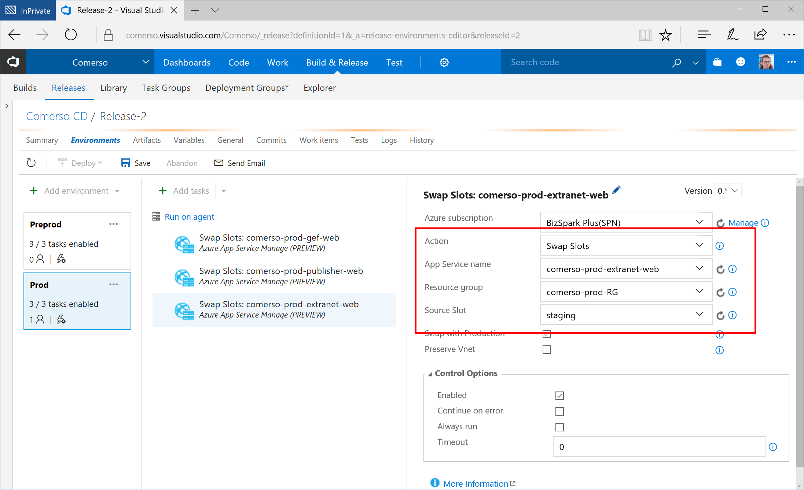


As you can see on the snapshot above, the production environment definition only uses a "swap slots" task to move the application running on staging to the production slot in a few seconds. We have also defined an approbation step to make sure that VSTS waits for the go before moving the application into production:

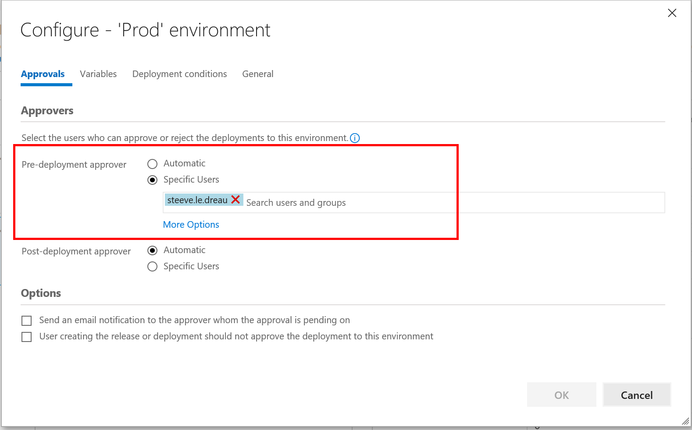

### Lifting the application

In this part are described the adjustments made to the applications so they can be moved to Azure App Service.

#### Moving to Azure Storage

As mentioned previously, the web applications were using the file system to store uploaded documents, images etc. In the case of a deployment in Azure App Service, it is not possible to keep this behavior for several reasons:

1. Azure App Service does not guarantee that the machine that will execute the application is always the same. For example, if the machine crashes or the underlying host has to be updated, then it is another virtual machine that is assigned to the application plan.
2. If you configure scaling / auto-scaling rules, you will have multiple machines in the application plan.

*Note: Azure App Service provides a shared file system but it is not recommanded to use it for dynamic data. This shared FS is used for source code, static files etc...*

To solve this issue, we moved the solution to Azure Storage. Actually, it was really easy to do that because Comerso had already developed an abstraction layer for the storage.

All we had to do is implement this interface:

```csharp
namespace IFileSystemService
{
    public interface IFileService
    {
        void Save(IFileBase file);

        T Get<T>(string filePath, string fileName) where T : IFileBase, new();

        bool Delete(string filePath, string fileName);

        bool Exists(string filePath, string fileName);
    }
}
```

And use the [Azure Storage Client Library for .NET](https://docs.microsoft.com/en-us/azure/storage/storage-dotnet-how-to-use-blobs). For example:

```csharp
public bool Exists(string filePath, string fileName)
{
    if (string.IsNullOrWhiteSpace(fileName))
      return false;

    if (string.IsNullOrWhiteSpace(filePath))
      return false;

    CloudBlobClient blobClient = this.cloudStorageAccount.CreateCloudBlobClient();
    CloudBlobContainer blobContainer = blobClient.GetContainerReference(filePath);
    CloudBlockBlob blockBlob = blobContainer.GetBlockBlobReference(fileName);

    return blockBlob.Exists();
}
```

By doing this, it was really easy to move the application to use Azure Storage blobs for document storage. We also needed to move Comerso's existing files to Azure storage. We used AzCopy to do that. The procedure will be described later in this article.

#### Using Redis Cache as session state provider

Once the storage migration was done, we had to deal with the session state in the web applications. As having the same machine is not guaranteed and because it is possible to have multiple machines in the app plan, you cannot use in-memory (InProc) session state provider to store sessions. Fixing this issue is really easy thanks to [Azure Redis Cache](https://azure.microsoft.com/en-us/services/cache/) and the [ASP.NET Session State Provider for Azure Redis Cache](https://docs.microsoft.com/en-us/azure/redis-cache/cache-aspnet-session-state-provider).

To make this new session state provider working, all you need to do is to install a NuGet package:

```powershell
Install-Package Microsoft.Web.RedisSessionStateProvider
```

And update your **Web.config** file to reference the new provider. Because Comerso did not want to use the Redis Cache provider during development time, we choose to use Web config transforms to inject this configuration when building the solution:

```xml
<system.web>
  <compilation xdt:Transform="RemoveAttributes(debug)" />
  <httpCookies requireSSL="true" xdt:Transform="Insert" />

  <sessionState mode="Custom" customProvider="MySessionStateStore" xdt:Transform="Insert" >
    <providers>
      <add type="Microsoft.Web.Redis.RedisSessionStateProvider"
            name="MySessionStateStore"
            connectionString="RedisConnectionString"/>
    </providers>
  </sessionState>

</system.web>
```

As you can see in the XML above, we referenced the `RedisConnectionString` which is the name of the connection string settings that stores the credentials to Azure Redis Cache.

#### Dealing with UTC date & times

Dealing with globalization is really important even if your application is used only from one country, in one unique language. One best practice to adopt is to always store date and time in UTC and global format in the database. The issue we encountered with Comerso is that they are storing date in a localized format and in the GMT+1 time zone. Because all the virtual machines in Azure are configured to run in UTC, some conversions, date/time display and actions were not working well.

Here is a sample code that allows to convert date from the French time zone to UTC:

```csharp
class Program
{
    static void Main(string[] args)
    {
        // force the current culture and current ui culture to fr-FR
        System.Globalization.CultureInfo frCulture = new System.Globalization.CultureInfo("fr-FR");
        System.Threading.Thread.CurrentThread.CurrentCulture = frCulture;
        System.Threading.Thread.CurrentThread.CurrentUICulture = frCulture;

        var toConvert = new SomeObjectFromDatabaseToConvertToUtc()
        {
            Day = 17,
            Month = 05,
            Year = 2017,
            Hour = 18,
            Minute = 13,
            Second = 34
        };

        // important: specify DateTimeKind.Local when creating the datetime instance, so it uses the current culture
        DateTime dt = new DateTime(toConvert.Year, toConvert.Month, toConvert.Day, toConvert.Hour, toConvert.Minute, toConvert.Second, DateTimeKind.Local);
        
        // convert to UTC DateTimeOffset
        DateTimeOffset utcTime = dt.ToUniversalTime();

        // use the ToString("O") to have time zone information in the output
        Console.WriteLine(dt.ToString("O")); // -> 2017-05-17T18:13:00.0000000+02:00
        Console.WriteLine(utcTime.ToString("O")); // -> 2017-05-17T16:13:00.0000000Z
    }
}
```

### Migrating Data to the Cloud

The data migration is another important part when moving an application to the Cloud. We simply had to move their existing SQL Server data in Azure SQL Database and their existing files data into Azure Blob storage.

#### Azure SQL Database Migration

Comerso was using an SQL Server database for its solution, so we just had to migrate their data to Azure SQL Database and update the connection string into the web applications configuration to make it works in Azure.

To have a database up and running in Azure quickly, we just used SQL Server Management Studio to migrate the database to SQL Azure.

Since we had the hackfest, they have worked to integrate database restore in the continuous deployment process, when they are creating environments.

#### Moving files to blobs using AzCopy 

The best way to move existing files to Microsoft Azure Storage blobs is to use [AzCopy](https://docs.microsoft.com/en-us/azure/storage/storage-use-azcopy), which is a really simple command line tool that allow to transfer a bunch of files to and from a blob container.

All you need to do is to retrieve the account key from the Microsoft Azure portal and create the different containers where you want to move the data. Comerso applications are using five root folders to store the different kinds of documents. So we have just created 5 containers in the Azure Storage account blob storage, to match the original structure on the file system:

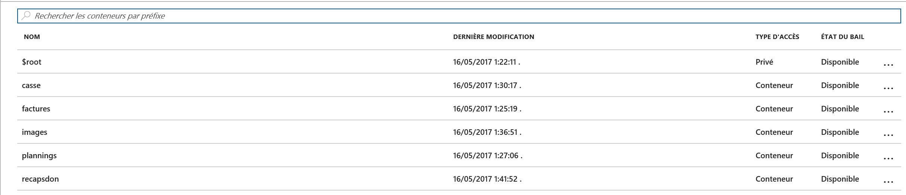


Then we used AzCopy for each folder to move to Azure:

```powershell
AzCopy /Source:D:\BackupLocation\images /Dest:https://account_name.blob.core.windows.net/images /DestKey:AZURE_STORAGE_ACCOUNT_KEY /S
```

## Conclusion ##

During this three days hackfest, we collaborated with Comerso to migrate their existing applications to Azure platform services and especially Azure App Services, SQL Azure Database, Azure Redis Cache and Azure Storage.

We also worked to enable a continuous delivery pipeline to make sure that the applications are deployed each time a new update is done in the source code, thanks to Visual Studio Team Services.

Migrating an existing solution into Azure App Service is not a huge amount of work or a full rewrite work. It's more about "lift & shift". You should deal with some issues like file system storage, in memory session etc., but moving from on premises to cloud environment is a rather simple task when steered carefully and using the various tools and services available in the Microsoft Azure environment.

A word from Steeve, CTO of Comerso:

*"Microsoft has clearly helped Comerso to initiate a huge project of migrating all the applications from our current production hosting service to Azure. Starting from scratch, without any knowledge about Azure was not a comfortable approach but thanks to David Coppet, Julien Corioland and other Microsoft people, I have understood all I needed in only 3 days and I’m now able to manage this from my own. Even after the workshop, they are available to answer to any questions and Microsoft service is also reactive. The community is full of examples and it’s easy to find any other resources or information.* 

*A really great experience, and I’ve been welcomed very well, thanks !"*


## Additional resources ##

Please find below additional resources that may be useful if you plan to migrate your existing web applications to Azure platform services:

- [SQL Server database migration to Azure SQL Database](https://docs.microsoft.com/en-us/azure/sql-database/sql-database-cloud-migrate)
- [Transfer data with the AzCopy Command-Line Utility](https://docs.microsoft.com/en-us/azure/storage/storage-use-azcopy)
- [Migrate an enterprise web app to Azure App Service](https://docs.microsoft.com/en-us/azure/app-service-web/web-sites-migration-from-iis-server)
- [ASP.NET Session State Provider for Azure Redis Cache](https://docs.microsoft.com/en-us/azure/redis-cache/cache-aspnet-session-state-provider)
- [Get Started with Azure Blob storage using .NET](https://docs.microsoft.com/en-us/azure/storage/storage-dotnet-how-to-use-blobs)