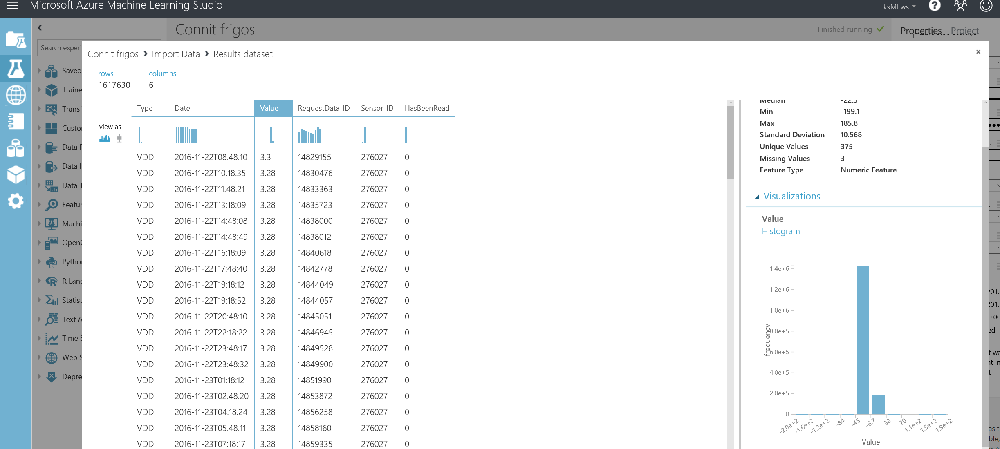

# IoT and Machine Learning hackfest with Connit #

Microsoft has partnered with Connit during a two-days hackfest. The goal was to help them to improve how they are using the data collected every day by connected objects using technologies like Azure IoT Hub, Stream Analytics, Data Lake and Machine Learning.

### Core team ###

- Erwann Mivielle, Connit, CEO
- Ludovic Sainmont, Connit, IT Manager
- Pierric Cistac, Connit, Developer
- Alex Danvy, Technical Evangelist, Microsoft France (@danvy)
- Benjamin Guinebertière, Technical Evangelist, Microsoft France (@benjguin)
- Aleksander Callebat, Technical Evangelist, Microsoft France
- Julien Corioland, Technical Evangelist, Microsoft France (@jcorioland),
- Jean-Sébastien Dupuy, Technical Evangelist, Microsoft France (@dupuyjs)
- Arnaud Fontaine, Partner Business Evangelist, Microsoft France

## Customer Profile ##

[Connit](http://www.connit.com/en/) is a pioneer of autonomous IoT solutions. They use next generation long range networks such as Sigfox or LoRaWAN. This expertise allows them to create efficient solutions that respects economical, technical or security constraints related to their customer4s environment.
Up to now, they have already connected more than 60 000 spots with their modules and their Live M2M IoT platform deals with more than 25 millions of IoT signals per month.

All this data allows them to develop the best algorithms to optimize processes.

Connit was born thanks to several complementary skills : electronic, on board computer, data platform, international development, organization, data marketing and user experience. This unique association allows them to provide a one-of-a-kind service.

They offer a special solution for marketplaces and adapt it to special needs. They help customers during all the steps and take into account all parts of their project, both opportunities and constraints :
- they participate to the user service analysis
- they conceive et realize the module and the on board software
- they optimize the network connection
- they store and handle the information
- they set up the data visualization and predictive algorithms

They create value in their customer's IoT project.

We spend some time in the past months to dicuss and elaborate Connit's new architecture. Moving from on premise Windows Server, SQL Server, IIS solution to the Cloud is not an easy task. Connit engineering team decided to build a whole new solution in Azure using PaaS components for several reasons :

- Scalability : A few years ago, customers were asking to connect hundreds of devices. Today, they need thounds if not millions of devices. With cheap communication cost, those devices generate huge streams of data. The platform has to deal with such demand.
- Security : With recent bad publicity about hacked devices, everybody now has security concerns in mind. Customers need a secured solution from devices to Cloud. Using Sigfox as the communication protocol makes it very difficult to hack the system in the field. Then, the Microsoft Azure connector to IoT Hub uses HTTPS with additional SAS token ensure that the data is pushed securly in Azure. Connit cloud platform uses every good practrice and tools available on Azure to garantee a very high level of security of the services themselves.
- Time to market : With the help of a flexible platform like Azure, Connit experts was able to build a new powerful IoT platform in reasonnable timeframe. They're ready to take new business opportunities.
- Feature rich platform : Modern IoT platforms need more than data collection and basic aggregation. Customers want their data to become valued information. Business Intelligence and Machine Learning open a new area of possibilities

Key components like the [Sigfox to Azure IoT Hub connector](https://danvy.tv/push-your-sigfox-devices-data-to-azure-iot-hub/), Azure SQL Database and App Service.

As the core architecture was running, it was time for Connit to go to the next level.
 
## Problem statement ##


While building their multipurpose ready-to-use IoT platform for smart metering, Connit were facing some challenges trying to solve some value added features asked by their customers.

Here are the 3 problems we focused on during the hackfest: 

- Create alerts based on user defined rules applied to near realtime message stream   
- Provide a 24/7 virtual assistant to ease user interactions when alerts occure
- Detect proactively when alerts will be raised or when devices are going out of service

One good scenario covered by the Connit platform is the case of connected freezers.

Connected freezers in retail shops have to be continuously monitored to ensure sanitary compliance. Freezers are equiped with sensors to regularly send their temperature, power conditions, baterry level, etc.). All this data can be encoded in a few bytes sent to the Cloud thru a LPWAN network like Sigfox or LoRaWAN.
Customers want to be alerted as soon as possible when temperature is out of range and a clear understanding of what's going on with their device. Of course, being able to be warned before the situation occure would be a real competitive advantage.


## Solution and steps ##

Architecture was discussed before starting to write some code. There are two versions of the architecture: what could be achieved during the hackfest and what could be done in the future. 

Before that, we did some sketching: 


### What was done


Here is a decsription of the diagram, from left to right, bottom to top.

Technology | description
-----------|------------
IoT Hub    | Connit already have the connection between their newest devices and IoT Hub.
Web App    | A web job takes data from IoT Hub and decodes the frames. The frames were sent thru Sigfox which provides very low costs provided that you sent very small frames. The way frames are encoded is described in XML. Once frames are decoded, they are sent to an Event Hub. 
Event Hub  | it contains decoded frames as well as other metadata in JSON format so that it can be easily managed in Stream Analytics.
Stream Analytics | A first Stream Analytics job copy all the data to storage blob
Storage Blob | It plays the role of a data lake where all decoded data is stored. This allows to have smaller databases as old data can be removed; it can be copied back to databases as needed from the data lake (implemented as blob storage). 
Machine Learning | This is where we learn from temperature history, in order to predict when to defrost freezers
Stream Analytics | Another Stream Analytics job send alerts based on some conditions. When an alert is created, it is sent to a service bus queue
Service Bus Queue | it contains alerts that will trigger a function call
Web Jobs | Users can define complex rule to fire alerts. Web Jobs are used to run the rule engine and send various notifications
Azure SQL Database | It contains the latest alert status. The alert is first created and additional details are provided by the chat bot that asks additional questions to customer. For instance, does the temperature given in the alert corresponds to the reality?
Chat Bot | It enriches the alerts details and updates the database

### Future possible enhancements


Azure Stream Analytics provides low latency alerts based on reference data that does not change often. Connit needs this type of alerts.

 Connit also need other alerts that are based on customer parameters that can change very often. These alerts can be based on data not older than 24 hours. In order to have a lot of flexibility in the way thos alerts are expressed, latest 24 hours events can be stored in a database. DocumentDB seems to be a very good fit for that use case. 

The alerts are calculated from a Web job (Web App) that can also call Machine Learning API. 

 For data analysis based on all the events stored in blob storage, an engine like Data Lake Analytics is a good fit. This can transform raw data into specialized datasets which are the results of U-SQL queries. These specialized datasets can contain the average number of data points sent by day and by type of device, or data that can be loaded in a SQL or NoSQL database for one purpose or another. 

Once an alert is triggered from the Web job connected to Azure ML and DocumentDB or the Azure function, it can be pushed to Logic App that can leverage connectors like Twilio to notify user.


## Technical delivery ##

Let's come back to the first architecture diagram because this the one we actually experimented. 


### Choose some components

#### Azure Blob storage vs Azure Data Lake Store

A general documentation on the difference between the two is [Comparing Azure Data Lake Store and Azure Blob Storage](https://docs.microsoft.com/en-us/azure/data-lake-store/data-lake-store-comparison-with-blob-storage).

Price per TB per month is [$22 for blob storage](https://azure.microsoft.com/en-us/pricing/details/storage/blobs/) and [$39 for data lake store](https://azure.microsoft.com/en-us/pricing/details/data-lake-store/).

Azure Data Lake Analytics and Azure Stream Analytics can work on both storages. The enhanced features of data lake store may not be used in the short term and it is possible to copy data from blob to data lake store in case of a need. 
Also, blob is available in more regions. 
So, the scenario will use Azure blob storage. 

#### near real time processing engine

Azure Stream Analytics seems a good fit. 
Connit wants to leverage PaaS components when possible. Also, there is a need to have time windows based on timestamps that are part of the payload. As shown in project [boontadata-paas](https://github.com/boontadata/boontadata-paas), Azure Stream Analytics can do that with very good functional results. 

### data

Here is some sample payload (1 message), after it has been decoded and sent to Event Hub: 

```json
{"metadata":{},"data":{"modemId":"001A90B7","frame":"0247308b48b58b48b700","modemType":"Sigfox","time":"1489078336","signal":"6.0","decodedFrame":{"Sensors":[{"RawValue":"2","Name":"Vproto","Computation":null,"Type":"Vproto","TimeShift":null,"IsAlert":0},{"RawValue":"2","Name":"CompteurTournant","Computation":null,"Type":"CompteurTournant","TimeShift":null,"IsAlert":0},{"RawValue":"7","Name":"Vdd","Computation":"{Vdd} * 0.1 + 1.8","Type":"Vdd","TimeShift":null,"IsAlert":0},{"RawValue":"48","Name":"Tmin","Computation":"({Tmin} * 1) - 30","Type":"Tmin","TimeShift":null,"IsAlert":0},{"RawValue":"2228","Name":"ExtTraw1","Computation":"{ExtTraw1} * 0.1 -200","Type":"ExtTraw1","TimeShift":null,"IsAlert":0},{"RawValue":"2229","Name":"ExtTmean1","Computation":"{ExtTmean1} * 0.1 -200","Type":"ExtTmean1","TimeShift":null,"IsAlert":0},{"RawValue":"2228","Name":"ExtTmin1","Computation":"{ExtTmin1} * 0.1 -200","Type":"ExtTmin1","TimeShift":null,"IsAlert":0},{"RawValue":"2231","Name":"ExtTmax1","Computation":"{ExtTmax1} * 0.1 -200","Type":"ExtTmax1","TimeShift":null,"IsAlert":0},{"RawValue":"0","Name":"Sd1","Computation":"Sqrt({Sd1} / 100)","Type":"Sd1","TimeShift":null,"IsAlert":0}],"Parameters":[],"EquipmentId":"586a656b-b413-4c3b-a8c6-b72be8069ae7","EquipmentType":29,"VersionProtocol":2},"computedSensors":[]},"id":"5f6e0768-2a98-48fb-8ee1-1e8dd8ece197","EventProcessedUtcTime":"2017-03-09T17:43:54.4734901Z","PartitionId":1,"EventEnqueuedUtcTime":"2017-03-09T16:52:21.5070000Z"}
```

once reformated: 

```json
{
    "metadata":{},
    "data":
    {
        "modemId":"001A90B7",
        "frame":"0247308b48b58b48b700",
        "modemType":"Sigfox",
        "time":"1489078336",
        "signal":"6.0",
        "decodedFrame":
        {
            "Sensors":
            [
                {"RawValue":"2","Name":"Vproto","Computation":null,"Type":"Vproto","TimeShift":null,"IsAlert":0},
                {"RawValue":"2","Name":"CompteurTournant","Computation":null,"Type":"CompteurTournant","TimeShift":null,"IsAlert":0},
                {"RawValue":"7","Name":"Vdd","Computation":"{Vdd} * 0.1 + 1.8","Type":"Vdd","TimeShift":null,"IsAlert":0},
                {"RawValue":"48","Name":"Tmin","Computation":"({Tmin} * 1) - 30","Type":"Tmin","TimeShift":null,"IsAlert":0},
                {"RawValue":"2228","Name":"ExtTraw1","Computation":"{ExtTraw1} * 0.1 -200","Type":"ExtTraw1","TimeShift":null,"IsAlert":0},{"RawValue":"2229","Name":"ExtTmean1","Computation":"{ExtTmean1} * 0.1 -200","Type":"ExtTmean1","TimeShift":null,"IsAlert":0},{"RawValue":"2228","Name":"ExtTmin1","Computation":"{ExtTmin1} * 0.1 -200","Type":"ExtTmin1","TimeShift":null,"IsAlert":0},{"RawValue":"2231","Name":"ExtTmax1","Computation":"{ExtTmax1} * 0.1 -200","Type":"ExtTmax1","TimeShift":null,"IsAlert":0},{"RawValue":"0","Name":"Sd1","Computation":"Sqrt({Sd1} / 100)","Type":"Sd1","TimeShift":null,"IsAlert":0}
            ],
            "Parameters":[],
            "EquipmentId":"586a656b-b413-4c3b-a8c6-b72be8069ae7",
            "EquipmentType":29,
            "VersionProtocol":2
        },
        "computedSensors":[]
    },
    "id":"5f6e0768-2a98-48fb-8ee1-1e8dd8ece197",
    "EventProcessedUtcTime":"2017-03-09T17:43:54.4734901Z",
    "PartitionId":1,
    "EventEnqueuedUtcTime":"2017-03-09T16:52:21.5070000Z"
}
```

Before generating only alerts, we test some aggregations on temperatures with time windows in Stream Analytics.

The SQL Database will receive this first test into the following table: 

```sql
CREATE TABLE [dbo].[AverageTemperature] (
    [equipmentId] NVARCHAR (50) NOT NULL,
    [windowtime]  DATETIME      NOT NULL,
    [modemId]     NVARCHAR (50) NOT NULL,
    [AvgTemp]     FLOAT (53)    NOT NULL,
    CONSTRAINT [PK_AverageTemperature] PRIMARY KEY CLUSTERED ([equipmentId] ASC, [windowtime] ASC)
);
```

One requirement is to have time windows based on time in the messages, not processing time.
Sample SQL in Azure Stream Analytics can be found as part of the project boontadata-paas: <https://github.com/boontadata/boontadata-paas/blob/master/code/paas-artifacts/StreamAnalytics/query.sql>

based on this and other documentation, the following SQL query is written in Stream Analytics:

```sql
WITH SensorDecodedFrames AS
(
    SELECT 
        decodedEH.data.decodedFrame.EquipmentId as equipmentId, 
        decodedEH.data.modemId as modemId,
        sensorsArrayElement.ArrayIndex as sensorIndex, 
        sensorsArrayElement.ArrayValue as sensor
    FROM decodedEH TIMESTAMP BY DATEADD(second, decodedEH.data.time, '1970-01-01T00:00:00Z')
    CROSS APPLY GetArrayElements(decodedEH.data.decodedFrame.Sensors) AS sensorsArrayElement
)
SELECT
    equipmentId, 
    modemId, 
    System.TimeStamp AS windowtime, 
    AVG(CAST(sensor.RawValue AS FLOAT)*0.1-200) AS AvgTemp
INTO AverageTemperature
FROM SensorDecodedFrames
WHERE sensor.Name = 'ExtTraw1'
GROUP BY equipmentId, modemId, TumblingWindow(minute, 15)
```

This generates the sample result in the database: 

```
SELECT * FROM dbo.AverageTemperature ORDER BY 1, 2

586a656b-b413-4c3b-a8c6-b72be8069ae7	2017-03-09 08:00:00.000	001A90B7	23
586a656b-b413-4c3b-a8c6-b72be8069ae7	2017-03-09 08:15:00.000	001A90B7	23.1
586a656b-b413-4c3b-a8c6-b72be8069ae7	2017-03-09 08:30:00.000	001A90B7	23.25
586a656b-b413-4c3b-a8c6-b72be8069ae7	2017-03-09 08:45:00.000	001A90B7	23.6
586a656b-b413-4c3b-a8c6-b72be8069ae7	2017-03-09 09:00:00.000	001A90B7	24.05
586a656b-b413-4c3b-a8c6-b72be8069ae7	2017-03-09 09:15:00.000	001A90B7	24.3
586a656b-b413-4c3b-a8c6-b72be8069ae7	2017-03-09 09:30:00.000	001A90B7	24.5
586a656b-b413-4c3b-a8c6-b72be8069ae7	2017-03-09 09:45:00.000	001A90B7	24.55
586a656b-b413-4c3b-a8c6-b72be8069ae7	2017-03-09 10:00:00.000	001A90B7	24.7
586a656b-b413-4c3b-a8c6-b72be8069ae7	2017-03-09 10:15:00.000	001A90B7	24.85
586a656b-b413-4c3b-a8c6-b72be8069ae7	2017-03-09 10:30:00.000	001A90B7	25.1
586a656b-b413-4c3b-a8c6-b72be8069ae7	2017-03-09 10:45:00.000	001A90B7	25.35
586a656b-b413-4c3b-a8c6-b72be8069ae7	2017-03-09 11:00:00.000	001A90B7	25.6
586a656b-b413-4c3b-a8c6-b72be8069ae7	2017-03-09 11:15:00.000	001A90B7	25.8666666666667
586a656b-b413-4c3b-a8c6-b72be8069ae7	2017-03-09 11:30:00.000	001A90B7	26.1
586a656b-b413-4c3b-a8c6-b72be8069ae7	2017-03-09 11:45:00.000	001A90B7	25.75
586a656b-b413-4c3b-a8c6-b72be8069ae7	2017-03-09 12:00:00.000	001A90B7	25.7
586a656b-b413-4c3b-a8c6-b72be8069ae7	2017-03-09 12:15:00.000	001A90B7	25.61
```

NB: in this sample dataset, temperatures are not normal freezer temperatures. Then, we generated an alert on temperatures > 25.75°C that corresponds to 2 records in the calculated averages above. More realistic alerts would be for temperatures > -20°C or < -30°C.

The Stream Analytics SQL query is modified to do 2 things: 
- generate only alerts when average temperature is too high
- send alerts in service bus queue, not the database

```sql
WITH SensorDecodedFrames AS
(
    SELECT 
        decodedEH.data.decodedFrame.EquipmentId as equipmentId, 
        decodedEH.data.modemId as modemId,
        sensorsArrayElement.ArrayIndex as sensorIndex, 
        sensorsArrayElement.ArrayValue as sensor
    FROM decodedEH TIMESTAMP BY DATEADD(second, decodedEH.data.time, '1970-01-01T00:00:00Z')
    CROSS APPLY GetArrayElements(decodedEH.data.decodedFrame.Sensors) AS sensorsArrayElement
)
SELECT
    equipmentId, 
    modemId, 
    System.TimeStamp AS windowtime, 
    AVG(CAST(sensor.RawValue AS FLOAT)*0.1-200) AS AvgTemp
INTO alertQueue
FROM SensorDecodedFrames
WHERE sensor.Name = 'ExtTraw1'
GROUP BY equipmentId, modemId, TumblingWindow(minute, 15)
HAVING AVG(CAST(sensor.RawValue AS FLOAT)*0.1-200) > 25.75
```

the 2 alerts are received by the Azure function: 


```
2017-03-10T11:41:18.805 Function started (Id=1bc18125-a9bc-4589-a502-e25f6573b248)
2017-03-10T11:41:18.805 C# Queue trigger function processed: {"equipmentid":"586a656b-b413-4c3b-a8c6-b72be8069ae7","modemid":"001A90B7","windowtime":"2017-03-09T11:15:00.0000000Z","avgtemp":25.866666666666674}
2017-03-10T11:41:18.805 Function completed (Success, Id=1bc18125-a9bc-4589-a502-e25f6573b248)
2017-03-10T11:41:18.805 Function started (Id=087d15db-d04f-464f-ad36-7dce876abcb4)
2017-03-10T11:41:18.805 C# Queue trigger function processed: {"equipmentid":"586a656b-b413-4c3b-a8c6-b72be8069ae7","modemid":"001A90B7","windowtime":"2017-03-09T11:30:00.0000000Z","avgtemp":26.100000000000023}
2017-03-10T11:41:18.805 Function completed (Success, Id=087d15db-d04f-464f-ad36-7dce876abcb4)
```

The Azure function has code that inserts the alert into a SQL Database and calls whatever is needed to push the alert to the correct user so that user can enter the conversation with the chat bot with the alertId as a correlation Id. 

Here is the code for the Azure function: 

run.csx

```csharp
using System;
using Newtonsoft.Json;
using Newtonsoft.Json.Linq;
using System.Data.SqlClient;

public static void Run(string alertmessage, TraceWriter log)
{
    string connectionString = @"Server=tcp:hf1703sqldbsrv.database.windows.net,1433;Initial Catalog=hf1703asqldb;Persist Security Info=False;User ID=hf1703;Password=KLcdbebn39§§;MultipleActiveResultSets=False;Encrypt=True;TrustServerCertificate=False;Connection Timeout=30;";
    Guid alertId = Guid.NewGuid();

    dynamic message = JsonConvert.DeserializeObject(alertmessage);
    string description = $"equipment {message.equipmentid} (modem {message.modemid}) has had an average temperature of {message.avgtemp}°C for the last 15 minutes ending on {message.windowtime} GMT";

    using (var cn = new SqlConnection(connectionString))
    {
        cn.Open();
        using (var cmd = new SqlCommand("INSERT INTO Alert (Id, description) values (@Id,@description)", cn))
        {
            var p1 = new SqlParameter("Id", System.Data.SqlDbType.UniqueIdentifier);
            p1.Value = alertId;
            cmd.Parameters.Add(p1);

            var p2 = new SqlParameter("description", System.Data.SqlDbType.NVarChar);
            p2.Value = description;
            cmd.Parameters.Add(p2);

            cmd.ExecuteNonQuery();
        }
    }

    log.Info($"New Alert: {alertId} (this log could be replaced in C# by any call to the right push mechanism.");
}
```

Project.json (cf <http://stackoverflow.com/questions/36411536/how-can-i-use-nuget-packages-in-my-azure-functions>)

```json
{
  "frameworks": {
    "net46":{
      "dependencies": {
        "Newtonsoft.Json": "9.0.1",
        "System.Data.Common": "4.3.0",
        "System.Data.SqlClient": "4.3.0"
      }
    }
   }
}
```

the database has the following table schemas: 

```sql
CREATE TABLE [dbo].[Alert] (
    [Id]                 UNIQUEIDENTIFIER NOT NULL,
    [description]        NVARCHAR (1024)  NOT NULL,
    [LastUpdateDateTime] DATETIME         DEFAULT (getdate()) NOT NULL,
    [botStatus]          INT              DEFAULT ((0)) NOT NULL,
    CONSTRAINT [PK_Alert] PRIMARY KEY CLUSTERED ([Id] ASC)
);

CREATE TABLE [dbo].[AlertDetails] (
    [Id]                 UNIQUEIDENTIFIER NOT NULL,
    [AlertId]            UNIQUEIDENTIFIER NOT NULL,
    [description]        NVARCHAR (1024)  NOT NULL,
    [LastUpdateDateTime] DATETIME         DEFAULT (getdate()) NOT NULL,
    CONSTRAINT [PK_AlertDetails] PRIMARY KEY CLUSTERED ([Id] ASC)
);
```

Putting it all together: 


Here is the Azure function log in text form: 

```
2017-03-10T14:18:35.984 Function started (Id=03953f29-c015-46df-96ee-6cd32b35a046)2017-03-10T14:18:36.000 Function started (Id=8e3cd897-00c9-418b-949a-e72bd1b0756a)2017-03-10T14:18:36.125 New Alert: 05cf5f32-c335-4cc0-967d-8616d7b39399 (this log could be replaced in C# by any call to the right push mechanism.
2017-03-10T14:18:36.125 Function completed (Success, Id=03953f29-c015-46df-96ee-6cd32b35a046)2017-03-10T14:18:36.156 New Alert: 5f56c72a-8fd6-44e9-87ff-8e6465016182 (this log could be replaced in C# by any call to the right push mechanism.
2017-03-10T14:18:36.156 Function completed (Success, Id=8e3cd897-00c9-418b-949a-e72bd1b0756a)
```

Once the Azue function has run, in the SQL Database, we have: 

```sql
SELECT * FROM Alert 
WHERE Id IN (
	'05cf5f32-c335-4cc0-967d-8616d7b39399', 
	'5f56c72a-8fd6-44e9-87ff-8e6465016182'
)
```

Id |	description |	LastUpdateDateTime |	botStatus
-|-|-|-
05CF5F32-C335-4CC0-967D-8616D7B39399 |	equipment 586a656b-b413-4c3b-a8c6-b72be8069ae7 (modem 001A90B7) has had an average temperature of 25.8666666666667°C for the last 15 minutes ending on 3/9/2017 11:15:00 AM GMT	| 2017-03-10 14:18:35.547	| 0
5F56C72A-8FD6-44E9-87FF-8E6465016182	| equipment 586a656b-b413-4c3b-a8c6-b72be8069ae7 (modem 001A90B7) has had an average temperature of 26.1°C for the last 15 minutes ending on 3/9/2017 11:30:00 AM GMT	| 2017-03-10 14:18:35.610	| 0

Then this alert will be updated by the chat bot which will change the botStatus and add alertDetails.

### Chat Bot

Connit have some awesome ideas around chatbots and wanted to experiment the possibilities of the **Microsoft Bot Framework**. 

They need their chat to be available on every platform, to answer 24/7 and have enough flexibility to cover various scenarios of the customer's life.

Some technical considerations :

Proof of concept has been created in Node.js using [Microsoft Bot Framework] (https://docs.botframework.com/en-us/node/builder/overview) and [Bot Framework Emulator](https://docs.botframework.com/en-us/tools/bot-framework-emulator).

An interesting challenge is to notify the user proactively depending on specific context. For this purpose, we created a specific GET endpoint listening on http://[::]:3978/api/notification ; each time this Url is called with an 'id' query string - bot starts a new dialog with the user. The main code logic is explained in the following code. 

```cs
var restify = require('restify');
var builder = require('botbuilder');

//=========================================================
// Bot Setup
//=========================================================

// Setup Restify Server
var server = restify.createServer();
server.use(restify.queryParser());

server.listen(process.env.port || process.env.PORT || 3978, function () {
   console.log('%s listening to %s', server.name, server.url); 
});

// Create chat bot
var connector = new builder.ChatConnector({
    appId: process.env.MICROSOFT_APP_ID,
    appPassword: process.env.MICROSOFT_APP_PASSWORD
});

var bot = new builder.UniversalBot(connector);
server.post('/api/messages', connector.listen());

var savedAddress;
// Endpoint to deliver a notification
server.get('/api/notification', (req, res, next) => {
    startProactiveDialog(savedAddress, req.query.id);
    res.send('triggered');
    next();
  }
);

//=========================================================
// Bots Dialogs
//=========================================================

// initiate a dialog proactively 
function startProactiveDialog(address, id) {
  bot.beginDialog(address, "*:/proactiveDialog", id);
}

bot.dialog('/proactiveDialog', [
    function (session, args, next) {
        session.send("Hello %s, let's try to help you", args);

        [...] // waterfall pattern to ask different questions

        session.endDialog();
    }
]);

[...]
```

Note: savedAdress variable has been previously initialize with session.message.address. This architecture is just for demo purpose and works with only one unique user. Next step is to store user's id and adress in an external storage and have full push notification service mechanism in addition to this logic.

Then we use a traditional [waterfall pattern](https://docs.botframework.com/en-us/node/builder/chat/dialogs/) to ask questions to the user. The full user scenario (questions) was not completed in the hackathon timeframe, so we just added some demo questions for testing purpose. Goal was also to retrieve also data on Sql database from node.js - a TDS node module named [tedious](https://github.com/tediousjs/tedious) has been used for this purpose. 

We finally published our demo bot service on a **Azure** (with App Service) then registered the Url on [Bot Connector](https://dev.botframework.com/bots) to create an instance of the Web Chat control ; and test it ! Adding a reference on the control can be done easily with a simple iframe (Note: There is other options to instantiate the control but this one is the easiest one). 

```html
 <iframe src='https://webchat.botframework.com/embed/myconnitbot?s=YOUR_SECRET_HERE'></iframe>
```

Future steps :

It was just a basic architecture and initiation to the main concepts, next steps for Connit is now to work on scenarios and user experience.

### Machine learning

*Note: the following describes the Machine Learning solution we have worked on with Connit. The implementation has been customized for Connit solution so it may not be used as is on any of your solutions.*

The Connit team had no expertise in Machine learning so far, thus the hackfest was the perfect occasion to showcase the value they could extract from the data they brought. In this regard, AzureML was used as a nice framework to implement the whole data science process and get rather quickly a few results.

Two works have been done with the AzureML Studio and a little bit of powerBI ; the first one was mostly about exploring the data of the freezers, integrated to the related work in the hackthon. There was also a second ML work on another subject interesting Connit, where we could do regression on the life expectancy of gas bottles.

 

The first Data consisted of 1.6 millions of rows with temperatures of 458 freezers. The temperatures usually ranged from -30 to -20, which is the normal behaviour, but would sometime go above the -20 threshold due to two possible causes :

1. The temperature would arise above -20 and up to room temperature due to a thawing for maintenance purposes. This would be a wanted behaviour and no need for alert shall arise.
2. The temperature would oscillate above -20 because of a defect in the quality of the Freezers. This was observed to be a recurrent behaviour proper to a few freezers.

Beyond those insights that we could gather, we notably mentionned the time series anomaly detection as a good candidate to differenciate both behaviours. 

 


In this picture, one can see the global path followed exploring the data : starting from the original data, we would modify the data to get a new point of view on those. We used mostly sql transformation due to its fast computation time. 
The first queries were about grouping by sensor type, then grouping by freezer, then filter abnormal values, and then we used a python script to create new indicators, detect local minima/maxima, which led us to being able to detect the cycles with which a freezer function, and analyse the problem not as a succession of temperature values but as a succession of cycles with a maxima and a period.

```python
# The script MUST contain a function named azureml_main
# which is the entry point for this module.

# imports up here can be used to 
import pandas as pd

# The entry point function can contain up to two input arguments:
#   Param<dataframe1>: a pandas.DataFrame
#   Param<dataframe2>: a pandas.DataFrame
def azureml_main(dataframe1 = None, dataframe2 = None):

# Execution logic goes here
print('Input pandas.DataFrame #1:\r\n\r\n{0}'.format(dataframe1))
pic=[0 for k in range(len(dataframe1['Value']))]
creux=[0 for k in range(len(dataframe1['Value']))]
amplitude=[0 for k in range(len(dataframe1['Value']))]
for k in range(1,len(dataframe1["Value"])-1):
    amplitude[k]=dataframe1['Value'][k]-dataframe1['Value'][k-1]
    if dataframe1["Value"][k]>=max(dataframe1['Value'][k+1],dataframe1['Value'][k-1]):
        pic[k]=1
    else :
        if dataframe1["Value"][k]<=min(dataframe1['Value'][k+1],dataframe1['Value'][k-1]):
            creux[k]=1
dataframe1["est_un_pic"]=pic
dataframe1["est_un_creux"]=creux
# If a zip file is connected to the third input port is connected,
# it is unzipped under ".\Script Bundle". This directory is added
# to sys.path. Therefore, if your zip file contains a Python file
# mymodule.py you can import it using:
# import mymodule

# Return value must be of a sequence of pandas.DataFrame
return dataframe1, 
```

With this new approach, we were able to gather the above insights with a higher precision. On the bottom right, the ML algorithms are there mainly with an educationnal purpose, as they are detecting something that a threshold function would be able to detect.

Then we focused on another work, not directly linked to  the freezer subject, but where a Machine Learning approach was quickly able to bring in some value.

In this second work, we predicted the estimated time before the gas bottle of a restaurant would empty. Although the amount of data was yet quite small (the buisiness was launched not long ago), the potential of a ML approach was demonstrated : based on only 600 rows, we were able to predict that event within a frame of 3 days. 
The considered features included the date, the alerts, and a good amount of feature engineering.

This was done with a regression model, as well as a faire amount of feature engineering. As for the model per se, after a few comparisons, a poisson regression was observed as yielding the best results -however surprising that might seem. As for the feature engineering, we mostly worked on the day of the week indicator, as it would intuitively be quite relevant to predict the consumption of a restaurant. The improvements it yielded were however quite small.

Obvious next steps include taking into account new data, be it rows as well as columns - an idea was to take into account factors such as the size of the restaurant, the external temperature, and an indicator of holidays.


> Ludovic Sainmont (Connit): Machine Learning is so impressive. Possibilitioes are endless. Azure ML already gives us great power without high data science skills yet.
 


## Conclusion ##

Together, we were able to find effective solutions to the submitted problems.

We found several ways to manage the alerts. It was interesting to see that based on the type of alerts, more than one technique could be use: 
- low latency alerts on fixed business rules: Stream Analytics
- very flexible alert rules applied to the latest 24 hours: Web job + DocumentDB
- long term analysis to define new alert rules: Data Lake Analytics on top of the data lake (implemented as blob storage)

The Microsoft Bot Framework allowed the creation of an intelligent virtual assistant in not time, serving information to customers 24 hours a day, 7 days a week. 

With the help of Azure Machine Learning, Connit now has predictive features in their platform. A real game changer in the market.

> Erwann Mivielle (Connit) This Hackfest was a great way for Connit to save a lot of time building the next version of our platform and gain a competitive advantage on the market.

## Additional resources ##

The following resources where leveraged during the Hackfest, or can be leveraged afterwards: 

- [Stream Analytics Query Language Reference](https://msdn.microsoft.com/library/azure/dn834998)
- [Stream Analytics sample code](https://github.com/boontadata/boontadata-paas)
- [Azure Machine Learning workshop](https://github.com/DXFrance/AzureMLWorkshop)
- [A presentation on feature engineering (French)](https://drive.google.com/file/d/0BzrlDxVZWSUpSDlzdVZZYzJXQ28tU3EyM3lLaFhHd21hQ0R3/view)
