# Helpicto : Migrating to Xamarin forms to be availabe on all stores and all devices

[**Equadex**](http://www.equadex.net/) is a digital services company that has spread its business around several axes: software engineering, telecommunications and computer systems.  
**Equadex** is currently developing a Xamarin application called **Helpicto**, providing a solution to help children with autism to communicate more easily with their environment, based on **pictograms** and associated **keywords**.  
**Equadex** partnered **Microsoft** to be able to migrate their current application to Xamarin and implement a unified authentication model.  

Eventually, the project is developed using Xamarin, ASPT.NET, Azure App Services, Azure SQL Database and Cognitive Services.  

We are going to focus on the **Helpicto** application, developed with **Xamarin**:
- Migrating from a **UWP** proof of concept application to a full **Xamarin** application.
- Implementing a standalone **text to speech** method, allowing the application to read tutorials and images sequences.
- Implementing a **speech to text** method, allowing the application to select images, as a sequence, from a voice command.
- Migrating the **authentication** process, from an existing custom method to **Azure B2C authentication** mode, allowing the user to authenticate himself through social providers as well as from a local provider.

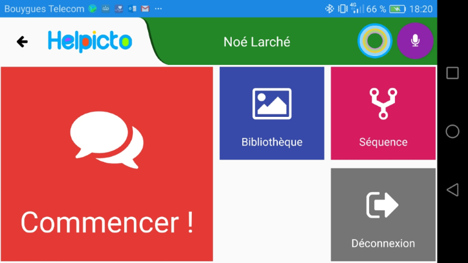 
 
For the HackFest, the whole team developing **Helpicto** was involved.  
Here is the list of the HackFest participants:

- [Anthony Allebee](https://twitter.com/) - Equadex CTO.
- [Yohan Guerin](https://www.linkedin.com/in/yohanguerin) - Equadex Xamarin specialist developer.
- [Thomas Belloc](https://www.linkedin.com/in/thomasbelloc) - Equadex embedded developer.
- [Mathieu Busolin](https://www.linkedin.com/in/mathieu-busolin-22796863) - Equadex Swiss Army knife developer.
- [Kevin Petit](https://github.com/kvpt) - Equadex full stack developer.
- [Sébastien Pertus](https://twitter.com/sebastienpertus) – Technical Evangelist, Microsoft France.

## Customer profile ##

**Equadex** is a French services company in IT engineering, and which activities are : computer systems, telecoms and software engineering.  
Over the last few years, the company has grown quickly. When it was created in 2007 the company had only 3 employees, compared to 43 today.  
The head office is located in Toulouse, and a new agency opened in Pamiers (Ariège) recently.  

With **Helpicto**, **Equadex** wants to position itself as an ISV on the global health sector.  
**Helpicto** is dedicated to people who suffers from Language Disorders related to autism, dysphasia or Alzheimer disease.  
The project is the result of a partnership between **Equadex** and **Carine Montoulan**, psychologist and director of the **Inpacts31 association** and the **John Bost foundation**, created in 1848, which welcomes more than **1,500 children**, adolescents and adults suffering from mental disorder or physical disability.  

After several months of intense work, a first version of the application was developed and based on this model, Microsoft came in as a real boost in the development phase, by implementing a strong and fast solution.  

**Equadex** has been using Microsoft Technologies since the beginning of its activity, and the team involved in the Helpicto project has strong skills in .Net, Xamarin and Azure as well.  

## Problem statement ##

**Helpicto** provides an innovative solution to help children with autism to communicate with their environment.  
To stay focused, a child with autism usually uses some specific pictograms, as a sequence, to recognize a situation, a question, or any other interactions.    

**Helpicto** uses [speech to text](https://azure.microsoft.com/en-us/services/cognitive-services/speech/) to generate a sentence.  
Then it uses [language understanding](https://www.luis.ai/) to categorize keywords.  

The final objective is to build a sequence that represents a specific situation:  

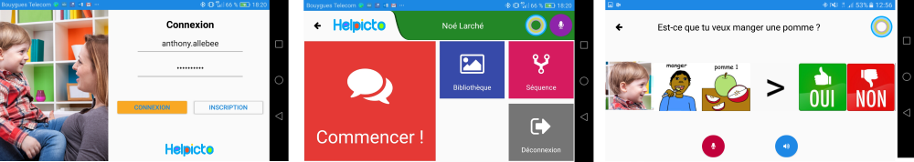  
*In this sample, the speech command is "Do you want to eat an apple?" **Helpicto** will then generate three images : The child himself, the  action of eating and a picture of an apple.*

The user experience should be intuitive, simple, and available from all **kind of mobile devices**, including Android, IPhone and Windows Phone:
- The user, a parent for example, uses the application **Helpicto** and sends a voice command for analysis.
- **Helpicto** gets the voice command, and uses **Speech to text** API to convert it into a sentence.
- **Helpicto** send this sentence to **LUIS**, then **LUIS** send the intents back to Helpicto.
- **Helpicto** gets the corresponding images for each keyword and show the result as an images sequence to the child.

Before the HackFest, the application was a POC (*proof of concept*) developed as a standalone UWP application.  
During the HackFest, we have migrated the application to **Xamarin** and then implemented all the services like **speech to text**, **text to speech** and **Azure B2C authentication**.
 
## Solution and steps ##

We divided the HackFest into 4 distinct parts, involving each member of the team depending on their skills:
- Migrating the current application from an UWP standalone application to a **Xamarin Forms** application. 
- Implementing a **Speech to text** service in the application using the native API from each mobile platform.
- Implementing a **Text to speech** service, calling the **Cognitive services** REST APIs. 
- Implementing the **Azure B2C Authentication** allowing the user to connect through different social providers.

### Migration from UWP to Xamarin Forms

Initially, **Helpicto** was developed as a *proof of concept* using the **UWP** application model.  
Since the team has strong skills in C#, we have decided to use **Xamarin Forms** to migrate the application so it would be available through all stores (Android, Apple and Windows).

The POC application's architecture was pretty much straightforward, involving a **Web API** as a backend service and a **UWP** application as the frontend client:  

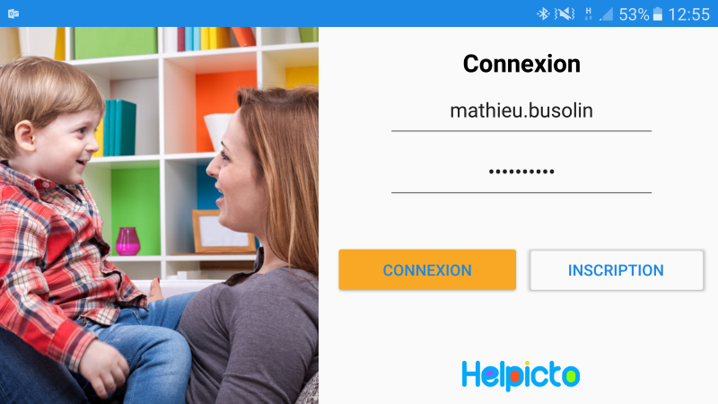  

The migration to **Xamarin** requiring a new architecture, was formalized like this:  

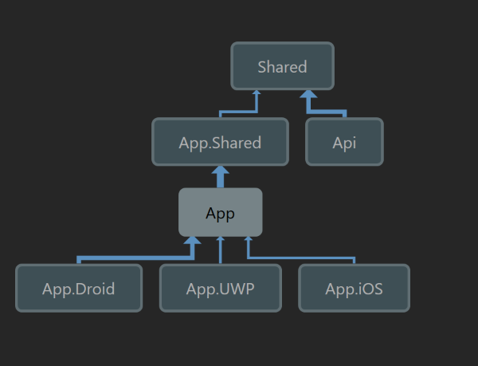

Eventually, the current applications is distributed like this:  

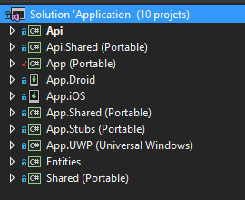

In a nutshell, here are the current distribution of every projects:

#### Web Backend:  
- **Api**: Web API project, FX 4.5, hosted in App Services.
- **Entities**: Database model, containing database first entities.

#### Xamarin:  
- **App.Shared**: Contracts, interfaces and services used by the Xamarin project.
- **App**: All the Xamarin forms views, view models, converters and customs controls.
- **App.Droid** / **App.iOS** / **App.UWP**: Xamarin forms application containing some specific renderers and all the entry points.

#### Shared:  
- **Shared** : Contains every entity shared by both the Xamarin solution and the Web API solution: Dto, Enumerations, Exceptions, Logger, LUIS models, and some Azure services helpers.

#### Feedback on the migration work

As a feedback, the team has made a quick and straightforward work to migrate all the entities, dto, and services successfully. 

The user interfaces, has been rewritten from UWP to Xamarin forms.  
All the Xamarin forms has been rewritten from **UWP** to **Xamarin forms**. This step was the longest part of the work, even though it was not a complex task.  

### Text to Speech

Eventually the user can launch a tutorial that will be "written and spoken" at the same time by the application.  
One of the requirement form the **Helpicto** team was to be able to launch the tutorials with potentially no internet connection.  
That's why we've decided to use the **native API** from each platform.  

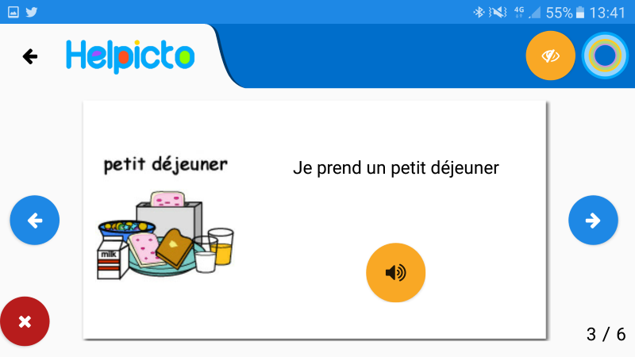

We have used a Xamarin plugin, written by [James Montemagno](http://motzcod.es/) called [TTS Plugin](https://github.com/jamesmontemagno/TextToSpeechPlugin)

Since we needed an *awaitable* version, we've used the **beta 3.0** version of the nuget package, available through **appveyor.com**: [https://ci.appveyor.com/nuget/texttospeechplugin](https://ci.appveyor.com/nuget/texttospeechplugin)

Using an *awaitable* version of the TTS plugin allowed us to *chain* sentences queued in a prepared dictionary.
Unfortunately, the Android version didn't work as expected. For instance, the second sentence, in the queue, was not played using the TTS plugin.

Until a new version of **TTS Plugin** is released, we've implemented a solution involving the **TTS plugin** for both **UWP** and **iOS** application and a native version for **Android**.

To achieve this in an elegant manner, we have created an interface, used in each project:

```csharp
namespace App.Shared.Services
{
    public interface ITextToSpeechService
    {
        Task Speak(string text);

        Task QueueSpeak(string text);

        Task Stop();
    }
}
```

The **TTS plugin** for **iOS** and **UWP** implementation was then pretty straightforward:

```csharp
public async Task Speak(string text)
{
    await CrossTextToSpeech.Current.Speak(text);
}
public async Task QueueSpeak(string text)
{
    await Speak(text);
}  
public async Task Stop()
{
   SpeechSynthesizer.StopSpeaking(AVSpeechBoundary.Immediate);
   await Task.CompletedTask;          
}
```

The Android version, relying on the native API **Android.Speech.Tts.TextToSpeech**, was quite more complicated:
Here is the full **Android** implementation that we have created:  

```csharp
using System;
using System.Collections.Generic;
using System.Threading.Tasks;
using Android.OS;
using Android.Speech.Tts;
using Java.Util;
using Xamarin.Forms;
using TextToSpeech = Android.Speech.Tts.TextToSpeech;

namespace App.Droid.Services
{
    public class TextToSpeechService : Java.Lang.Object, ITextToSpeechService, TextToSpeech.IOnInitListener
    {
        private TaskCompletionSource<bool> InitTaskCompletionSource { get; set; }
        private TaskCompletionSource<bool> SpeakTaskCompletionSource { get; set; }
        private TextToSpeech Speaker { get; set; }

        private AsyncLock AsyncLock { get; }
        private bool IsInitialized { get; set; }

        public TextToSpeechService(ILogService logService)
        {
            AsyncLock = new AsyncLock();
        }

        private async Task Init()
        {
            using (await AsyncLock.LockAsync())
            {
                if (IsInitialized)
                    return;

                InitTaskCompletionSource = new TaskCompletionSource<bool>();

                Speaker = new TextToSpeech(Forms.Context, this);

                IsInitialized = await InitTaskCompletionSource.Task.ConfigureAwait(false);
            }
        }

        public async Task Speak(string text)
        {
            if (!IsInitialized)
                await Init();

            using (await AsyncLock.LockAsync())
            {
                if (!IsInitialized)
                    return;

                SpeakTaskCompletionSource = new TaskCompletionSource<bool>();

                Speaker.SetOnUtteranceProgressListener(new ProgressListener(LogService, SpeakTaskCompletionSource));
                Speak(text, QueueMode.Flush);

                await SpeakTaskCompletionSource.Task.ConfigureAwait(false);
            }
        }

        public async Task QueueSpeak(string text)
        {
            if (!IsInitialized)
                await Init();
  
            if (!IsInitialized)
                return;

            Speak(text, QueueMode.Add);
        }

        private void Speak(string text, QueueMode queueMode)
        {
            string utteranceId = UUID.RandomUUID().ToString();

            if (Build.VERSION.SdkInt < BuildVersionCodes.Lollipop)
            {
                Dictionary<string, string> p = new Dictionary<string, string> { { TextToSpeech.Engine.KeyParamUtteranceId, utteranceId } };
                Speaker.Speak(text, queueMode, p);
            }
            else
            {
                Speaker.Speak(text, queueMode, Bundle.Empty, utteranceId);
            }
        }

        public async Task Stop()
        {
            if (!IsInitialized)
                return;
 
            using (await AsyncLock.LockAsync())
                Speaker?.Stop();
        }

        public void OnInit(OperationResult status)
        {
            switch (status)
            {
                case OperationResult.Success:
                    Speaker.SetLanguage(Locale.France);
                    InitTaskCompletionSource.TrySetResult(true);
                    break;
                case OperationResult.Error:
                case OperationResult.Stopped:
                    InitTaskCompletionSource.TrySetResult(false);
                    break;
                default:
                    throw new ArgumentOutOfRangeException(nameof(status));
            }
        }

        private class ProgressListener : UtteranceProgressListener
        {
            private TaskCompletionSource<bool> SpeakTaskCompletionSource { get; }

            public ProgressListener(TaskCompletionSource<bool> completionSource)
            {
                SpeakTaskCompletionSource = completionSource;
            }
            public override void OnDone(string utteranceId)
            {
                SpeakTaskCompletionSource?.SetResult(true);
            }
            public override void OnError(string utteranceId)
            {
                SpeakTaskCompletionSource?.TrySetResult(false);
           }
        }
    }
}
```

Actually the Helpicto team uses a dependency injection in the Xamarin application, called **SimpleInjector**.  

You can find more information about **SimpleInjector** here : [SimpleInjector getting started documentation](https://simpleinjector.readthedocs.io/en/latest/quickstart.html#getting-started)

We have then registered the service in each platform, using the dependency injector methods:

```csharp
public static void RegisterSingle<TContract, TResolve>() where TContract : class where TResolve : class, TContract
{
    Container.RegisterSingleton<TContract, TResolve>();
}

ResolverHelper.RegisterSingle<ITextToSpeechService, TextToSpeechService>();
```

Eventually, we have used our **Text to speech** implementation everywhere we needed it:

```csharp

// ITextToSpeechService service, injected with DI
ITextToSpeechService textToSpeechService;

// Constructor
public SpeakHandler(ITextToSpeechService textToSpeechService){
  this.textToSpeechService = textToSpeechService
}

// Queue all spoken sentences
private async Task SpeakNextStep()
{
    var hasMoreSequence = true;

    while (hasMoreSequence){
      hasMoreSequence = await ApiService.NewSequenceStep(CurrentSessionId, CurrentSequenceEtapeDto.Id, true);

      if (!hasMoreSequence){
        string endingSentence = $"Wonderful ! You finished your sequence : {CurrentSequenceDto.Title}";
        await textToSpeechService.Speak(endingSentence);
        return;
      }
      await textToSpeechService.Speak(CurrentSequenceDto.Title);
    }
}
```

**Speech to Text**

In the other hand, a user can invoke the speech to text functionality to generate images sequences:

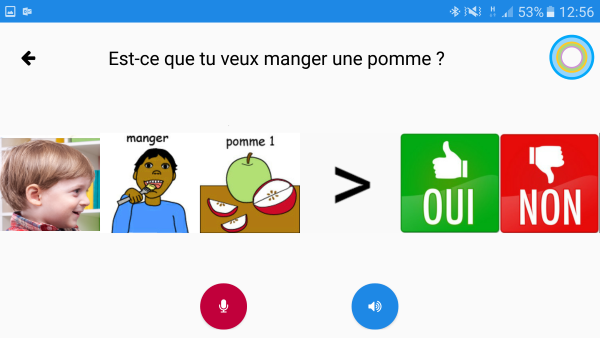  
*In this sample, the speech command is "Do you want to eat an apple?" **Helpicto** will then generate three images: The child himself, the  action of eating and a picture of an apple.* 

### Using Cognitives API REST

Actually, there is no available SDK encapsulating the REST call to Cognitive Services, for Xamarin.  

If you are creating a **UWP** application, you should use the current **C# Client SDK** available here: 
- Getting started with C# Client Library: [https://docs.microsoft.com/fr-fr/azure/cognitive-services/speech/getstarted/getstartedcsharpdesktop](https://docs.microsoft.com/fr-fr/azure/cognitive-services/speech/getstarted/getstartedcsharpdesktop)
- Github sample : [https://github.com/Azure-Samples/Cognitive-Speech-STT-Windows](https://github.com/Azure-Samples/Cognitive-Speech-STT-Windows)

Since we wanted to use the Cognitive Services Speech to Text from Xamarin, we used the available **REST APIs** :  
- Get Started with C# REST APIs: [https://docs.microsoft.com/fr-fr/azure/cognitive-services/speech/getstarted/getstartedrest](https://docs.microsoft.com/fr-fr/azure/cognitive-services/speech/getstarted/getstartedrest)

The actual **Helpicto** architecture implies the implementation from the backend. 
The code is quite similar than the *get started* documentation except we used the **Flurl API** for all our **REST** calls.  

If you want more information about *Flurl*, here is the documentation: [https://tmenier.github.io/Flurl/](https://tmenier.github.io/Flurl/)

Here is the **SpeechRecognition** implementation, available from the WebAPI server side:

```csharp
public async Task<LuisResponse> SpeechRecognition(Stream audio, int utilisateurId, int profilId)
{
    if (SpeechApiWrapper == null || LuisApiWrapper == null)
        Init();
    var results = await SpeechApiWrapper.Recognize(audio);
    var result = results.Results.FirstOrDefault();

    var response = result == null ? new LuisResponse() : await LuisApiWrapper.Recognize(result.Name);

    if (result != null)
        response.Pictos = PictoService.GetFromPhrase(result.Name, utilisateurId, profilId);

    return response;
}

```

And here is the call to the **Cognitive Services Speech to Text REST API**, available through a **SpeechApiWrapper** class:  

```csharp
public class SpeechApiWrapper
{
    private string ApiAuthUrl => ConfigurationService.SpeechApiAuthUrl;
    private string ApiUrl => ConfigurationService.SpeechApiUrl;
    private string PrimaryKey => ConfigurationService.SpeechRecognitionKey1;
    private string DefaultLocale => ConfigurationService.SpeechApiDefaultLocale;
    private static readonly Lazy<Guid> InstanceGuid = new Lazy<Guid>(Guid.NewGuid);

    private string Token { get; set; }
    private IConfigurationService ConfigurationService { get; }

    public SpeechApiWrapper()
    {
        LogService = ResolverHelper.Resolve<ILogService>();
        ConfigurationService = ResolverHelper.Resolve<IConfigurationService>();
        FlurlHttp.Configure(c => c.HttpClientFactory = ResolverHelper.Resolve<IHttpClientFactory>());
    }

    private async Task Connect()
    {
        Token = await ApiAuthUrl
            .AppendPathSegments("sts", "v1.0", "issueToken")
            .WithHeader("Ocp-Apim-Subscription-Key", PrimaryKey)
            .PostJsonAsync(new { })
            .ReceiveString();
    }


    public async Task<SpeechRecognitionResponse> Recognize(Stream stream)
    {
        await Connect();

        if (Token == null)
            return null;

        try
        {
            return await ApiUrl
                .AppendPathSegment("recognize")
                .SetQueryParam("version", "3.0")
                .SetQueryParam("requestid", Guid.NewGuid())
                .SetQueryParam("appid", "D4D52672-91D7-4C74-8AD8-42B1D98141A5")
                .SetQueryParam("format", "json")
                .SetQueryParam("locale", DefaultLocale)
                .SetQueryParam("device.os", "Xamarin")
                .SetQueryParam("scenarios", "ulm")
                .SetQueryParam("instanceid", InstanceGuid.Value)
                .SetQueryParam("result.profanitymarkup", "0")
                .WithOAuthBearerToken(Token)
                .PostAudioStreamAsync(stream)
                .ReceiveJson<SpeechRecognitionResponse>();
        }
        catch (Exception ex)
        {
            LogService.Error(ex, $"{nameof(SpeechApiWrapper)} - Cant retrieve an valid response from the API");

            return null;
        }
        finally
        {
            stream.Dispose();
        }
    }
}
``` 

### Azure B2C authentication

Initially, the authentication was managed by an internal system, relying on a custom database authentication:  

  

Since the application needs to be available through social providers like **Facebook** or **Google**, we managed to migrate the authentication system to **Azure B2C authentication**.

If you need more information on how to integrate **Azure B2C** in your Xamarin application:  
- [Azure B2C homepage](https://azure.microsoft.com/en-us/services/active-directory-b2c/)

Here are some useful links for integrating Azure B2C in your Xamarin application:
- [Create an Azure AD B2C directory](https://docs.microsoft.com/en-us/azure/active-directory-b2c/active-directory-b2c-get-started)
- [Register your application](https://docs.microsoft.com/en-us/azure/active-directory-b2c/active-directory-b2c-app-registration)
- [Overview with Azure B2C and OAuth 2.0](https://docs.microsoft.com/en-us/azure/active-directory-b2c/active-directory-b2c-reference-oauth-code)
- [Xamarin sample application on Github](https://github.com/Azure-Samples/active-directory-b2c-xamarin-native)

<!--From the **Helpicto** perspective, the migration from a custom database authentication to Azure B2C authentication was quite simple, involving some minors changes to the Azure SQL Database :  
- Removing the **UserName** and **Password** from the **[User]** table.
- Adding the **AB2CUserId** from Azure B2C service, identifying an authenticated user.-->

#### Azure B2C Configuration

Before configuring the Azure B2C settings, we've created the Facebook application and the Google+ accounts:  


Here are the full steps required to register your application with Facebook and Google:  
- [Provide sign-up and sign-in to consumers with Google+ accounts](https://docs.microsoft.com/en-us/azure/active-directory-b2c/active-directory-b2c-setup-goog-app)
- [Provide sign-up and sign-in to consumers with Facebook accounts](https://docs.microsoft.com/en-us/azure/active-directory-b2c/active-directory-b2c-setup-fb-app)  

Then, from the Azure configuration page, we've enabled the native client mode:  

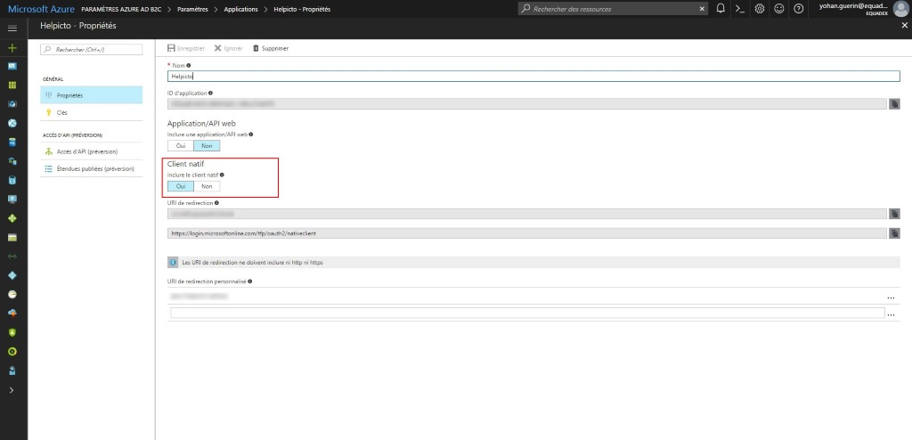  

Then we've added the Facebook and Google as available providers:  

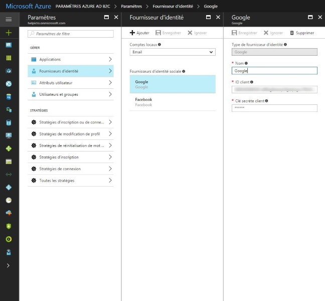

Since we want Facebook, Google and Helpicto authentication, as available providers, we've selected them in the providers section:  

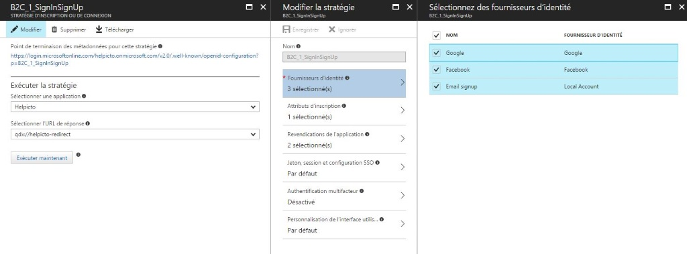

The only required field used in Helpicto is the email account, that is why we chose it as a mandatory field:  

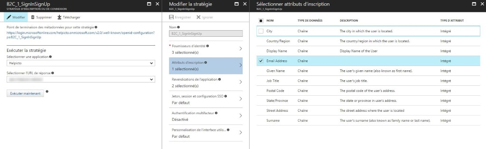

Eventually, here is the migrated login screen, available from the **Helpicto** application:  

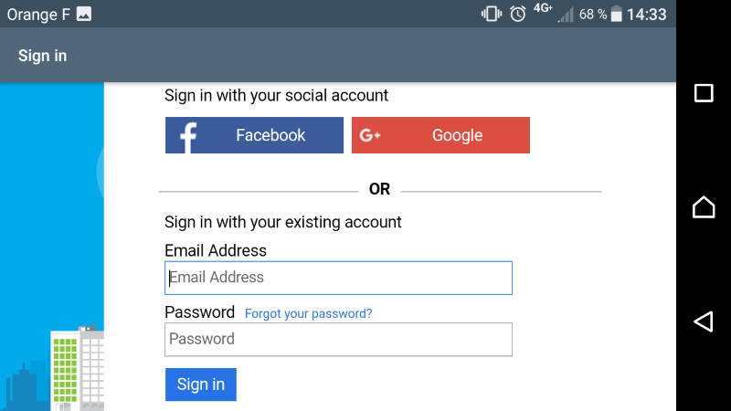  


#### Code implementation

Actually, two SDKs are available to manage the authentication process through the client application : **ADAL** and **MSAL**.   
Basically, **MSAL** is the successor of **ADAL**.  

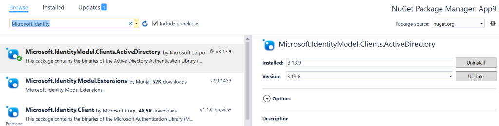

- **ADAL** SDK (Microsoft.IdentityModel.ActiveDirectory) is actually in release mode, in version 3x. ADAL works only with Azure Active Directory V1 authentication endpoint.
- **MSAL** SDK (Microsoft.Identity.Client) is actually in prerelease mode, and works with the newly Azure Active Directory V2.

Since the team has a strong knowledge on the **ADAL** SDK, we have decided to use it for our solution.

*Note*: If you want more information about **MSAL** and **ADAL** and their actual differences, here are some useful links:
- Differences between **ADAL** and **MSAL**: [http://nzpcmad.blogspot.com/2016/04/adfs-msal-microsoft-authentication.html](ADAL / MSAL authentication library)
- Vittorio Bertucci's presentation at //Build 2016: [Microsoft Identity : State of the union and future direction](https://channel9.msdn.com/Events/Build/2016/B868)

*Note*: The [Xamarin sample application on Github](https://github.com/Azure-Samples/active-directory-b2c-xamarin-native) uses the **MSAL** provider to connect the user through Azure B2C process.

Using the **ADAL** library is quite similar. Here are the steps required we've implemented into the **Helpicto** application:  

First of all, be sure to add the correct references in each project:
- Shared project: Microsoft.Identity.Client
- Android / iOS project: Microsoft.Identity.Client and Microsoft.Identity.Client.Platform
- UWP Project: Microsoft.Identity.Client  

Then call the authentication method from **ADAL** to allow the user to authenticate himself through **Azure B2C**:  

```csharp
try
{
  var cacheUsers = App.AuthenticationClient.UserTokenCache.ReadItems(App.ClientId);
  var tokenUser = cacheUsers?.FirstOrDefault();
  var authenticatedUser = tokenUser?.User;

  AuthenticationResult authenticationResult;

  if (authenticatedUser != null && DateTime.Now > tokenUser.ExpiresOn)
  {
      authenticationResult = await App.AuthenticationClient
         .AcquireTokenSilentAsync(new []{ App.Authority}, authenticatedUser);
  }
  else
  {
      App.AuthenticationClient.UserTokenCache.Clear(App.ClientId);

      authenticationResult = await App.AuthenticationClient
        .AcquireTokenAsync(App.Scopes,
                        "",
                        UiOptions.SelectAccount,
                        string.Empty,
                        null,
                        App.Authority,
                        App.SignUpSignInPolicy);
   }
                
     await Navigation.PushAsync(new AuthenticationSuccessfulPage(authenticationResult));
 }
 catch (Exception ex)
 {
     await DisplayAlert("Error Authenticating", ex.Message, "OK");
 }
}
```


## Conclusion ##

During this three-day HackFest with **EQUADEX**, we partnered with the team to help them migrating their *proof of concept* application to **Xamarin**, making their application available through all the mobile stores.

According to **Mathier Busolin** and **Anthony Allebee** in an interview with **"L'usine digitale"**, ([Read the full interview in french](http://www.usine-digitale.fr/article/helpicto-la-reconnaissance-d-images-au-service-de-personnes-atteintes-de-troubles-du-langage.N516719)) a French high tech news website, this 3-days HackFest opened great opportunities, helped them work in a more collaborative way and consider new technical solutions they never thought of before.   
The HackFest made them save large weeks of work in the development process and enabled Equadex to announce that the commercial distribution of the application will begin on July 1st.

The economist website "[http://www.touleco.fr](Touléco)" also published an article ([Read the full article in french](http://www.touleco.fr/Quand-Equadex-travaille-main-dans-la-main-avec-les-Americains-de,21641)) on the collaboration between Microsoft and Equadex focusing on the cognitive services provided by Microsoft.
An extract from the article:  

**_"...[These 3 days]  aimed to integrate new technologies into Helpicto application thanks to Microsoft Cognitive Services, dedicated to empower Healthcare though technology"_**


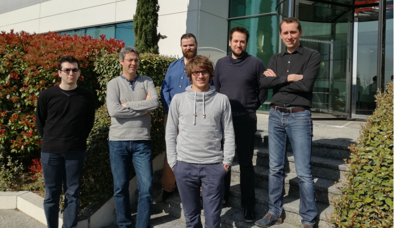
