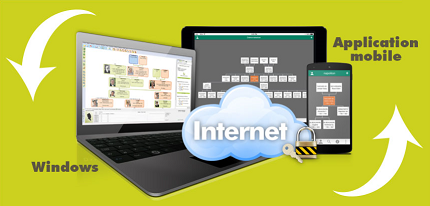

# Bringing Geneatique Desktop Application to Windows Store

Microsoft teamed up with CDIP to convert one of their popular genealogy software, Geneatique, to the Universal Windows Platform (UWP), using Desktop Bridge.

Geneatique is a leading genealogy software in France that provides tools for research, charting and organizing your family tree easier. Geneatique.com is a very comprehensive and high-performance tool, renowned as one of the best family tree software program on the market. 
By bringing its first software to the Windows Store, CDIP saw a great opportunity to increase the number of downloads, reach more than 400 million PC around the world, provide a richer user experience and benefit from a simpler installation and update process management.

As more and more of their customers are running the current Desktop Genealogy Software on Windows 10, CDIP decided to distribute this Software through the Windows Store

  
  
 

The solution relies on :

- [Desktop App Converter](https://www.microsoft.com/fr-fr/store/p/desktop-app-converter/9nblggh4skzw) : Used to automatically convert the Desktop Application into a package compliant with Windows Store

- [Windows 10 SDK (10.0.15063.0)](https://developer.microsoft.com/en-us/windows/downloads/sdk-archive ) : Windows 10 SDK which includes the tools 

- [Windows 10 Base Image 15063](http://aka.ms/converterimages/) : This Base Image is necessary to generate the package for Creator Update

 

 

**Core Team:** 

- Aouatif Alilou - Project Manager, CDIP

- Maud Tournay - Business Evangelist, Microsoft

- Fred Le Coquil - Technical Evangelist, Microsoft

## Customer profile ##

**CDIP** is an ISV specialized in genealogy, scrapbooking and old mapping. Their main product is Geneatique, a leading genealogy software in France that provides tools for research, charting and organizing your family tree easier. Geneatique.com is a very comprehensive and high-performance tool, renowned as one of the best family tree software program on the market. It offers more than 100 different templates that you can customize.
The Geneatique software can be purchased online or in DVD.

 

 [Geneatique Web Site](http://www.geneatique.com/)
  
## Problem statement ##

Geneatique is a classic Win32 Desktop application available from their official Web Site. The application is installed with a specific installation program. The Win32 application is not the best experience for Windows 10 users, but CDIP did not want to rewrite all the code to create a new Universal Windows Platform (UWP) app to leverage Windows Store capabilities. They have been trying to integrate Geneatique.com to the Windows Store since December 2016 and but they were facing deployments issues.

The easiest approach was to use the Desktop Bridge App Converter to automatically convert their Desktop Application into packages distributed with the Windows Store.
This effort did start last year using Windows 10 Anniversary Update, unfortunatelly the packages generated for this version of Windows 10 were instable: the application installed from those packages oftentimes crashed while the user was using the embedded Web Browser.
Since Creator Update the packages are stable and the application is able to run the embedded Web Browser without crashing.

 
## Solution and steps ##

As the main objective of this initiative is to generate Application packages for the latest version of Windows 10 aka Creator Update, you need to prepare your configuration to support Windows 10 Creator Update.

1. Install the latest version of Windows 10 (Creator Update) Build 15063 on your machine

2. Install on the same machine Windows 10 SDK (10.0.15063.0)

      https://developer.microsoft.com/en-us/windows/downloads/sdk-archive 

3. Install [DesktopAppConverter from Windows Store](https://www.microsoft.com/en-us/store/p/desktopappconverter/9nblggh4skzw) 

4. Switch your machine to developer mode under Settings - Update & Security - For Developers 

 

5. Add the container feature

 

6. Download the base image 15063 from there http://aka.ms/converterimages

7. Install the base Image 15063. Launch DesktopAppConverter.exe and enter the following command in the command shell window:

       DesktopAppConverter.exe -Setup -BaseImage C:\temp\BaseImage-15063.wim

8. Your machine is now configured to generate Application packages for Windows 10 Creator Update.

You can now generate the package for Geneatique application. As the application is only available as a Win32 (32 bits), the generated package will only support 32 bits binaries.
 

1. Copy the latest version of Geneatique Installation Application on your machine.

2. Create the Win32 package with DesktopAppConverter, enter the following command in the command shell window. The installation program uses the two options "/SILENT /NORESTART" to launch a silent installation

       DesktopAppConverter.exe -Installer C:\projects\geneatique\inputs\setup-geneatique2017.exe -InstallerArguments "/SILENT /NORESTART" -Destination "C:\projects\geneatique\outputs" -AppExecutable "Geneatique.exe" -PackageName "Geneatique2017" -PackageDisplayName "Geneatique 2017" -AppDisplayName "Geneatique 2017" -AppDescription  "Logiciel de Généalogie : Geneatique 2017" -AppExecutable "Geneatique.exe" -Version 1.0.8.0 -Publisher "CN=CENTRE DE DEVELOPPEMENT DE L''INFORMATIQUE PERSONNELLE, OU=Secure Application Development, O=CENTRE DE DEVELOPPEMENT DE L''INFORMATIQUE PERSONNELLE, L=OSNY, S=Val-d''Oise, C=FR" - MakeAppx -Verbose  

3. After few minutes the new package is available under "C:\projects\geneatique\outputs\Geneatique2017.appx" . The appx file is built using the files under "C:\projects\geneatique\outputs\PackageFiles". For troubleshooting, you can use the log files under "C:\projects\geneatique\outputs\Logs".

4. You can update the package file for instance to use updated logos. In the command Window, launch the following commands:

       "C:\Program Files (x86)\Windows Kits\10\bin\x64\makeappx.exe" pack /d "C:\projects\geneatique\outputs\PackageFiles" /p "C:\projects\geneatique\outputs\Geneatique2017.appx"

5. The Appx file is now ready to be published, you only need to sign the package wit the company certificate using the following command line: 

       "C:\Program Files (x86)\Windows Kits\10\bin\x64\signtool.exe" sign -f C:\projects\geneatique\outputs\Certificate.pfx -p [password] -fd SHA256 -v C:\projects\geneatique\outputs\Geneatique2017.appx

6. Now the Appx file is ready to be published. You can test the installation using the following Powershell command: 

       Add-AppxPackage -Path C:\projects\geneatique\outputs\Geneatique2017.appx

You can also install the package file in double-clicking on the file Geneatique2017.appx in the file explorer.

1. Double-click on the file Geneatique2017.appx in the file explorer, on the dialog box "Install Geneatique 2017", click on the button "Install"

 

2. The installation program is copying the files on your machine.

 

3. Once the installation is completed, click on the button "Launch" to launch the application.

 

4. The Geneatique Welcome dialog box is displayed on the screen.

 

If you don't have a company certificate you can create your own test certificate using the command lines below:

1. Create a certificate using the command lines: 

       "C:\Program Files (x86)\Windows Kits\10\bin\x64\makecert.exe" -r -h 0 -n "CN=CENTRE DE DEVELOPPEMENT DE L''INFORMATIQUE PERSONNELLE, OU=Secure Application Development, O=CENTRE DE DEVELOPPEMENT DE L''INFORMATIQUE PERSONNELLE, L=OSNY, S=Val-d''Oise, C=FR"  -eku 1.3.6.1.5.5.7.3.3 -pe -sv C:\projects\Geneatique\outputs\TempCert.pvk C:\projects\Geneatique\outputs\TempCert.cer

2. Create the pfx file using the command lines:

       "C:\Program Files (x86)\Windows Kits\10\bin\x64\pvk2pfx.exe" -pvk  C:\projects\Geneatique\outputs\TempCert.pvk -spc C:\projects\Geneatique\outputs\TempCert.cer -pfx C:\projects\Geneatique\outputs\TempCert.pfx

3. Once the pfx file is created, you can import the certificat on the machine where you to test the application package. Double-click on the pfx file, select the **local machine**  for the Store Location and click on the Next button.

4. Enter the password associated with your certificate and click on the Next button.

5. Finally select **trusted people** certificate store, click on the Next button and Finish button to complete the import.

## Conclusion ##

The main objective of this project was to enable CDIP to distribute his application through the Windows Store in order to address the 500 Million devices running Windows 10.
After a first unsuccessful attempt using Anniversary Update - the package generated with Desktop App Converter was unstable when the application used the embedded browser - we finally managed the migration while using the Creator Update.
The application generated and installed through the Windows Store is  now completely stable.

**Measurable impact/benefits resulting from the implementation of the solution:**

With the current version of Windows 10 Creator Update, the generation of the Geneatique package is automated. This package can be generated alongside the binaries for the Win32 Desktop application.

**General lessons:**

Though Geneatique 2017 is a very complex application with several third parties dependencies (300 MBytes), it is possible to generate an installation package compliant with the Windows Store using the Desktop App Converter.
Moreover, as the application is now available through the Windows Store, CDIP can now seize the opportunity to introduce a new business model using In App Purchase.

**Opportunities going forward**

This project was the first step for the distribution of Geneatique Application through Windows Store.
Below a list of extensions which could improve Geneatique application running on Windows 10:
1. Calling the UWP API from the Win32 Application to support Tiles, Notification, Cortana...
2. Use Windows Store In App Purchase API to change the business model associated with the application.
3. Prepare a full UWP implementation

## Additional resources ##
Below a list of links to resources used by the team:
- Desktop Bridge:

https://developer.microsoft.com/en-us/windows/bridges/desktop 

- Desktop app bridge to UWP Samples on github: 

https://github.com/Microsoft/DesktopBridgeToUWP-Samples 

- Startup Desktop Bridge extension for UWP application Sample Application:

https://github.com/flecoqui/Windows10/tree/master/Samples/StartupUWP 

