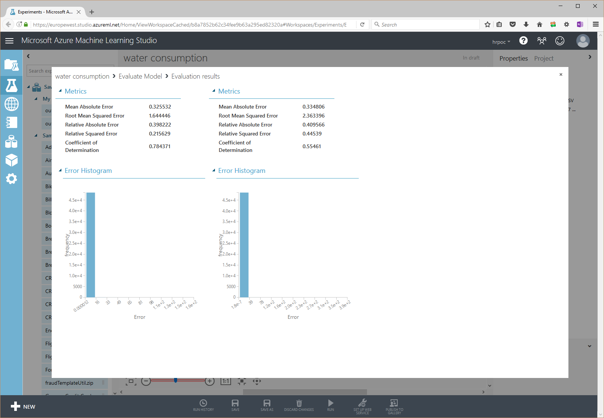

# Learnings from an IoT hackfest with Homerider Systems

Homerider, Exakis and Microsoft partnered during a 5 day hackfest to put together an architecture that flows data from connected water meters to machine learning and Power BI via a data lake and other technologies that can sustain high volumes of data collection and processing.

Technologies used during the hackfest include the following Azure components: 
- IoT Hub
- Event Hubs
- Stream Analytics
- Redis Cache
- Document DB
- Linux Virtual Machine
- App Services
- Data Lake
- Machine Learning
- Power BI

The core team was composed of: 
- Geoffroy Duplessis, Digital Services Manager, Homerider Systems
- Thibaut de Dompsure, IT Operations Manager, Homerider Systems
- Ludovic Millier, CIO, Homerider Systems
- Cédric R., Software Development Engineer, Homerider Systems
- Grégory Strubel, Software Development Engineer, Homerider Systems
- Guillaume Blaquière, Project Manager, Homerider Systems
- Julien Dumenil, Software Development Engineer, Homerider Systems
- Séb., Software Development Engineer, Homerider Systems
- Samir Arezki, Software Architect & Microsoft MVP Azure, Exakis, @itfana
- Benjamin Guinebertière, Technical Evangelist, Microsoft, @benjguin
- Alex Danvy, Technical Evangelist, Microsoft, @danvy

## Homerider Systems profile ##


Homerider Systems was founded in 2000 as an end to end IoT solution provider for industries and utilities and was acquired by Veolia, a historical partner, in 2009. While the water industry is the main focus for Homerider Systems, they have a global environment vision with solutions to monitor the consumption of electricity, gas and oil. To date, Homerider Systems has sold over 5 million modules, sharing 130 million pieces of information (volume indexes, alerts, ...) every day. More at http://www.homeridersystems.com/en#about-us  

The company is located in Bordeaux France (device manufacturing), and Vienne France (IT, Marketing, ...).
The hackfest happened in Vienne.

## Problem statement ##

Today, Homerider Systems get more than 6 million of frames per day and this volume of data grows by 10% a month. They get that data on premises which is not scalable. Time is spent on optimization while Homerider hopes to continue to leverage data.

NB: a frame is a ~99 byte encoded message from which pieces of information (volume indexes, alerts, ...) can be extracted.

It will get worse as the law requires individual meters instead of common meter at the building level so that consumption lowers. This will generate even more data from more meters.

Homerider has been operating Water & Energy services for 15 years with their own protocol. They had to adapt to new technologies like LPWAN protocols (LoRaWan and Sigfox) which are widely adopted by the market. The same is also true with public cloud  platform as a service :

> The Cloud PaaS infrastructure is the most obvious way to improve our processes and help our customers to transform their daily operations into digital water & energy services.
> Implementing our IT on Azure platform will allow us to make our architecture more powerful and scalable.
>
> Geoffroy Duplessis, Digital Services Manager, Homerider Systems


(Geoffroy Duplessis is on the bottom left of the photo)

## Solution and steps ##

One of the ideas during the hackfest was to leverage big data architecture and experiment new ideas that could be put in place to move away from a pure relational database that shows its limits today.

The POC must put an architecture in place that does not consume too many Azure resources in the first day, but that can scale seamlessly. This is the reason why components like IoT Hub, Event Hubs, Blob storage, Azure machine learning are leveraged. 

One of the important requirements is that there is a lot of deduplication and decoding code that already exists in C code and that should not be rewritten. For that having this code consuming records from IoT Hub or Event Hub and publishing it to Event Hub would be a scalable solution. 

So we sketched some functional and technical architecture diagrams.

The functional diagram basically corresponds to the following:


so we tried a number of things 


and came up to the following during the hackfest


The hackfest was done with Microsoft Partner Exakis
.
They will continue working with Homerider after these few days.

One possible target architecture could be something like the following:


## Technical delivery ##

### Create Azure Assets ###

During the Hackfest, a number of Azure resources were created. Here is a screenshot of the Azure portal:


Some work was also done to show how to monitor these resources. The following topics were covered: 
- metrics
- diagnostic logs
- activity logs
- Application Insights
- OMS

Also [Azure pricing](https://azure.microsoft.com/en-us/pricing/) was studied to check the impact of choices to the economic sustainability of the model. For instance, as we'll see next, Event Hubs was preferred to Apache Kafka in HDInsight for this reason.

### Reusing C code ###


A lot of the existing code for deduplication and decoding is written in C / C++. 
We spent quite a bit of time during the hackfest finding the best solution to reuse the code without porting it to another language.

In order to be able to do that in a scalable and independant way (the goal is to leverage PaaS components for other processing), the main idea is to have messaging arriving in a broker (IoT Hub, Event Hub, Apache Kafka), then consumed by C/C++ code that sends the result in a broker. 

Said in other words, the problem to solve is: **(broker) -> C/C++ host -> (broker)**

Several solutions were studied: 

**1/ broker = IoT Hub / Event Hub, C/C++ code executed as an executable in Linux VMs**

Some tests were done to leverage the [C client library for Azure Event Hubs](https://github.com/Azure/azure-event-hubs-c/tree/b1b28676ee228c6cf828a4cb3f2505d65c3284a9). 

IoT Hub (and Event Hubs) have SDKs that send data from C code. 
We were trying to receive data from C code which is much more uncommon.

Some instabilities were found in our tests (this has been fixed since then, there was a timeout set too low). Moreover, the C SDK has quite simplistic samples in terms of reception. For instance, code receives from one partition only and it can start from a timestamp with 1 sec precision (offset start is not part of the SDK). This is far less elaborated than the event processor host available in Java or C#.

So we decided to test other scenarios.

**2/ broker = Apache Kafka, C/C++ code executed as an executable in Linux VMs**

Apache Kafka, as a very well spread open source solution, has a broad ecosystem, including C libraries. 

As Homerider want to leverage PaaS component whenever possible, HDInsight was a good option to implement Apache Kafka.

A few tests could be successfully done from a CentOS VM in the same vNet


as an HDInsight cluster


Still the lowest cost for an Apache Kafka cluster could be much higher than the corresponding Event Hubs. 

The following Microsoft blog post can provide additional information on Azure Event Hubs vs Apache Kafka: [Choosing between Azure Event Hub and Kafka: What you need to know](https://blogs.msdn.microsoft.com/opensourcemsft/2015/08/08/choosing-between-azure-event-hub-and-kafka-what-you-need-to-know/).

There were reversibility considerations. As an example, [boontadata project](https://github.com/boontadata) shows very similar pieces of Python code doing similar things towards Apache Kafka and Azure IoT Hub.
- <https://github.com/boontadata/boontadata-paas/blob/master/code/pyclient/inject.py>
- <https://github.com/boontadata/boontadata-streams/blob/master/code/pyclient/ingest.py>

After those interesting discussions, we came back to an Event Hubs option.

**3/ broker = IoT Hub / Event Hub, C/C++ code executed as library called by C# Event Hub Processor Host in a Web Job**

Coming back to IoT Hub / Event Hubs, the advantage of using C# is to leverage Event Processor Host. This [piece of code](http://www.nuget.org/packages/Microsoft.Azure.ServiceBus.EventProcessorHost/) manages messages reception from one or several C# hosts that share metatadata state like offset in an Azure storage account. 

The event processor host is not available (march 2017) in .NET Core. So this code should be executed in Windows.

Here is a view in Visual Studio 2017 of C# code calling some C++ code: 


and the excerpts in text: 

```cs
        public async Task ProcessEventsAsync(PartitionContext context, IEnumerable<EventData> messages)
        {
            foreach (EventData eventData in messages)
            {
                string data = Encoding.UTF8.GetString(eventData.GetBytes());

                Console.WriteLine("Message received.  Partition: '{0}', Data: '{1}'", context.Lease.PartitionId, data);
                
                // Decode with C++ 
                Decoding d = new Decoding();
                var result = d.decodeFrame(data);
                Console.WriteLine(result);
            }

            try
            {
                // Decomment To remove events in eventhub 
                await context.CheckpointAsync();
            }
            catch (Exception ex)
            {
                Trace.TraceError(
                    "{0}{0}*** CheckpointAsync Exception - ActionProcessor.ProcessEventsAsync ***{0}{0}{1}{0}{0}",
                    Console.Out.NewLine,
                    ex);
            }
        }
```

```cpp
// HRPocInterop.DecodeLibrary.h

#pragma once

#include <string>
#include <msclr\marshal_cppstd.h>


using namespace System;

namespace HRPocInteropDecodeLibrary {

	public ref class Decoding
	{
		public:
			String^ decodeFrame(String^ str) {
				//System::String^ managedString = "test";

				msclr::interop::marshal_context context;
				std::string standardString = context.marshal_as<std::string>(str);
				return gcnew String((standardString + "plop").c_str()); }
	};
}
```

**Conclusion:**

In the context of Homerider, hosting solution 3/ in a Web Job seems the best option.

### inject data in IoT Hub ###

Homerider Systems produces modules like this one
 

 
that send data back to their datacenters. During the hackfest, we wanted to inject the same data in IoT Hub where the same data can arrive.

In order to import millions of devices, import must be done in bulk. During the hackfest, [iothub-explorer](https://github.com/azure/iothub-explorer) (written in Node.js) was successfully used. This [article](https://docs.microsoft.com/en-us/azure/iot-hub/iot-hub-bulk-identity-mgmt) provides information on how to do that.

As any Azure resource, an IoT Hub can be managed thru REST APIs (and also thru the portal, command line tools and SDKs).

Messages can also be sent to IoT Hub with REST APIs. As an example, some sample code was provided to send data from Python. It can be found as part of project [boontadata](https://github.com/boontadata). In particular, [boontadata-paas](https://github.com/boontadata/boontadata-paas) contains a small example: [iothub_helper.py](https://github.com/boontadata/boontadata-paas/blob/master/code/pyclient/iothub_helper.py).

NB: To retrieve data from IoT Hub or Event Hubs, the low level connected protocol AMQP + SSL is used. This [gist](https://gist.github.com/tomconte/87c9fe34a166591c3000) shows some low level code.

### securing devices, data and transport ###

Today, Homerider Systems G1 modules can encrypt the frames they send. Gateways are also authenticated before sending data. The gateways are authenticated against the backend.

Some networks like LoRaWan can also be encrypted.

By implementing the backend with IoT Hub, this can be reproduced. Each device or each gateway can be authenticated by using their IoT Hub keys. Also, the encrypted messages can flow thru IoT Hub.

### copy data from IoT Hubs, Event Hubs to Storage, DocumentDB, Power BI

During the POC, very simple logic was put in place to copy data from brokers to destinations. Screen shots of the Azure Stream Analytics component we used follow.


The code is a simple as:

```SQL
SELECT * INTO [archiveoutput]        FROM [iothubinput];
SELECT * INTO [archivedecodedoutput] FROM [eventhub2];
SELECT * INTO [powerbi]              FROM [eventhub2];
SELECT * INTO [docdboutput]          FROM [eventhub2];
```

NB: In this case, Azure Stream Analytics is used to copy data from IOT Hub and Event Hub to other storages; for instance, in the first line above, Stream Analytics is an efficient way to append many messages as blobs in Azure storage. In other use cases, Azure Stream Analytics may also be used for more complex queries managing time windows, aggregations, filters and so on. 

### Exposing APIs from DocumentDB ###

In the architecture diagram, DocumentDB is the serving layer i.e. it provides data that need to be retrieved with low latency by API, applications, etc. 

A sample was developed to show how an API can be developed in ASP.NET Core. Here are some excerpts of the code: 

The controller: 

```CS
using System;
using System.Collections.Generic;
using System.Linq;
using System.Threading.Tasks;
using Microsoft.AspNetCore.Mvc;
using HRPoc.Api.Repositories;

// For more information on enabling Web API for empty projects, visit https://go.microsoft.com/fwlink/?LinkID=397860

namespace HRPoc.Api.Controllers
{
    [Route("api/[controller]")]
    public class IndexController : Controller
    {

        public IIndexRepository _indexRepository { get; set; }

        public IndexController(IIndexRepository indexRepository)
        {
            _indexRepository = indexRepository;
        }

        #region GetIndexById
        [HttpGet("{id}")]
        [Produces(typeof(IEnumerable<Models.Index>))]
        public IActionResult GetIndexById(string id)
        {
            var item = _indexRepository.GetIndexById(id);

            if (item == null)
            {
                return NotFound();
            }

            return Ok(item);
        }
        #endregion

        #region GET
        [HttpGet("adress/{adress}")]
        [Produces(typeof(IEnumerable<Models.Index>))]
        public IActionResult GetByAdress(string adress)
        {
            var items = _indexRepository.GetIndexByAdress(adress);

            if (items == null)
            {
                return NotFound();
            }

            return Ok(items);
        }
        #endregion
    }
}
```

IIndexRepository.cs: 

```cs
using HRPoc.Api.Models;
using System;
using System.Collections.Generic;
using System.Linq;
using System.Threading.Tasks;

namespace HRPoc.Api.Repositories
{
    public interface IIndexRepository
    {
        Models.Index GetIndexById(string id);

        IEnumerable<Models.Index> GetIndexByAdress(string adress);
    }
}
```

IndexRepository.cs: 

```cs
using System;
using System.Collections.Generic;
using System.Collections.Concurrent;
using System.Linq;
using Microsoft.Azure.Documents;
using Microsoft.Azure.Documents.Client;
using Microsoft.Azure.Documents.Linq;
using Microsoft.Extensions.Options;
using HRPoc.Api.Models;

namespace HRPoc.Api.Repositories
{
    public class IndexRepository : IIndexRepository
    {
        private static DocumentClient client;

        private readonly HrPocDbSettings _settings;

        public IndexRepository(IOptions<HrPocDbSettings> settings)
        {
            _settings = settings.Value;
        }

        #region GetIndexById
        public Models.Index GetIndexById(string id)
        {
            Models.Index index = null;

            //Get a Document client 
            using (client = new DocumentClient(new Uri(_settings.EndpointUrl), _settings.AuthorizationKey))
            {
                string pathLink = string.Format("dbs/{0}/colls/{1}", _settings.DatabaseId, _settings.CollectionId);

                dynamic doc = client.CreateDocumentQuery<Models.Index>(pathLink, new FeedOptions { EnableCrossPartitionQuery = true })
                    .Where(d => d.Id == id)
                    .AsEnumerable()
                    .FirstOrDefault();

                if (doc != null)
                {
                    index = doc;
                }
            }

            return index;
        }
        #endregion


        #region GetIndexByAdress
        public IEnumerable<Models.Index> GetIndexByAdress(string adress)
        {
            IEnumerable<Models.Index> items = null;

            //Get a Document client
            using (client = new DocumentClient(new Uri(_settings.EndpointUrl), _settings.AuthorizationKey))
            {
                string pathLink = string.Format("dbs/{0}/colls/{1}", _settings.DatabaseId, _settings.CollectionId);

                dynamic docs = client.CreateDocumentQuery<Models.Index>(pathLink, new FeedOptions { EnableCrossPartitionQuery = true })
                    .Where(d => d.Adress == adress)
                    .OrderByDescending(o => o.DateRef)
                    .AsEnumerable()
                    .ToList();

                if (docs != null)
                {
                    items = docs;
                }
            }

            return items;
        }
        #endregion
    }
}
```

The API is exposed thru Swagger. Here is a sample call:


### Machine learning ###

Gathering data from millions of objects is even more interesting when you can leverage that data to predict the near future with machine learning. In order to show that this can be put together quite simply with Azure PaaS components, a simple experiment was developed to see what kind of precision we could get in the first place.

A few hundreeds of devices sample data was extracted as a csv file from the existing database. This would typically be part of the data lake in the architecture that we described previously. 

Machine learning start with data preparation and feature engineering. 

The raw data contains the following columns: 
- the water meter id
- the index (as pulses)
- the corresponding volume of water (as m3)
- the date/time when the data was emitted (20170312120000 = 2017-MAR-12 12:00:00)

we would like to generate a dataset with the following columns:
- the water meter id
- pulse ratio that can be used to categorize different type of meters, which could correspond to different kinds of water consumption (factories, residential buildings, detached houses, ...)
- the date for which we try to predict water consumption: *date0* (the label day)
- *date0*'s day of week
- *date0*'s year
- *date0*'s month
- *date0*'s day
- aggregated consumption data for
    - *date0*. This is the "label" that we want to predict from all data but date0's consumption
    - a week before, day by day
    - a month before, week by week

Data preparation may have to deal with large volumes of data and generate smaller files by filtering and aggregating. For instance, during the hackfest, I had a ~700 MB gzip file which corresponded to ~4.5 GB uncompressed. It led to a ~65 MB uncompressed file.

So the data preparation takes place in Azure Data Lake Analytics, in U-SQL. The aggregated file is then fed to Azure Machine Learning. A linear regression will learn from passed consumption so that it will then be possible to predict a day consumption based on previous days and weeks consumption.

Note that in this case, we used a linear regression as a baseline and also tried with another regression algorithm (neural network regression) that did not lead to better results. Choosing the right algorithm with the right parameters can be done by reading documentations like [How to choose algorithms for Microsoft Azure Machine Learning](https://docs.microsoft.com/en-us/azure/machine-learning/machine-learning-algorithm-choice), and experimenting. A comprehensive process is described in Azure documentation: [https://azure.microsoft.com/en-us/documentation/learning-paths/data-science-process/](https://azure.microsoft.com/en-us/documentation/learning-paths/data-science-process/). Also note that feature engineering is at least as important as choosing the right algorithm. 

The data that was actually used is not shown here, but some synthetic data I used to develop the code is shown here. The `synth.csv` file looks like: 

```
synht1,135961,135.961,20170312120000
synht1,135961,135.961,20170313120000
synht1,135961,135.961,20170314120000
synht1,135961,135.961,20170315120000
(...)
```
(please see appendix for a bigger listing)

The U-SQL script is the following:

```sql
/* @prefix is either the base path for local execution or for a cloud execution in the Azure Data Lake Account */
DECLARE @prefix string = "/CP/HRPOC"; /* uncomment this line for local execution */
//DECLARE @prefix string = "adl://###obfuscated###.azuredatalakestore.net/CP/HRPOC"; /* uncomment this line for cloud execution */

/* @in1 is the relative path to the input file */
//DECLARE @in1 string   = @prefix + "/in/dataset1.csv";    /* uncomment when using the real dataset */
DECLARE @in1 string   = @prefix + "/in/synth.csv";         /* uncomment when using synthetic dataset */
//DECLARE @in1 string   = @prefix + "/in/sampledata.csv";  /* uncomment when using only a part of the real dataset */

/* @out{n} are the relative paths to the output files */
DECLARE @out1 string  = @prefix + "/out/out1.csv";
DECLARE @out2 string  = @prefix + "/out/out2.csv";

/* date format that is used in the CSV files we'll read */
DECLARE @datetimeformat string = "yyyyMMddHHmmss";

/* @labelDay is the day for which we have the label, i.e. the value we try to predict.
   In production, this would typically be yesterday, which is the last day for which we collected all the data.
   The model could be retrained with data collected that way over the last label days.
   This script only takes into account one label day. It could be enhanced with a set of label days.
*/
DECLARE @labelDay DateTime = DateTime.Parse("2017-03-27", CultureInfo.InvariantCulture).Date;

/* get data from input file. Define the schema we use at read time (big data = schema on read). */
@raw = EXTRACT deviceId string, indexP decimal, indexV decimal, dateRefString string
    FROM @in1
    USING Extractors.Csv(encoding:System.Text.Encoding.UTF8, skipFirstNRows:0);

/* add a pulse computed column, parse date-time */
@parsed = SELECT 
        deviceId, 
        indexV, 
        (indexV==0?0:indexP/indexV) AS pulse,
        DateTime.ParseExact(dateRefString, @datetimeformat, CultureInfo.InvariantCulture) AS dateRef
    FROM @raw;

/* get only the data between the label day and 4 weeks before it */
@latestonly = SELECT *
       FROM @parsed
       WHERE dateRef.Date >= @labelDay.AddDays(-28) AND dateRef.Date <= @labelDay; // 4 weeks - labelDay

/* add a computed column: 
   prevDay is the number of days between the label day and the date of the data in the current row (dateRef) */
@newcols1 = SELECT *, 
            (@labelDay - dateRef.Date).Days AS prevDay
        FROM @latestonly;

/* compute min and max for volume index and dateRef per device, pulse and prevDay
   NB: min dateRef and max dateRef are on the same day */
@agg1 = SELECT deviceId, pulse, prevDay, 
            MIN(indexV).Value AS indexVMin, MAX(indexV).Value AS indexVMax, 
            MIN(dateRef).Value AS dateRefMin, MAX(dateRef).Value AS dateRefMax
        FROM @newcols1
        GROUP BY deviceId, pulse, prevDay;

/* compute the volume index for the min dateRef */ 
@startindexv = SELECT @agg1.deviceId, @agg1.pulse, @agg1.prevDay, @newcols1.indexV AS indexVStart
        FROM @agg1 LEFT OUTER JOIN @newcols1
             ON @agg1.deviceId == @newcols1.deviceId
             AND @agg1.dateRefMin == @newcols1.dateRef;
             
/* compute the volume index for the max dateRef */ 
@endindexv = SELECT @agg1.deviceId, @agg1.pulse, @agg1.prevDay, @newcols1.indexV AS indexVEnd
        FROM @agg1 LEFT OUTER JOIN @newcols1 
             ON @agg1.deviceId == @newcols1.deviceId
             AND @agg1.dateRefMax == @newcols1.dateRef;

/* join the previous columns in one dataset: start volume index, end volume index, and compute additional columns about the date */
@joined = SELECT @agg1.*, @startindexv.indexVStart, @endindexv.indexVEnd,
            ((long) @agg1.dateRefMin.DayOfWeek) AS dayOfWeek, 
            @agg1.dateRefMin.Year AS year, 
            @agg1.dateRefMin.Month AS month, 
            @agg1.dateRefMin.Day AS day, 
            @agg1.dateRefMin.Hour AS hourMin,
            @agg1.dateRefMax.Hour AS hourMax
        FROM @agg1 
            INNER JOIN @startindexv ON @agg1.deviceId == @startindexv.deviceId
                AND @agg1.prevDay == @startindexv.prevDay
            INNER JOIN @endindexv ON @agg1.deviceId == @endindexv.deviceId
                AND @agg1.prevDay == @endindexv.prevDay;

/* 
    start aggregations per days and weeks for the last 4 weeks 
*/

/* aggregates for the last 8 days 
   NB: const0 to const7 are columns on which will be able to define left outer joins later
       they allow joining in the ON clause instead of a WHERE which wouldn't work
*/
@latestdays = SELECT *, indexVEnd-indexVStart AS dayVolume, 
        0 AS const0,
        1 AS const1,
        2 AS const2,
        3 AS const3,
        4 AS const4,
        5 AS const5,
        6 AS const6,
        7 AS const7
    FROM @joined WHERE prevDay <= 7;

/* compute a week number called prevWeek, based on prevDay. Same logic, but that is per week instead of per day. */
@latestweeks1 = SELECT *, ((int) prevDay / 7) AS prevWeek
    FROM @joined;

/* aggregate by weeks */
@latestweeks2 = SELECT deviceId,pulse,prevWeek,
                       SUM(indexVEnd - indexVStart) AS weekVolume, 
                       MIN(dateRefMin).Value AS weekDateRefMin, MAX(dateRefMax).Value AS weekDateRefMax
                FROM @latestweeks1
                GROUP BY deviceId,pulse,prevWeek;

/* @mlds = machine learning data set, the dataset on which we can learn. 
   n-1 columns define criteria and an additional column - the label column - contains what we want to predict
   here, the label column is volumeToday_label
   NB: in that code, weekVolume0 = volumeToday_label + volumePrevDay1 + ... + volumePrevDay6
       So weekVolume0 is quite useless for ML. The column was ignored afterwards in Azure ML. 
*/
@mlds = SELECT ld0.deviceId, ld0.pulse, 
               ld0.dateRefMin AS dateRef0, ld0.dayOfWeek AS dayOfWeek0, ld0.year AS year0, ld0.month AS month0, ld0.day AS day0,
               lw0.weekDateRefMin AS weekDateRefMin0,
               lw0.weekDateRefMax AS weekDateRefMax0,
               lw1.weekDateRefMin AS weekDateRefMin1,
               lw1.weekDateRefMax AS weekDateRefMax1,
               lw2.weekDateRefMin AS weekDateRefMin2,
               lw2.weekDateRefMax AS weekDateRefMax2,
               lw3.weekDateRefMin AS weekDateRefMin3,
               lw3.weekDateRefMax AS weekDateRefMax3,
               ld0.dayVolume AS volumeToday_label,
               ld1.dayVolume AS volumePrevDay1,
               ld2.dayVolume AS volumePrevDay2,
               ld3.dayVolume AS volumePrevDay3,
               ld4.dayVolume AS volumePrevDay4,
               ld5.dayVolume AS volumePrevDay5,
               ld6.dayVolume AS volumePrevDay6,
               ld7.dayVolume AS volumePrevDay7,
               lw0.weekVolume AS weekVolume0,
               lw1.weekVolume AS weekVolume1,
               lw2.weekVolume AS weekVolume2,
               lw3.weekVolume AS weekVolume3
    FROM @latestdays AS ld0
         LEFT OUTER JOIN @latestdays AS ld1 ON ld0.deviceId == ld1.deviceId AND ld0.pulse == ld1.pulse AND ld1.prevDay == ld0.const1
         LEFT OUTER JOIN @latestdays AS ld2 ON ld0.deviceId == ld2.deviceId AND ld0.pulse == ld2.pulse AND ld2.prevDay == ld0.const2
         LEFT OUTER JOIN @latestdays AS ld3 ON ld0.deviceId == ld3.deviceId AND ld0.pulse == ld3.pulse AND ld3.prevDay == ld0.const3
         LEFT OUTER JOIN @latestdays AS ld4 ON ld0.deviceId == ld4.deviceId AND ld0.pulse == ld4.pulse AND ld4.prevDay == ld0.const4
         LEFT OUTER JOIN @latestdays AS ld5 ON ld0.deviceId == ld5.deviceId AND ld0.pulse == ld5.pulse AND ld5.prevDay == ld0.const5
         LEFT OUTER JOIN @latestdays AS ld6 ON ld0.deviceId == ld6.deviceId AND ld0.pulse == ld6.pulse AND ld6.prevDay == ld0.const6
         LEFT OUTER JOIN @latestdays AS ld7 ON ld0.deviceId == ld7.deviceId AND ld0.pulse == ld7.pulse AND ld7.prevDay == ld0.const7
         LEFT OUTER JOIN @latestweeks2 AS lw0 ON ld0.deviceId == lw0.deviceId AND ld0.pulse == lw0.pulse AND lw0.prevWeek == ld0.const0
         LEFT OUTER JOIN @latestweeks2 AS lw1 ON ld0.deviceId == lw1.deviceId AND ld0.pulse == lw1.pulse AND lw1.prevWeek == ld0.const1
         LEFT OUTER JOIN @latestweeks2 AS lw2 ON ld0.deviceId == lw2.deviceId AND ld0.pulse == lw2.pulse AND lw2.prevWeek == ld0.const2
         LEFT OUTER JOIN @latestweeks2 AS lw3 ON ld0.deviceId == lw3.deviceId AND ld0.pulse == lw3.pulse AND lw3.prevWeek == ld0.const3
    WHERE ld0.prevDay == 0;

/* write the @joined dataset to out1.csv */
OUTPUT @joined
    TO @out1
    ORDER BY deviceId ASC, prevDay ASC
    USING Outputters.Csv(encoding:System.Text.Encoding.UTF8, outputHeader: true);

/* write the @mlds dataset to out2.csv */
OUTPUT @mlds
    TO @out2
    ORDER BY deviceId ASC
    USING Outputters.Csv(encoding:System.Text.Encoding.UTF8, outputHeader: true);
```

This script execution from the Azure portal or from Visual Studio shows this graph


and it generates the following files: 


`out1.csv` that contains aggregates per day

```
"deviceId","pulse","prevDay","indexVMin","indexVMax","dateRefMin","dateRefMax","indexVStart","indexVEnd","dayOfWeek","year","month","day","hourMin","hourMax"
"synht1",1000,0,135.961,135.961,2017-03-27T12:00:00.0000000,2017-03-27T12:00:00.0000000,135.961,135.961,1,2017,3,27,12,12
"synht1",1000,1,135.961,135.961,2017-03-26T12:00:00.0000000,2017-03-26T12:00:00.0000000,135.961,135.961,0,2017,3,26,12,12
"synht1",1000,2,135.961,135.961,2017-03-25T12:00:00.0000000,2017-03-25T12:00:00.0000000,135.961,135.961,6,2017,3,25,12,12
(...)
```

(please see appendix for the full listing)

as well as `out2.csv` which will be used as a training model. The file contains the aggregation for the label day (*date0*) as well as the past days and weeks:

```
"deviceId","pulse","dateRef0","dayOfWeek0","year0","month0","day0","weekDateRefMin0","weekDateRefMax0","weekDateRefMin1","weekDateRefMax1","weekDateRefMin2","weekDateRefMax2","weekDateRefMin3","weekDateRefMax3","volumeToday_label","volumePrevDay1","volumePrevDay2","volumePrevDay3","volumePrevDay4","volumePrevDay5","volumePrevDay6","volumePrevDay7","weekVolume0","weekVolume1","weekVolume2","weekVolume3"
"synht1",1000,2017-03-27T12:00:00.0000000,1,2017,3,27,2017-03-21T12:00:00.0000000,2017-03-27T12:00:00.0000000,2017-03-14T12:00:00.0000000,2017-03-20T12:00:00.0000000,2017-03-12T12:00:00.0000000,2017-03-13T12:00:00.0000000,,,0.000,0.000,0.000,0.000,0.000,0.000,0.000,0.000,0.000,35.961,0.000,
"synth2",1000,2017-03-27T12:00:00.0000000,1,2017,3,27,2017-03-21T12:00:00.0000000,2017-03-27T12:00:00.0000000,2017-03-14T12:00:00.0000000,2017-03-20T12:00:00.0000000,,,,,0.000,0.000,0.000,0.000,0.000,0.000,0.000,0.000,0.000,-264.039,,
"synth3",100,2017-03-27T00:00:00.0000000,1,2017,3,27,2017-03-21T00:00:00.0000000,2017-03-27T23:00:00.0000000,2017-03-14T00:00:00.0000000,2017-03-20T23:00:00.0000000,2017-03-07T00:00:00.0000000,2017-03-13T23:00:00.0000000,2017-02-28T00:00:00.0000000,2017-03-06T23:00:00.0000000,15.70,13.17,20.25,17.54,19.67,15.87,16.06,18.22,118.26,123.58,123.17,118.73
```

From this last dataset, a predictive experiment is built that contains models training and evaluation. Here is how that looks. 

From top to bottom, here are the steps of the experiment: 
- last mile preparation of the dataset: remove records that are considered as anomalies, select the rights columns, mark some columns like `pulse` as categorical, ...
- split the dataset in two parts: a training dataset that will be shown to the algorithm while learning, a test dataset that will be shown to the train model only while evaluating the model. This ensures the model can predict on data it never saw.
- train several different models, and score the test data
- evaluate and compare both models


the following picture is a view of the dataset at the end of the last mile preparation:


At the end of the training experiment execution we can compare both models and choose the best one


In that case, the linear regression has a faire result with a coefficient of determination of 0.78 (1 is the best possible value)



from here, we can expose a REST Web API that can then be [called by Azure Stream Analytics](https://docs.microsoft.com/en-us/azure/stream-analytics/stream-analytics-machine-learning-integration-tutorial) or other components.

This was a first version of what could be done with Machine Learning. This simple linear regression on water consumption showed how the tools can be used to implement a simple model in a few hours.

In terms of features, there are many other scenarios that could be useful. Here are a few examples: 
- Predictive maintenance: 
    - get battery data to predict when batteries should be replaced
    - predict when other modules should be replaced based on relevant data
- Anomaly detection: 
    - detect water flow measures that need human investigation either because real consumption is not a regular one or because there should be some issues in the way water meters were installed and so on
- churn analysis: 
    - detect when some installation might be decomissioned and replaced by the competition so that proactive actions can be taken in advance
- ...

## Conclusion ##

This hackfest was a means for Homerider, Exakis and Microsoft to better understand each other needs and capabilities. We experimented several paths and started with difficult points like the interaction between C/C++ and IoT Hub/Event Hubs. This was considered as a higher priority rather than putting together an end to end scenario during the hackfest. For instance, data that was used by Machine Learning was extracted from existing databases directly to CSV files in the data lake; in the mean time, another part of the hackfest showed how to bring data from Iot Hub to the data lake; the two datasets were different. Still, a majority of the pieces are there and that should lead to an Azure PaaS architecture that will be able to handle large volumes of data coming from the millions of devices that Homerider manages every day. 

> The aim is to transform parts of this proof of concept into production elements. Homerider wants to move to PaaS architecture step by step on a validated and secured architecture.
>
> Geoffroy Duplessis, Digital Services Manager, Homerider Systems

## Appendix ##

### Machine Learning synthetic datasets ###

#### synth.csv ####

```
synht1,135961,135.961,20170312120000
synht1,135961,135.961,20170313120000
synht1,135961,135.961,20170314120000
synht1,135961,135.961,20170315120000
synht1,135961,135.961,20170316120000
synht1,135961,135.961,20170317120000
synht1,135961,135.961,20170318120000
synht1,135961,135.961,20170319120000
synht1,135961,135.961,20170319110000
synht1,135961,135.961,20170319100000
synht1,100000,100.000,20170319010000
synht1,135961,135.961,20170320120000
synht1,135961,135.961,20170321120000
synht1,135961,135.961,20170322120000
synht1,135961,135.961,20170323120000
synht1,135961,135.961,20170324120000
synht1,135961,135.961,20170325120000
synht1,135961,135.961,20170326120000
synht1,135961,135.961,20170327120000
synht2,135961,135.961,20170312120000
synht2,135961,135.961,20170313120000
synth2,135961,135.961,20170314120000
synth2,135961,135.961,20170315120000
synth2,135961,135.961,20170316120000
synth2,135961,135.961,20170317120000
synth2,135961,135.961,20170318120000
synth2,135961,135.961,20170319120000
synth2,235961,235.961,20170319110000
synth2,35961,35.961,20170319100000
synth2,400000,400.000,20170319010000
synth2,135961,135.961,20170320120000
synth2,135961,135.961,20170321120000
synth2,135961,135.961,20170322120000
synth2,135961,135.961,20170323120000
synth2,135961,135.961,20170324120000
synth2,135961,135.961,20170325120000
synth2,135961,135.961,20170326120000
synth2,135961,135.961,20170327120000
synth3,10000,100,20170220000000
synth3,10046,100.46,20170220010000
synth3,10185,101.85,20170220020000
synth3,10195,101.95,20170220030000
synth3,10327,103.27,20170220040000
synth3,10401,104.01,20170220050000
synth3,10449,104.49,20170220060000
synth3,10474,104.74,20170220070000
synth3,10616,106.16,20170220080000
synth3,10636,106.36,20170220090000
synth3,10730,107.3,20170220100000
(...)
synth3,74370,743.7,20170328000000
synth3,74401,744.01,20170328010000
synth3,74429,744.29,20170328020000
synth3,74470,744.7,20170328030000
synth3,74564,745.64,20170328040000
synth3,74569,745.69,20170328050000
synth3,74658,746.58,20170328060000
synth3,74730,747.3,20170328070000
synth3,74783,747.83,20170328080000
synth3,74929,749.29,20170328090000
synth3,74951,749.51,20170328100000
synth3,74974,749.74,20170328110000
synth3,75021,750.21,20170328120000
```

#### out1.csv ####

```
"deviceId","pulse","prevDay","indexVMin","indexVMax","dateRefMin","dateRefMax","indexVStart","indexVEnd","dayOfWeek","year","month","day","hourMin","hourMax"
"synht1",1000,0,135.961,135.961,2017-03-27T12:00:00.0000000,2017-03-27T12:00:00.0000000,135.961,135.961,1,2017,3,27,12,12
"synht1",1000,1,135.961,135.961,2017-03-26T12:00:00.0000000,2017-03-26T12:00:00.0000000,135.961,135.961,0,2017,3,26,12,12
"synht1",1000,2,135.961,135.961,2017-03-25T12:00:00.0000000,2017-03-25T12:00:00.0000000,135.961,135.961,6,2017,3,25,12,12
"synht1",1000,3,135.961,135.961,2017-03-24T12:00:00.0000000,2017-03-24T12:00:00.0000000,135.961,135.961,5,2017,3,24,12,12
"synht1",1000,4,135.961,135.961,2017-03-23T12:00:00.0000000,2017-03-23T12:00:00.0000000,135.961,135.961,4,2017,3,23,12,12
"synht1",1000,5,135.961,135.961,2017-03-22T12:00:00.0000000,2017-03-22T12:00:00.0000000,135.961,135.961,3,2017,3,22,12,12
"synht1",1000,6,135.961,135.961,2017-03-21T12:00:00.0000000,2017-03-21T12:00:00.0000000,135.961,135.961,2,2017,3,21,12,12
"synht1",1000,7,135.961,135.961,2017-03-20T12:00:00.0000000,2017-03-20T12:00:00.0000000,135.961,135.961,1,2017,3,20,12,12
"synht1",1000,8,100.000,135.961,2017-03-19T01:00:00.0000000,2017-03-19T12:00:00.0000000,100.000,135.961,0,2017,3,19,1,12
"synht1",1000,9,135.961,135.961,2017-03-18T12:00:00.0000000,2017-03-18T12:00:00.0000000,135.961,135.961,6,2017,3,18,12,12
"synht1",1000,10,135.961,135.961,2017-03-17T12:00:00.0000000,2017-03-17T12:00:00.0000000,135.961,135.961,5,2017,3,17,12,12
"synht1",1000,11,135.961,135.961,2017-03-16T12:00:00.0000000,2017-03-16T12:00:00.0000000,135.961,135.961,4,2017,3,16,12,12
"synht1",1000,12,135.961,135.961,2017-03-15T12:00:00.0000000,2017-03-15T12:00:00.0000000,135.961,135.961,3,2017,3,15,12,12
"synht1",1000,13,135.961,135.961,2017-03-14T12:00:00.0000000,2017-03-14T12:00:00.0000000,135.961,135.961,2,2017,3,14,12,12
"synht1",1000,14,135.961,135.961,2017-03-13T12:00:00.0000000,2017-03-13T12:00:00.0000000,135.961,135.961,1,2017,3,13,12,12
"synht1",1000,15,135.961,135.961,2017-03-12T12:00:00.0000000,2017-03-12T12:00:00.0000000,135.961,135.961,0,2017,3,12,12,12
"synht2",1000,14,135.961,135.961,2017-03-13T12:00:00.0000000,2017-03-13T12:00:00.0000000,135.961,135.961,1,2017,3,13,12,12
"synht2",1000,15,135.961,135.961,2017-03-12T12:00:00.0000000,2017-03-12T12:00:00.0000000,135.961,135.961,0,2017,3,12,12,12
"synth2",1000,0,135.961,135.961,2017-03-27T12:00:00.0000000,2017-03-27T12:00:00.0000000,135.961,135.961,1,2017,3,27,12,12
"synth2",1000,1,135.961,135.961,2017-03-26T12:00:00.0000000,2017-03-26T12:00:00.0000000,135.961,135.961,0,2017,3,26,12,12
"synth2",1000,2,135.961,135.961,2017-03-25T12:00:00.0000000,2017-03-25T12:00:00.0000000,135.961,135.961,6,2017,3,25,12,12
"synth2",1000,3,135.961,135.961,2017-03-24T12:00:00.0000000,2017-03-24T12:00:00.0000000,135.961,135.961,5,2017,3,24,12,12
"synth2",1000,4,135.961,135.961,2017-03-23T12:00:00.0000000,2017-03-23T12:00:00.0000000,135.961,135.961,4,2017,3,23,12,12
"synth2",1000,5,135.961,135.961,2017-03-22T12:00:00.0000000,2017-03-22T12:00:00.0000000,135.961,135.961,3,2017,3,22,12,12
"synth2",1000,6,135.961,135.961,2017-03-21T12:00:00.0000000,2017-03-21T12:00:00.0000000,135.961,135.961,2,2017,3,21,12,12
"synth2",1000,7,135.961,135.961,2017-03-20T12:00:00.0000000,2017-03-20T12:00:00.0000000,135.961,135.961,1,2017,3,20,12,12
"synth2",1000,8,35.961,400.000,2017-03-19T01:00:00.0000000,2017-03-19T12:00:00.0000000,400.000,135.961,0,2017,3,19,1,12
"synth2",1000,9,135.961,135.961,2017-03-18T12:00:00.0000000,2017-03-18T12:00:00.0000000,135.961,135.961,6,2017,3,18,12,12
"synth2",1000,10,135.961,135.961,2017-03-17T12:00:00.0000000,2017-03-17T12:00:00.0000000,135.961,135.961,5,2017,3,17,12,12
"synth2",1000,11,135.961,135.961,2017-03-16T12:00:00.0000000,2017-03-16T12:00:00.0000000,135.961,135.961,4,2017,3,16,12,12
"synth2",1000,12,135.961,135.961,2017-03-15T12:00:00.0000000,2017-03-15T12:00:00.0000000,135.961,135.961,3,2017,3,15,12,12
"synth2",1000,13,135.961,135.961,2017-03-14T12:00:00.0000000,2017-03-14T12:00:00.0000000,135.961,135.961,2,2017,3,14,12,12
"synth3",100,0,726.91,742.61,2017-03-27T00:00:00.0000000,2017-03-27T23:00:00.0000000,726.91,742.61,1,2017,3,27,0,23
"synth3",100,1,712.57,725.74,2017-03-26T00:00:00.0000000,2017-03-26T23:00:00.0000000,712.57,725.74,0,2017,3,26,0,23
"synth3",100,2,690.99,711.24,2017-03-25T00:00:00.0000000,2017-03-25T23:00:00.0000000,690.99,711.24,6,2017,3,25,0,23
"synth3",100,3,672.79,690.33,2017-03-24T00:00:00.0000000,2017-03-24T23:00:00.0000000,672.79,690.33,5,2017,3,24,0,23
"synth3",100,4,652.6,672.27,2017-03-23T00:00:00.0000000,2017-03-23T23:00:00.0000000,652.6,672.27,4,2017,3,23,0,23
"synth3",100,5,635.24,651.11,2017-03-22T00:00:00.0000000,2017-03-22T23:00:00.0000000,635.24,651.11,3,2017,3,22,0,23
"synth3",100,6,618.56,634.62,2017-03-21T00:00:00.0000000,2017-03-21T23:00:00.0000000,618.56,634.62,2,2017,3,21,0,23
"synth3",100,7,600.05,618.27,2017-03-20T00:00:00.0000000,2017-03-20T23:00:00.0000000,600.05,618.27,1,2017,3,20,0,23
"synth3",100,8,577.29,599.17,2017-03-19T00:00:00.0000000,2017-03-19T23:00:00.0000000,577.29,599.17,0,2017,3,19,0,23
"synth3",100,9,559.25,576.68,2017-03-18T00:00:00.0000000,2017-03-18T23:00:00.0000000,559.25,576.68,6,2017,3,18,0,23
"synth3",100,10,540.15,558.51,2017-03-17T00:00:00.0000000,2017-03-17T23:00:00.0000000,540.15,558.51,5,2017,3,17,0,23
"synth3",100,11,522.94,539.34,2017-03-16T00:00:00.0000000,2017-03-16T23:00:00.0000000,522.94,539.34,4,2017,3,16,0,23
"synth3",100,12,506.79,522.57,2017-03-15T00:00:00.0000000,2017-03-15T23:00:00.0000000,506.79,522.57,3,2017,3,15,0,23
"synth3",100,13,490.04,505.55,2017-03-14T00:00:00.0000000,2017-03-14T23:00:00.0000000,490.04,505.55,2,2017,3,14,0,23
"synth3",100,14,472.25,489.5,2017-03-13T00:00:00.0000000,2017-03-13T23:00:00.0000000,472.25,489.5,1,2017,3,13,0,23
"synth3",100,15,452.94,472.17,2017-03-12T00:00:00.0000000,2017-03-12T23:00:00.0000000,452.94,472.17,0,2017,3,12,0,23
"synth3",100,16,435.98,452.31,2017-03-11T00:00:00.0000000,2017-03-11T23:00:00.0000000,435.98,452.31,6,2017,3,11,0,23
"synth3",100,17,418.84,435.92,2017-03-10T00:00:00.0000000,2017-03-10T23:00:00.0000000,418.84,435.92,5,2017,3,10,0,23
"synth3",100,18,400.97,417.4,2017-03-09T00:00:00.0000000,2017-03-09T23:00:00.0000000,400.97,417.4,4,2017,3,9,0,23
"synth3",100,19,380.96,399.65,2017-03-08T00:00:00.0000000,2017-03-08T23:00:00.0000000,380.96,399.65,3,2017,3,8,0,23
"synth3",100,20,362.41,380.57,2017-03-07T00:00:00.0000000,2017-03-07T23:00:00.0000000,362.41,380.57,2,2017,3,7,0,23
"synth3",100,21,346.41,361.72,2017-03-06T00:00:00.0000000,2017-03-06T23:00:00.0000000,346.41,361.72,1,2017,3,6,0,23
"synth3",100,22,331.71,346.15,2017-03-05T00:00:00.0000000,2017-03-05T23:00:00.0000000,331.71,346.15,0,2017,3,5,0,23
"synth3",100,23,311.93,330.99,2017-03-04T00:00:00.0000000,2017-03-04T23:00:00.0000000,311.93,330.99,6,2017,3,4,0,23
"synth3",100,24,294.69,310.75,2017-03-03T00:00:00.0000000,2017-03-03T23:00:00.0000000,294.69,310.75,5,2017,3,3,0,23
"synth3",100,25,276.1,294.29,2017-03-02T00:00:00.0000000,2017-03-02T23:00:00.0000000,276.1,294.29,4,2017,3,2,0,23
"synth3",100,26,254.5,274.63,2017-03-01T00:00:00.0000000,2017-03-01T23:00:00.0000000,254.5,274.63,3,2017,3,1,0,23
"synth3",100,27,238.49,254.03,2017-02-28T00:00:00.0000000,2017-02-28T23:00:00.0000000,238.49,254.03,2,2017,2,28,0,23
"synth3",100,28,219.21,237.19,2017-02-27T00:00:00.0000000,2017-02-27T23:00:00.0000000,219.21,237.19,1,2017,2,27,0,23
```

#### out2.csv ####

```
"deviceId","pulse","dateRef0","dayOfWeek0","year0","month0","day0","weekDateRefMin0","weekDateRefMax0","weekDateRefMin1","weekDateRefMax1","weekDateRefMin2","weekDateRefMax2","weekDateRefMin3","weekDateRefMax3","volumeToday_label","volumePrevDay1","volumePrevDay2","volumePrevDay3","volumePrevDay4","volumePrevDay5","volumePrevDay6","volumePrevDay7","weekVolume0","weekVolume1","weekVolume2","weekVolume3"
"synht1",1000,2017-03-27T12:00:00.0000000,1,2017,3,27,2017-03-21T12:00:00.0000000,2017-03-27T12:00:00.0000000,2017-03-14T12:00:00.0000000,2017-03-20T12:00:00.0000000,2017-03-12T12:00:00.0000000,2017-03-13T12:00:00.0000000,,,0.000,0.000,0.000,0.000,0.000,0.000,0.000,0.000,0.000,35.961,0.000,
"synth2",1000,2017-03-27T12:00:00.0000000,1,2017,3,27,2017-03-21T12:00:00.0000000,2017-03-27T12:00:00.0000000,2017-03-14T12:00:00.0000000,2017-03-20T12:00:00.0000000,,,,,0.000,0.000,0.000,0.000,0.000,0.000,0.000,0.000,0.000,-264.039,,
"synth3",100,2017-03-27T00:00:00.0000000,1,2017,3,27,2017-03-21T00:00:00.0000000,2017-03-27T23:00:00.0000000,2017-03-14T00:00:00.0000000,2017-03-20T23:00:00.0000000,2017-03-07T00:00:00.0000000,2017-03-13T23:00:00.0000000,2017-02-28T00:00:00.0000000,2017-03-06T23:00:00.0000000,15.70,13.17,20.25,17.54,19.67,15.87,16.06,18.22,118.26,123.58,123.17,118.73
```