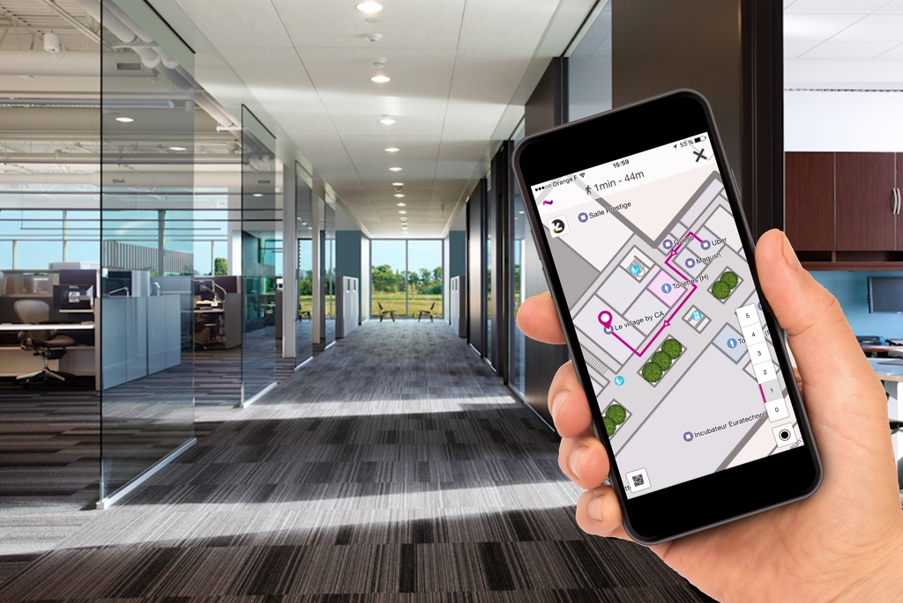
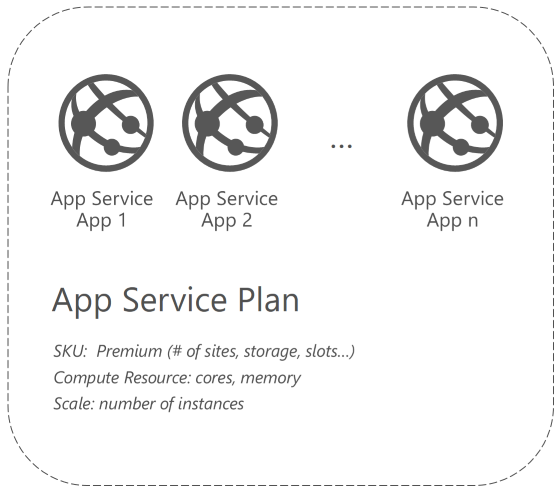
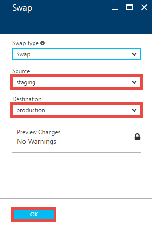
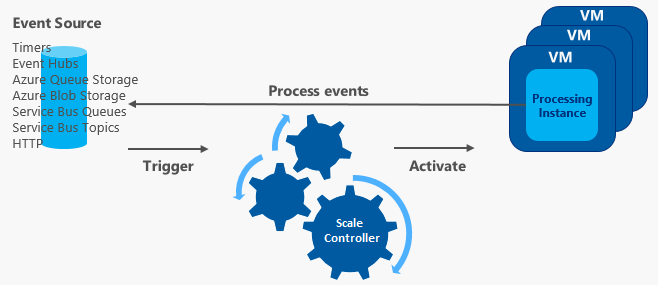
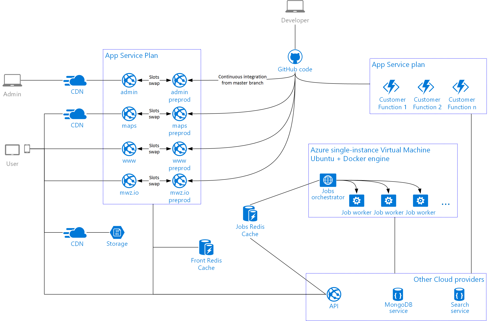
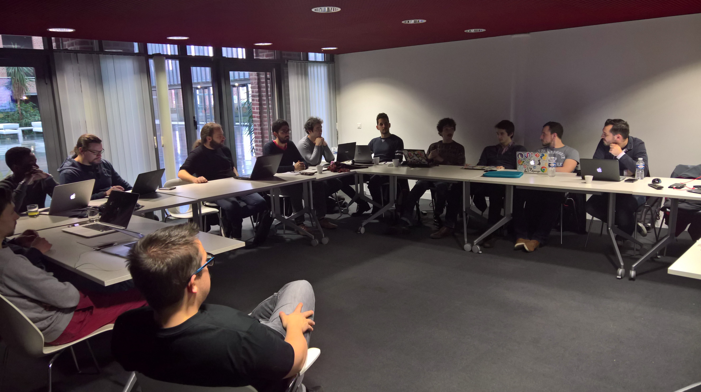

# Migrating the global and scalable cloud architecture of Mapwize from Heroku #

[Mapwize](https://www.mapwize.io/en/), a French startup born in the Cloud has chosen Microsoft to be its preferred partner to provide the Cloud services needed for them to scale and succeed.

In order to work closely with Microsoft experts, to discover the latest technologies available for them and to accelerate the migration to Microsoft Azure, Microsoft and Mapwize have organized a three-days hackfest at Euratech, one of the French biggest startups accelerators.

From Azure App Service to host ruby based applications to Azure CDN with some pieces of Redis Cache and Node.js Azure Functions, we're going to see how Microsoft Azure services has been used in this Open Source Software world.

Hackfest Participants List:

- Mathieu Gérard, Co-Founder, Mapwize
- Cyprien Lang, Developer, Mapwize
- Cédric Derue, Architect, Altran, Microsoft Most Valuable Professional - [@cderue](https://twitter.com/cderue)
- Julien Corioland, Technical Evangelist, Microsoft France - [@jcorioland](https://twitter.com/jcorioland)
- Benjamin Talmard, CTO in Residence Microsoft Accelerator Paris, Microsoft France - [@benjiiim](https://twitter.com/benjiiim)
- Joel Amoussou, Technical Evangelist Intern, Microsoft France

## Customer profile ##

People rely so much on GPS these days, but there is no such tool inside buildings. This is why the startup Mapwize has been created, with the ambition to become the multi-purpose indoor mapping platform for smart buildings.

Mapwize is providing an innovative solution to different industries such as healthcare (guiding visitors and patients in hospitals), retail (guiding customers in stores and shopping malls) or others (guiding people around large office buildings).



The core of the solution is a powerful direction engine which can work across floors & buildings, taking into account stairs, bridges or elevators and which can provide accessible routes when needed.

They are providing their services to professional through a public cross-platform Mapwize app or through a professional SDK for customization purposes.

### Mapwize and Microsoft ###

This French start-up has been created in 2014 and in now based in Lille - France at the EuraTechnologies startups accelerator and in Boston at the French Tech Hub, the biggest French start-up accelerator in the United States.

Microsoft has been supporting Mapwize since September 2015 when they joined the Bizspark Plus program. The long-term partnership they built has never stop growing ever since. They were invited at the Microsoft Worldwide Partner Conference in July 2016 and participated in Microsoft Experiences in September 2016 as an exhibitor in the start-up village. Mapwize also joined Microsoft start-up team to attend Lisbon Web Summit in November 2016, one of the largest tech conference in the world.

Their strong dedication to create value and innovation and the quality of their work has been rewarded many times. Among other successful achievements, they joined the FrenchIoT program after a tough selection among 280 candidates which gave them the opportunity to participate at the CES2017 tradeshow in Las Vegas.

Today, they are a team of 10 employees with customers in France, Benelux and USA but their ambition goes much further as they want to expand their solution at an international level. 

## Problem statement ##

Mapwize was facing the following problems making difficult for them to keep a clean architecture while scaling and expanding their features set.

First, the solution was built around a big monolithic web application, where all the features were managed and deployed together: the public facing website, the technical API, the administration platform and even the short URLs service.
This had the following drawbacks:
- The code base begun to be quite complex to maintain for the relatively small development team
- In order to deploy a new feature or to fix a small issue, the whole system had to be deployed again with potential downtime on unchanged parts
- URL rewriting and extra configuration had to be written in order to setup caching for some parts of the system for example
- It was hard to fine-tune the system to attain the right level of performance where it mattered the most

Furthermore, in order to ingest data from their customers (new map versions, meeting rooms availabilities, ...), the team had developed specific adapters to fulfill all requirements, customer per customer.
In order not to pollute the main API with all these specific use cases, they had to find a way to isolate these pieces of code and to run them only when the time comes or when a specific event occurs.

Finally, Mapwize aspires to build a global solution, with customers and users around the world. They already have users in Europe and North America and needs to build the best experience for them, wherever they are on Earth.

## Solution, steps, and delivery ##

After a quick architecture design session, it was clear for everyone that splitting the monolith into multiple parts would be the first step required to achieve the goal of a much more agile solution.  
Taking this direction has allowed the team to consider one technical solution for each part of the application:
- Azure App Service to host the multiple web based services without managing the infrastructure
- Azure CDN to accelerate the global delivery
- Azure Functions to run the customers' specific code

Let's explain each part of the solution in more details.

### Using Azure App Service to host the multiple services of the application ###

Azure App Service has a notion of App (Web App, Mobile App and API App) which represents the logical boundaries of an application and the notion of App Service plan, which represents the collection of physical resources used to host apps (the virtual machines).  
One advantage of this model is that you can run multiple apps in one plan, in order to share the resources defined by it allowing you to save cost.



To make the most of this model, Mapwize developers has worked on their code in order to separate 4 independent services:
- The public facing static website: [mapwize.io](https://www.mapwize.io/en/), bundled thanks to the Ruby based system [http://jekyllrb.com/](Jekyll).
- The API, used by various part of the system, including the mobile apps and the SDK, developed in Node.js.
- The maps delivery service, which renders the maps and the location data to the users: [maps.mapwize.io](https://maps.mapwize.io)
- The short URLs service: [mwz.io](http://mwz.io)
- Mapwize Studio, the admin backend
Each of these services can be run as an independent app on Azure App Service, allowing Mapwize to save cost while being able to use high value features such as custom domain names, continuous deployment or even tests in production.

One very important feature of Azure App Service for Mapwize was the continuous deployment from GitHub combined with the notion of deployment slots.
Thanks to these two features, the last available version of the application on the master branch on GitHub can be automatically deployed to Azure App Service, in a staging slot next to the production slot.
If the team is happy with the behavior of the application in this staging slot, they can trigger a slots swap, in order to route the users to the new version of the application.



An other feature related to deployment on Azure App Service is the deployment script, with the ability to customize the deployment process run by App Service when a new version of the code is available.  
The default deployment script knows for example how to handle node.js packages restore through Node Package Manager or how to handle a .NET Core application.
However, as Ruby is not officially supported on Azure App Service, it doesn't know how to build a Jekyll application thanks to the Jekyll Ruby gem.

Thanks to this feature, Mapwize has been able to customize the script to automatically download the Ruby installer, install it on the App Service instance, install all the dependencies found in the Gemfile and execute the jekyll build process to generate the static website!

The full process has been detailed by Khalid Abuhakmeh from the Ritter Insurance Marketing company on the following [blog post](https://rimdev.io/deploying-jekyll-to-windows-azure-app-services/).  
The most important part is the getruby.cmd script pasted below:

```Batchfile
@if "%SCM_TRACE_LEVEL%" NEQ "4" @echo off

REM Put Ruby in Path
REM You can also use %TEMP% but it is cleared on site restart. Tools is persistent.
SET PATH=%PATH%;D:\home\site\deployments\tools\r\ruby-2.2.4-x64-mingw32\bin

REM I am in the repository folder
pushd D:\home\site\deployments
if not exist tools md tools
cd tools
if not exist r md r
cd r
if exist ruby-2.2.4-x64-mingw32 goto end

echo No Ruby, need to get it!

REM Get Ruby and Rails
REM 64bit
curl -o ruby224.zip -L https://bintray.com/artifact/download/oneclick/rubyinstaller/ruby-2.2.4-x64-mingw32.7z?direct
REM Azure puts 7zip here!
echo START Unzipping Ruby
SetLocal DisableDelayedExpansion & d:\7zip\7za x -xr!*.ri -y ruby224.zip > rubyout
echo DONE Unzipping Ruby

REM Get DevKit to build Ruby native gems  
REM If you don't need DevKit, rem this out.
curl -o DevKit.zip http://cdn.rubyinstaller.org/archives/devkits/DevKit-mingw64-64-4.7.2-20130224-1432-sfx.exe
echo START Unzipping DevKit
d:\7zip\7za x -y -oDevKit DevKit.zip > devkitout
echo DONE Unzipping DevKit

REM Init DevKit
ruby DevKit\dk.rb init

REM Tell DevKit where Ruby is
echo --- > config.yml
echo - D:/home/site/deployments/tools/r/ruby-2.2.4-x64-mingw32 >> config.yml

REM Setup DevKit
ruby DevKit\dk.rb install

REM Update Gem223 until someone fixes the Ruby Windows installer https://github.com/oneclick/rubyinstaller/issues/261
curl -L -o update.gem https://github.com/rubygems/rubygems/releases/download/v2.2.3/rubygems-update-2.2.3.gem
call gem install --local update.gem
call update_rubygems --no-ri --no-rdoc > updaterubygemsout
ECHO What's our new Rubygems version?
call gem --version
call gem uninstall rubygems-update -x

popd

:end

REM Need to be in Reposistory
cd %DEPLOYMENT_SOURCE%
cd

call gem install bundler

ECHO Bundler install (not update!)
call bundle install

cd %DEPLOYMENT_SOURCE%
cd

ECHO Running Jekyll
call bundle exec jekyll build

REM KuduSync is after this!
```

### Use Azure Functions to host the custom code needed customer per customer ###

As described earlier, some code has been written for several customers in order to provide them with specific capabilities.  
As Mapwize didn't want to handle some exceptions in the main API, they had to find a way to host and run this code in a separate environment, with a separate lifecycle and with distinct scaling mechanism.  
As this code had to ben run only when specific events occurred or thanks to a scheduler, the choice has been made to use Azure Functions for that.

Azure Functions is an event-based serverless compute experience aimed to accelerate development. Thanks to the Consumption Plan, it can scale based on demand and allow the users to pay only for the resources consumed.



Instead of using the Consumption Plan which provides the full serverless option of Azure Functions, Mapwize has made the choice to deploy their Functions in an App Service Plan they manage themselves, in order to control the function timeout setting useful to be sure that their long-running functions can run without any issue.
Indeed, when using an App Service Plan to host your functions, your functions run on dedicated virtual machines, just like Web Apps. It is then possible to remove the limit of the functionTimeout setting in the [https://github.com/Azure/azure-webjobs-sdk-script/wiki/host.json](host.json file).

### Integrate Azure CDN with Azure App Service to accelerate the global delivery ###

Mapwize users can be connected to the service from all over the world, especially from Europe and North America.  
In order to provide them the best performance possible, a global architecture has to be built.  
One of the competitive advantage of Microsoft Azure is the fact that it operates at a global scale, with 38 regions around the world, and is working with leading partners to go even further.

The first option when you want to reach your users globally is to use a Content Delivery Network service in order to reduce load times and increase responsiveness. To build the Azure Content Delivery Network service, Microsoft has been working with Verizon and Akamai in order to provide the best choices to customers based on their needs, regions in which they operate or even to load balance across multiple CDNs.  
One feature Mapwize was very interested in was the ability to use HTTPS with a custom domain over Azure CDN. This feature was one of the most awaited one listed on [UserVoice](https://feedback.azure.com/forums/169397-cdn/suggestions/1332683-allow-https-for-custom-cdn-domain-names) and has fortunately been completed just in time for the hackfest on Azure CDN Verizon profiles!

Thanks to this improvement, Mapwize has been able to enable HTTPS for their custom domain on Azure CDN via a very simple one-click enablement, without worrying about the certificate management and all with no additional cost as everything is handled by the service.  
Furthermore, Azure CDN is deeply integrated with other Azure services such as Azure Storage and Azure Web App, both used by Mapwize, which made things even simpler for Mapwize to improve the experience of their global users.


### Opportunities for the future ###

You can do a lot during a three-days hackfest with the right experts in the room.  
But most of the time, it ends with even more ideas for the following weeks or months. That was the case for Mapwize's team, which left the hackfest with the following opportunities for the future:

- Use Azure Traffic Manager and multiple deployments in order to serve dynamic data faster to the global users. CDN is great for static data but is not enough if you want to improve the experience for dynamic content as well. Azure Traffic Manager, as a DNS load balancing mechanism can be used to redirect users to the closest deployments and then provide the best performance.
- The main API, written in Node.js, hasn't been migrated to Azure yet. The team wanted to use Azure App Service on Linux, the new flavor of Azure App Service designed to improve developer experiences when using OSS web stacks such as Node.js, PHP or Ruby on Rails. Unfortunately, the service is still in Preview, and the choice has been made to wait until it reaches general availability before using it in production.
- A MongoDB database as a service is still used from an other cloud provider. This has been setup before Azure offered the MongoDB API and protocol support in Azure DocumentDB which provides a great compatibility with MongoDB. Now that the service is generally available, it is going to be easier for Mapwize to get a limitless scale, globally available and enterprise grade NoSQL document database in the Cloud!
- At the same time, a search service from a Microsoft competitor is still used in the solution. Using Azure Search, the cloud service providing the best of ElasticSearch with the best of the integrated Microsoft natural language stack will be a great opportunity for Mapwize.



## Conclusion ##

Using multiple Web Apps on Azure App Service and several Azure Functions instead of the old monolith application on Heroku, Mapwize now benefits from several advantages of a micro-services architecture (independent lifecycle, independent scaling, …) without having to leverage a complex orchestrator such as Kubernetes or Docker Swarm.
They are getting high value features such as continuous deployment including deployment slots and deployment scripts in order to be more agile with their release process.

Working with Mapwize's team during a few days to implement these improvements was key for them. In their own words: "The hackfest was a great occasion to quickly integrate new Azure technologies in our production stack. In just 3 days, we had implemented the deployment structure we had been dreaming of for months, increasing ease of deployment and app performance."

For the future, as the developers' team is used to Linux environments, having the option to run their remaining Node.js services on Azure App Service on Linux will be a game changer to get the seamless experience possible.

When you add the advantages of Microsoft Azure in term of global scale thanks to features such as Azure CDN or Azure Traffic Manager, there is no doubt that Azure was the right choice for Mapwize solution.



## Additional resources ##

You will find below some pointers to additional resources that will help you to deeply understand the concepts and technologies we discussed in this article:

- [Set up staging environments in Azure App Service](https://docs.microsoft.com/en-us/azure/app-service-web/web-sites-staged-publishing)
- [Azure Functions](https://azure.microsoft.com/en-us/services/functions/)
- [Deploy Jekyll to Azure App Service](https://rimdev.io/deploying-jekyll-to-windows-azure-app-services/)
- [Azure App Service on Linux](https://docs.microsoft.com/en-us/azure/app-service-web/app-service-linux-intro)
- [Custom domain HTTPS support with Azure CDN](https://azure.microsoft.com/en-us/blog/announcing-custom-domain-https-support-with-azure-cdn/)