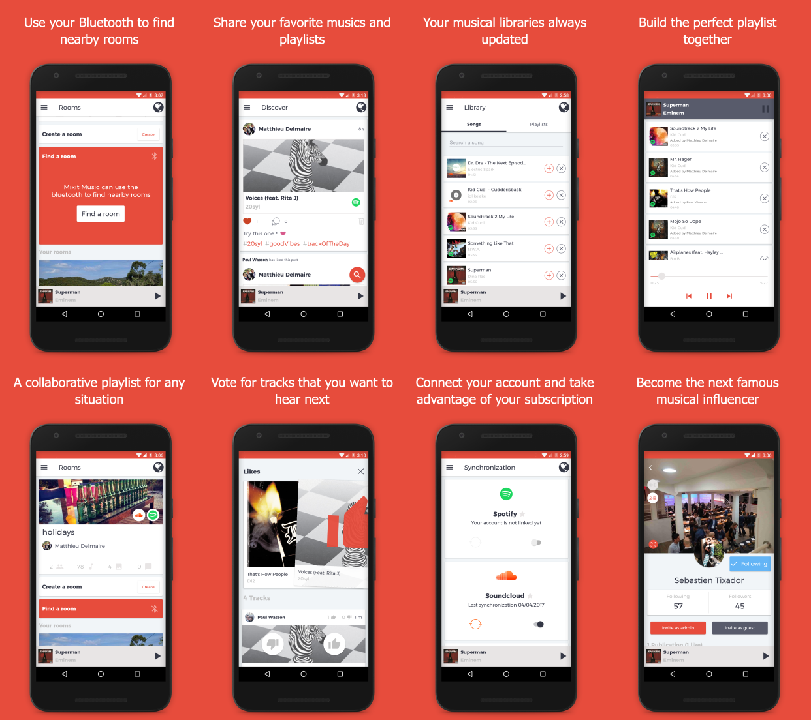
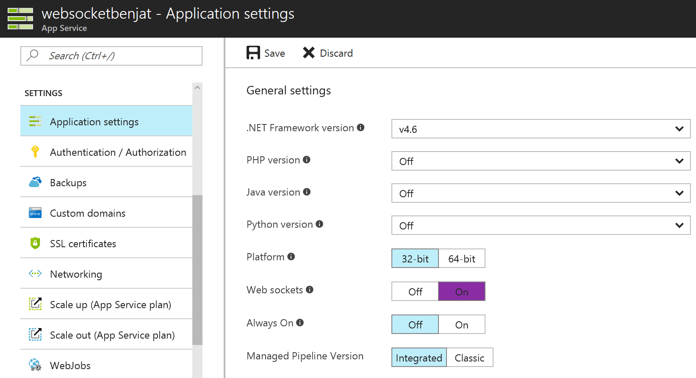
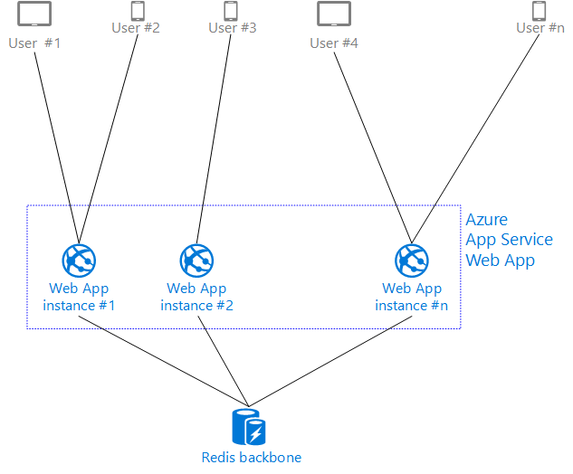
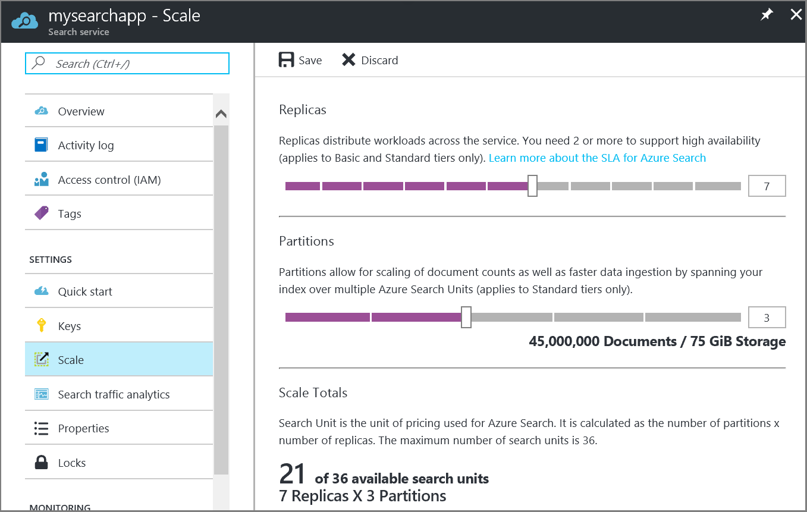
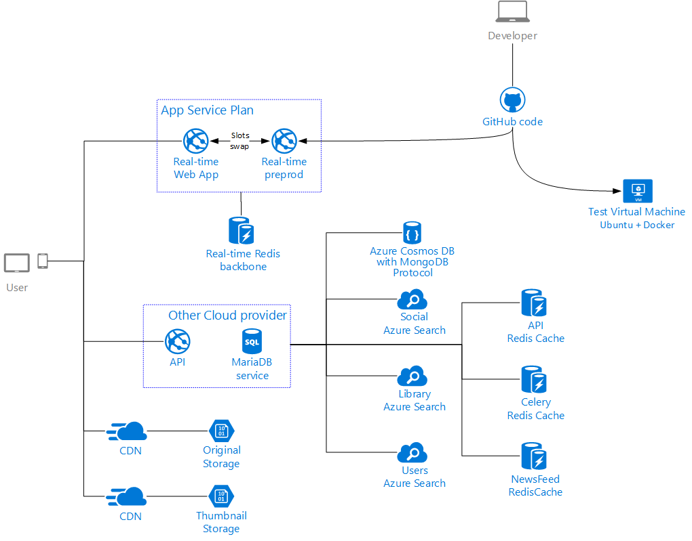
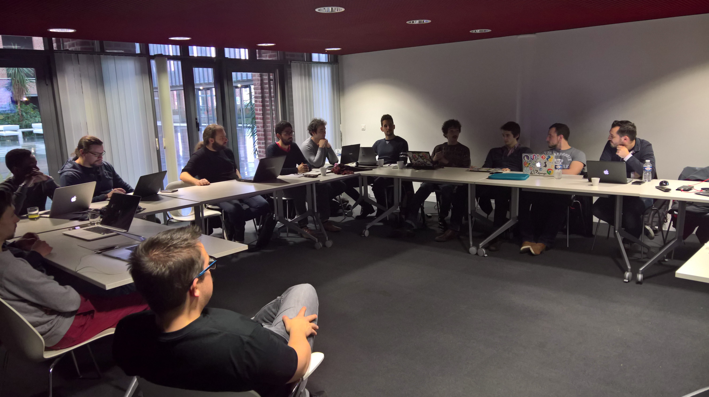

# Building a scalable and managed cloud architecture with Open Source technologies for the collaborative music service Mixit-Music #

[Mixit Music](https://mixit-music.com/), a French startup born in the Cloud was looking for the right partner to support their business needs and succeed.

They created a B2C application that helps consumers choose the right music when they are part of a group through collaborative playlists.

In order to discover the latest technologies available for them, to see if Microsoft Azure could satisfy their needs and work closely with technical experts, Microsoft and Mixit Music have organized a three-day-long hackfest.

From Socket.IO to Lucene search query syntax with some pieces of Redis Cache and MongoDB API, we're going to describe how Microsoft Azure services have been used in this Open Source Software world.

Hackfest Participants List:

- Matthieu Delmaire, Co-Founder, Mixit-Music
- Paul Wasson, Co-Founder, Mixit-Music
- Cédric Derue, Architect, Altran, Microsoft Most Valuable Professional - [@cderue](https://twitter.com/cderue)
- Julien Corioland, Technical Evangelist, Microsoft France - [@jcorioland](https://twitter.com/jcorioland)
- Benjamin Talmard, CTO in Residence Microsoft Accelerator Paris, Microsoft France - [@benjiiim](https://twitter.com/benjiiim)
- Joel Amoussou, Technical Evangelist Intern, Microsoft France

## Customer profile ##

Weddings, birthdays, parties with friends are some examples of situations where choosing music that pleases everyone is a real headache.
[Mixit Music](https://mixit-music.com/) has been created to address this problem and revolutionize the way we listen to music as a group of people!  
Thanks to collaborative features, synchronization with music services (such as Spotify or Soundcloud), recommendations algorithms or automatic detection, listening to music as a group has never been so easy.

In addition to end-users' mobile applications, Mixit Music is developing several services for business to allow them to improve loyalty with their customers through music.
Imagine a shop or a bar where the music can be automatically chosen based on their customer's taste in real time. Conversely, if a customer is looking for a place to go out and dance, Mixit Music can recommend you the bar nearby that best suits your musical tastes. These kinds of scenarios are enabled by the combination of Mixit Music business services and their end-users' features.

Mixit Music is part of the French biggest startups accelerators and partner of the [BizSpark Plus](https://bizspark.microsoft.com/about/plus) program: [Euratechnologies](http://www.euratechnologies.com/).

## Problem statement ##

To build the backend needed for their mobile applications, Mixit Music needed a scalable Cloud platform able to handle the load of tens of thousands of users, with even more search queries, songs stored in playlists or social interactions including pictures sharing. As their small development team is addressing a high number of final users, they are constantly trying to find the best compromise between manageability and control on the platform.  
An other strong requirement was the ability of the system to handle real-time bidirectional communication between the mobile applications and the backend, to provide a rich and fluid experience to the users.
Furthermore, the Cloud platform had to support the Open Source technologies chosen by the team such as Node.js, Python, MongoDB, Redis Cache, [Celery](http://www.celeryproject.org/) or even [Stream Framework](https://github.com/tschellenbach/Stream-Framework).
Last, but not least, the developers at Mixit Music didn't want to manage the infrastructure by themselves and recruiting ops engineers was not the plan.

## Solution, steps, and delivery ##

To achieve these objectives, the team has decided to work on several subjects during the hackfest:
- Using Azure App Service to enable a real-time bidirectional communication channel between mobile applications and the backend.
- Use Azure Redis Cache to enable several features needed to improve performance (data caching, fast distributed task queue, activity streams caching).
- Use Azure Search to index the maximum of content to improve performance and to minimize the load on the databases systems.
- Use Azure Cosmos DB to store NoSQL data.

Let's explain each part of the solution in more details.

### Using Azure App Service for real-time bidirectional communication ###

To enable rich interaction between users (playlist contributions, social interactions, new user joining a group, ...), a real-time bidirectional communication system has to exist between the mobile applications and the server.  
The most popular system providing this kind of mechanism is [Socket.IO](https://socket.io/), a JavaScript framework available to Node.js developers.  
The best option available for Socket.IO to provide this mechanism is to use WebSockets as a network protocol. When WebSockets is available, Socket.IO will prioritize it over less efficient technologies such as long polling.  
As Azure App Service (one of the Platform-as-a-Service services of Microsoft Azure) has support for both Node.js and WebSockets, it is a great option to host a Socket.IO-based backend.

Mixit Music has ambitious goals regarding users' adoption. Even if it is not a short-term need, they always think about scaling when building a new block in their solution.  
To scale out a Socket.IO backend (meaning having multiple instances of the backend to handle the load), you have to use an adapter to distribute messages and events between multiple application instances. Thanks to this pattern, a user having a Websocket channel open with one instance of the backend will be able to communicate with another user having a channel open with another instance.  
While there are several adapters available, the socket.io-redis adapter is the one the team has chosen to use, as it allows them to use Azure Redis Cache as the distribution backbone.  
The following diagram illustrate this architecture:

### Using Azure Redis Cache to improve performance ###

A lot of design patterns are built with distributed cache systems nowadays.  
A good example is the Cache-Aside pattern, which consists of loading data on demand into a cache from a data store to improve performance. The backbone mechanism described above is an other use case. And more and more libraries out there are using distributed cache systems to implement various features such as Celery, a distributed task queue or Stream-Framework, a Python library helping developers to build news feed, activity streams or notification systems.

According to several surveys and ranking, Redis is one of the most popular distributed in-memory database in the market. That's one of the reason Microsoft has chosen to use it to build its managed cache service on Azure: Azure Redis Cache.  
One of the benefits for developers is that they can use Azure Redis Cache as they would use Redis everywhere else (same SDKs used everywhere), without the need to manage the infrastructure operations such as setup, high availability or updates.

Thanks to these advantages, using Azure Redis Cache where it fits into their architecture was a no brainer for Mixit Music.

### Using Azure Search to index the maximum of content ###

In order to improve performance, a good search engine is often key when building a high-scale solution. Indeed, instead of querying a database with complex queries to find the right records, using a specialized engine can improve performance (thanks to powerful indexing) and provide a best experience (thanks to natural language support, faceting and more).

As often on Azure, you have two choices to build a great search engine system:
- Setup one of the popular tools on top of Azure Infrastructure (Azure Virtual Machine): Apache Solr or Elasticsearch for example.
- Use a managed service, to avoid dealing with index corruption, service availability, scaling or service updates.

The last option is the direction Mixit Music has chosen to take, by using the managed service Azure Search.  
It allows them to index music library, social interaction and users' data in powerful search engines, providing a great experience for their users, without having to manage and secure themselves the complex infrastructure required.  
Furthermore, as the Lucene query syntax is available, it is possible for them to use the widely-adopted and expressive query language developed as part of Apache Lucene.

In term of scaling, the notion of search unit (a combination of replicas to distribute workloads and partition to grow the storage capacity) and their choice of having one Azure Search instance per search type makes them comfortable about the fact that their scale needs will be fulfilled quite easily for the foreseeable future!

### Using Azure Cosmos DB for NoSQL storage ###

An other great example of fully managed Azure service the team has chosen to use is Azure Cosmos DB.  
Azure Cosmos DB is a globally distributed, multi-model database, which allows developers to get huge throughput, very low latency, great availability and limitless elastic scalability.  
Thanks to its powerful database engine, it is able to natively support multiple data models such as key-value, documents, graphs and columns, with the ability to use popular APIs for accessing data including MongoDB or Gremlin.

Before knowing about this service, using a MongoDB cluster to store the NoSQL data needed for the solution or paying for a third party managed service would have been the best option. After discovering Azure Cosmos DB, it was clear that it was the right choice for them.

## Conclusion ##

Choosing a NoSQL database compatible with the MongoDB API, being able to query search indexes with the Apache Lucene query syntax, hosting a distributed Socket.IO backend and deploying Redis cache instances to support various open source systems and libraries, all with 100 % managed services? That's the experience Mixit Music is having with Microsoft Azure!

The support of Open Source technologies on Azure has been one of the decision factor for the team to consider Microsoft Azure as their cloud provider of choice.  
The new services and capabilities announced a few weeks after the hackfest will help to reinforce this choice:
- Azure App Service on Linux, which is going to improve the experiences of Node.js, PHP, Ruby or Python developers on Azure.
- Azure Database for MySQL (and the PostgreSQL counterpart), which provides a managed database service for those who haven't choose SQL Server.

Working with Mixit Music's team during a few days to help them evaluate these technologies was key for them. In their own words: "The Hackfest was a great experience. On the one hand this allowed us to increase our knowledge and on the other hand we have been able to improve the quality of our infrastructure with the help of experienced users."

## Additional resources ##

You will find below some pointers to additional resources that will help you to deeply understand the concepts and technologies we discussed in this article:

- [Create a Node.js chat application with Socket.IO in Azure App Service](https://docs.microsoft.com/en-us/azure/app-service-web/web-sites-nodejs-chat-app-socketio)
- [Cache-Aside pattern](https://docs.microsoft.com/en-us/azure/architecture/patterns/cache-aside)
- [Using the MongoDB API with Cosmos DB](https://docs.microsoft.com/en-us/azure/documentdb/documentdb-protocol-mongodb)
- [Lucene query syntax in Azure Search](https://docs.microsoft.com/en-us/rest/api/searchservice/lucene-query-syntax-in-azure-search)
- [Azure Database for MySQL](https://docs.microsoft.com/en-us/azure/mysql/overview)
- [Azure App Service on Linux](https://docs.microsoft.com/en-us/azure/app-service-web/app-service-linux-intro)