# Developing and delivering continuously a mobile application on iOS and Android using Xamarin for Natixis

Microsoft teamed up with Natixis, a leader in financial services in France, to help them to develop and to deliver a mobile application continuously using Xamarin, Visual Studio Team Services, Microsoft Azure, Xamarin Test Cloud and HockeyApp.
 
## Customer profile ##

Natixis is the international corporate, investment, insurance and financial services arm of Groupe BPCE, the second-largest banking group in France.
We worked with a small team that develops PurpleRide a mobile application for Natixis employees that aim to simplify co-driving within their different buildings. 

When the discussions started with the team, we discovered that one of their principal challenge was to be able to reuse their competencies (especially with the C# language) to deliver the same application on iOS, Android and Windows.

They are developing the application using agile methods, they have two-weeks sprints to implement new features and one of their need was to be able to simplify the way they can deliver the application continuously. They were really asking for implementing DevOps practices like Contiunous Integration and Continuous Delivery.

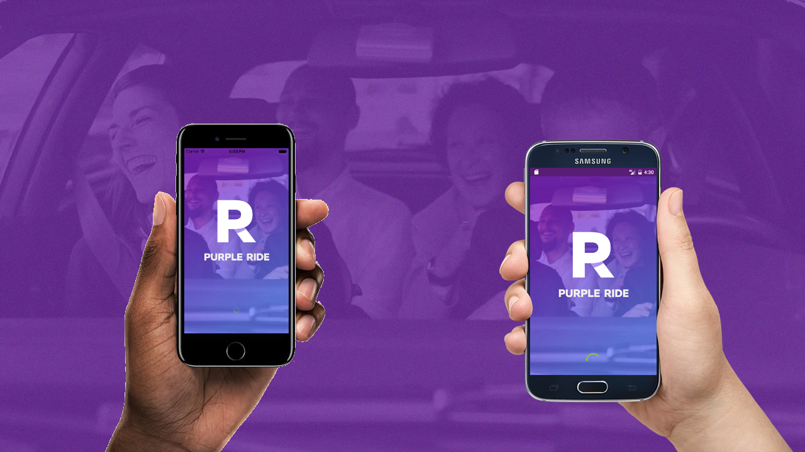

To help them to get results quickly, two technical evangelists from Microsoft France, [Jean-Sébastien Dupuy](https://twitter.com/dupuyjs) and [Julien Corioland](https://twitter.com/jcorioland) worked with the development team during a three-days hackfest.
 
## Problem statement ##

Main challenge was to develop a cross-platform application to target Android, iOS and Windows platform. They wanted to build UIs for all operating systems with native experience and performance for the end-users.
Objectives were to validate the following key points: 
     
- Target 3 mobile platforms with only 2 developers, in a limited time (2 months)
- Share a maximum of code and UI layouts
- Build the application continuously
- Test application automatically over multiple physical devices 
- Provide features more quickly than native apps, still with high quality 
- Get users feedbacks and crash reporting easily
- Test Azure Mobile Service as a backend solution

Our first work with the customer was about helping on the Xamarin parts, to help them to design the application backend with Azure Mobile Apps and being able to get started with it very quickly. 
We also worked on the Xamarin.Forms part with them. As explained, they have mostly C# competencies and do not know Android and iOS so they want to be able to share the maximum amount of code between the three platforms, even for the UI.
Finaly, we help them to embrace DevOps practices like Continuous Integration and Continuous Deployment so they can deliver the application continuously with a very high level of quality. 
This point was very important for them for several reasons:

- They are only two developers so they do not wanted to loose time with deployment
- They wanted - of course - deliver a high quality application
- This application is the first one to use Xamarin internaly and they really wanted to prove that Xamarin is the best technology to deliver mobile application on multiple devices: with that in mind, being able to deliver functionnalities continuously to their internal customers was extremely important.

In the follwing, we are going to details some parts of our work with the customer:

- How they have used Azure Mobile Apps to build a mobile backend for the application
- How they have used Xamarin.Forms to share UI between different platforms
- How to create a CI/CD pipeline with Visual Studio Team Services to deliver a Xamarin application continuously
- How to use Hockey App to distribute an application on iOS and Android
 
## Solution, steps, and delivery ## 

## Focus on backend with Azure Mobile Apps ##

Azure Mobile Apps was used to develop the backend part. A template based on ASP.NET was selected to build the REST APIs ; so client and server stack were both developed in C# language.

Overview of the steps needed to create the backend architecture :

1. Create a new **Resource Group** on Azure portal 
2. Add a **Mobile App** service in the resource group
3. Add also an **Azure SQL** server and database in the same resource group
4. Connect the Mobile App service to the database server
5. Define entities and expose data with ASP.NET and Entity Framework
6. Configure user authentication

Implementation details: 

First configuration of the project was to connect our Mobile App service to an Azure SQL Database source. Once completed, we started by a new **Cloud** -> **Azure Mobile App** template in Visual Studio.
Main concepts and default steps are documented on the following article :

[Mobile App Backend](https://docs.microsoft.com/en-us/azure/app-service-mobile/app-service-mobile-xamarin-forms-get-started)

### 1. Expose entities to the Xamarin app ###

A code-first approach is implemented to define entities directly in C# code. For instance, the following code declares the *Person* entity.

```cs
    [Table("Contoso.People")]
    public class Person : EntityData
    {
        public string LastName { get; set; }
        
        public string FirstName { get; set; }

        [ForeignKey("GenderId")]
        public Gender DepartureSite { get; set; }
    }
```
In the same way, we declared all entities in the **DataObjects** folder.

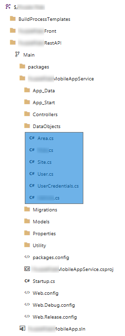

We also need to update the **MobileAppContext** file (the class which inherits from DbContext) to include tables in the Entity Framework context, and create database schema into SQL.

```cs
        public DbSet<Person> People { get; set; }
        public DbSet<Gender> Genders { get; set; }
        public DbSet<User> Users { get; set; }
        public DbSet<UserCredentials> UserCredentials { get; set; }
``` 
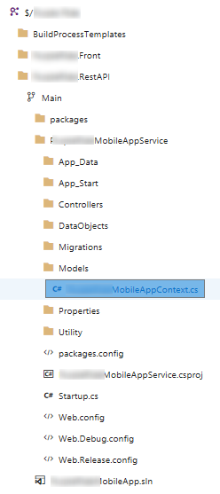

Last, we exposed our entities to Xamarin client application by using REST API with a CRUD pattern. The job is performed by controllers, and especially **TableController** classes.

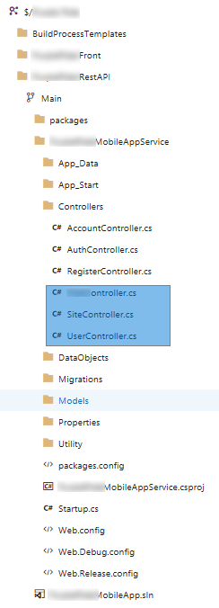

When accessing data from Xamarin application, for example *Person* table, we just used the default proxy provided by Microsoft.Azure.Mobile.Client nuget package. The following code retrieves all items from *Person* table.

```cs
var client = new MobileServiceClient("http://localhost:2427/");
IMobileServiceTable<Person> peopleTable = client.GetTable<Person>();
IEnumerable<Person> items = await peopleTable.ToEnumerableAsync();
```

However, this call does not catch related entities from *User* table. 
At the moment, implementation of Azure Mobile SDK does not support the use of *$expand* query. Anyway, if you access the REST API manually by using tool such as Postman with $expand, it works perfectly. 

So we workaround this behavior by adding the following attribute definition on server side.

```cs
    public class QueryableExpandAttribute : ActionFilterAttribute
    {
        private const string ODataExpandOption = "$expand=";

        public QueryableExpandAttribute(string expand)
        {
            this.AlwaysExpand = expand;
        }

        public string AlwaysExpand { get; set; }

        public override void OnActionExecuting(HttpActionContext actionContext)
        {
            HttpRequestMessage request = actionContext.Request;

            string query = request.RequestUri.Query.Substring(1);
            var parts = query.Split('&').ToList();
            bool foundExpand = false;

            for (int i = 0; i < parts.Count; i++)
            {
                string segment = parts[i];
                if (segment.StartsWith(ODataExpandOption, StringComparison.Ordinal))
                {
                    foundExpand = true;
                    parts[i] += "," + this.AlwaysExpand;
                    break;
                }
            }

            if (!foundExpand)
            {
                parts.Add(ODataExpandOption + this.AlwaysExpand);
            }

            UriBuilder modifiedRequestUri = new UriBuilder(request.RequestUri);
            modifiedRequestUri.Query = string.Join("&",
                                       parts.Where(p => p.Length > 0));
            request.RequestUri = modifiedRequestUri.Uri;

            base.OnActionExecuting(actionContext);
        }
    }
```

Objective is to enforce the *$expand* query usage when requesting data. We just added this attribute to **GetAllPeople** operation on **PeopleController** class, and the magic happens.

```cs
    public class PeopleController : TableController<Person>
    {
        MobileServiceContext context;

        protected override void Initialize(HttpControllerContext controllerContext)
        {
            base.Initialize(controllerContext);
            context = new MobileServiceContext();
            DomainManager = new EntityDomainManager<Person>(context, Request);
        }

        // GET tables/People
        [QueryableExpand("Gender,Addresses")]
        public IQueryable<Person> GetAllPeople()
        {
            return Query(); 
        }

        ...
    }
```

Note: An alternative solution could be to implement a [DelegatingHandler](https://blogs.msdn.microsoft.com/azuremobile/2014/05/27/retrieving-data-from-1n-relationship-using-net-backend-azure-mobile-services/) if you want to control *$expand* usage on the client side.

### 2. Authentication ###

The second core objective on server side was to authenticate users. Mobile App supports several identity providers to sign-up with social networks account or active directory one.

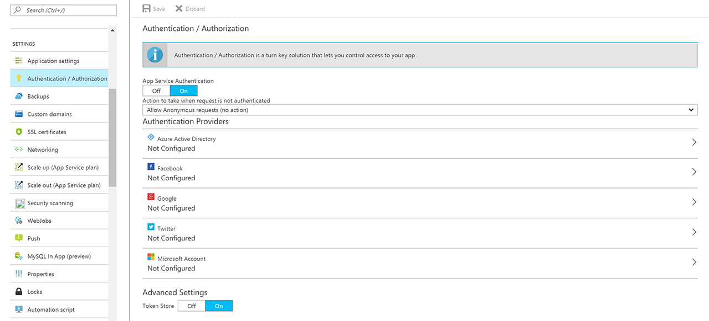

The customer prefered an alternative approach with a custom authentication scheme, and created a sign-up process based on *username* and *password* stored in the database.

The solution is to request an access token to the Mobile App service which assert some claims (email and password in our situation). Once this process is completed, next calls to the backend are authenticated with this token.

The process is quite simple: 

1. Define a new API endpoint on server side (with ApiController).
2. Assert claims based on email and password
3. Generate a token with AppServiceLoginHandler.CreateToken
4. Decorates existing TableController endpoints with [Authorize] attribute.
5. Don't forget to enable App Service Authentication on Azure portal.

For instance, code below provides main logic to generate the token.

```cs
namespace MobileAppService.Controllers
{
    public class AuthController : ApiController
    {
        private MobileAppContext context;

        protected override void Initialize(HttpControllerContext controllerContext)
        {
            base.Initialize(controllerContext);
            context = new MobileAppContext();
        }

        public IHttpActionResult Post([FromBody] JObject assertion)
        {
            string email = assertion["email"].Value<string>();
            string password = assertion["password"].Value<string>();

            User resUser = GetValidUser(email, password);
            var signingKey = Environment.GetEnvironmentVariable("WEBSITE_AUTH_SIGNING_KEY");

            if (resUser != null) 
            {
                JwtSecurityToken token = AppServiceLoginHandler.CreateToken(new Claim[] { new Claim(JwtRegisteredClaimNames.Sub, resUser.Id) },
                    signingKey,
                    ConfigurationManager.AppSettings["ValidAudience"],
                    ConfigurationManager.AppSettings["ValidIssuer"],
                    TimeSpan.FromHours(24));

                return Ok(new
                {
                    authenticationToken = token.RawData,
                    user = new { userId = resUser.Id }
                });
            }
            else // user assertion was not valid
            {
                return this.Unauthorized();
            }
        }

        private User GetValidUser(string username, string password)
        {
            try
            {
                User user = context.Users.SingleOrDefault(u => u.EmailAddress == username);

                // Validation Logic

            }
            catch(Exception ex)
            {
                Debug.WriteLine($"Error in GetValidUser: {ex.Message}");
            }

            return null;
        }
    }
}
```

Note about WEBSITE_AUTH_SIGNING_KEY : This environment variable is created when you enable App Service authentication.

On client side, you can then just request authentication in a single line of code.

```cs
MobileServiceUser resToken = await App.MobileClient.LoginAsync("CustomAuth", JObject.FromObject(new { email = email, password = password }));
```

You can find more details on custom Authentication with Mobile App on the following [article](https://adrianhall.github.io/develop-mobile-apps-with-csharp-and-azure/chapter2/custom/).

## Focus on mobile application with Xamarin.Forms ##

The application supports Android, iOS and Windows platforms. Application has been released in 8 weeks with only 2 developers - the team were experienced in .NET but with no previous Xamarin background. Visual Studio (on Windows) and Xamarin Studio (on Mac) were both used during the development phase.

Code is implemented in C# with Xamarin.Forms ; all user interfaces are shared between the three platforms. The picture below shows the flow between different pages in the application:

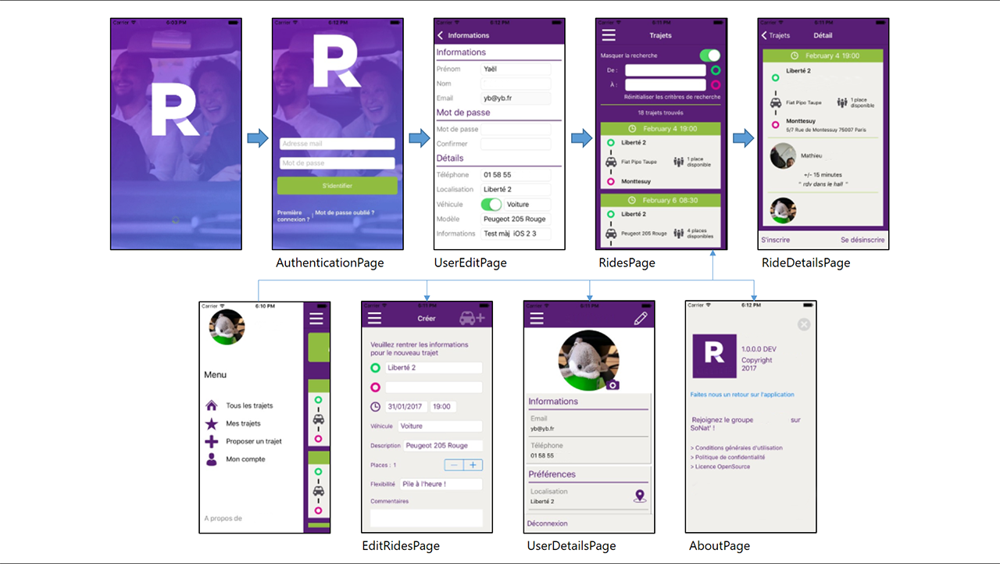


Application architecture is a traditionnal Model-View-ViewModel (MVVM) approach. Majority of the code (more than 90%) is shared between the different platform, except some native API calls.

### Native API calls ###

Some code is specific to each platform :

- Local notifications (to trigger a specific alarm)
- Local file access (especially images and data serialization)
- HockeyApp integration

To provide a smooth abstraction between shared code and call to plateform specific code, dependency injection approach with [DependencyService](https://developer.xamarin.com/guides/xamarin-forms/application-fundamentals/dependency-service/) was used. The following pattern has been implemented : 

1. A declaration of **IPlatform** inteface on the shared code.

```cs
namespace Front.Tools
{
    public interface IPlatform
    {
        void GetUserFeedback(string userName, string email);
        [...]
    }
}
```

2. An implementation of this interface on each platform. Code below shows implementation for Android plateform, namespace is decorated with DependencyService metadata attribute to register it. 

```cs
using Xamarin.Forms;

[assembly: Xamarin.Forms.Dependency(typeof(Front.Droid.Tools.DroidPlatform))]
namespace Front.Droid.Tools
{
    public class DroidPlatform : IPlatform
    {
        // methods
        public void GetUserFeedback(string userName, string email)
        {
            FeedbackManager.SetUserName(userName);
            FeedbackManager.SetUserEmail(email);
            FeedbackManager.ShowFeedbackActivity(Forms.Context);
        }
        [...]
    }
}
```

3. Once completed, the specific code can be simply called on shared side with the DependencyService.Get<IPlatform>() method.

```cs
using Xamarin.Forms;

namespace PurpleRide.Front.Views
{
    public partial class AboutPage : ContentPage
    {
        public AboutPage()
        {
            InitializeComponent();
        }

        private void feedbackButton_Clicked(object sender, EventArgs e)
        {
            DependencyService.Get<IPlatform>().GetUserFeedback(App.CurrentUser.DisplayName, App.CurrentUser.EmailAddress);
        }
    }
}
```

### UX Design and rounded images ###

We chose to keep the interface simple so we do not have to use any Xamarin.Forms renderers or customer control. The only specific needs was to be able to display an image cropped in a circle.

To do that, the easiest solution was to apply a transformation by using [FFImageLoading](https://github.com/luberda-molinet/FFImageLoading/) nugget package.   

```xml
    <ffimageloading:CachedImage x:Name="ProfilePhoto"
                                Source="{Binding Driver.Thumbnail}"
                                HorizontalOptions="Center" 
                                VerticalOptions="Center" 
                                WidthRequest="42" 
                                HeightRequest="42" 
                                DownsampleToViewSize="true">
                                <ffimageloading:CachedImage.Transformations>
                                    <fftransformations:CircleTransformation />
                                </ffimageloading:CachedImage.Transformations>
    </ffimageloading:CachedImage>
```

### HockeyApp Integration ###

As explained in introduction, one of the customer's needs was to prove internaly that Xamarin is a great technology to build application for iOS and Android so they wanted to be able to get feedbacks from testers and crash reports in a smooth way and be able to fix bugs as soon as possible.

To answer those problematics, we proposed to use the HockeyApp solution that allows to monitor usage, distribute the application and get user's feedback. By the way, application supports the following tasks: 

- Crash Reporting
- User Metrics : get session and custom events
- Update Distribution : alerts the user at startup if a new application update is available
- In-App feedback : user can create feedback discussion to inform the developers about a specific issue

The Hockey App SDK allows to integrate those features in the app very quickly with a few line of codes.

More information about Hockey App on Android and iOS:
- [HockeyApp for Android](https://components.xamarin.com/gettingstarted/hockeyappandroid)
- [HockeyApp for iOS](https://components.xamarin.com/gettingstarted/hockeyappios)

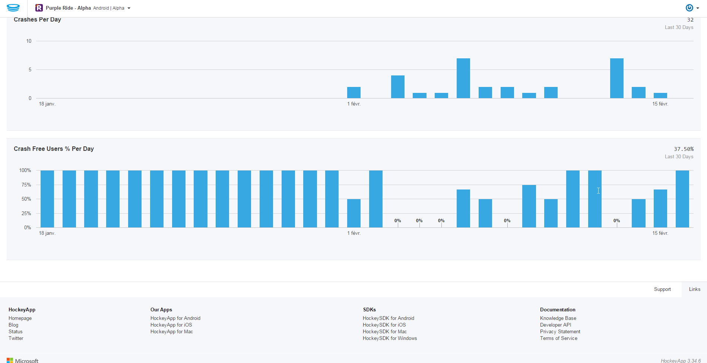

## Focus on the application lifecycle and delivery ##

### 1. Overview ###

During the hackfest we also worked with the team to help them to design a strong delivery pipeline to make sure that they can release new features in the application in the best way as possible.

As they do not have processes already in place, we have started by drafting the way they wanted to release new features to the users:

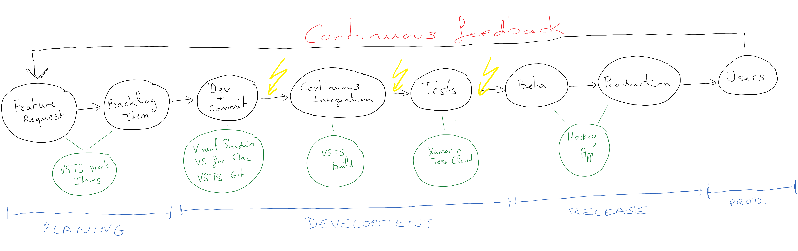


As you can see on the figure above, the application lifecycle is composed by 4 main steps: Planning, Development, Release and Production.

The team was already using Visual Studio Team Services to manage their backlog and store the application code into a GIT repository. We worked with them to create build and release both Android and iOS application.

Visual Studio Team Services help us to implement some DevOps practices like [Continuous Integration using VSTS Build](https://www.visualstudio.com/team-services/continuous-integration), [Continuous Deployment using VSTS Release Management](https://www.visualstudio.com/team-services/release-management/) and [Hockey App](https://www.hockeyapp.net/).

We also used [Xamarin Test Cloud](https://www.xamarin.com/test-cloud) to prototype automated tests during the Continuous Integration process. The goal here was to be able to launch the application on multiple devices and take a screenshot. By doing this, the customer will only have to define some functional tests and those tests will be automatically executed in the build.

Here is a description of the continuous deployment pipeline we have worked on with the customer:

1. Once a commit is done into the repository, a build is triggered in Visual Studio Team Services
2. The build is responsible for creating the application package
3. Then, we have used Xamarin Test Cloud to execute UI tests
4. When the tests are completed successfuly a release is triggered automatically
5. Next, the release push the application into HockeyApp, for beta testers
6. Then, they can approve or reject the beta and in the case it is approved, the application is made available through Hockey app to all the users.

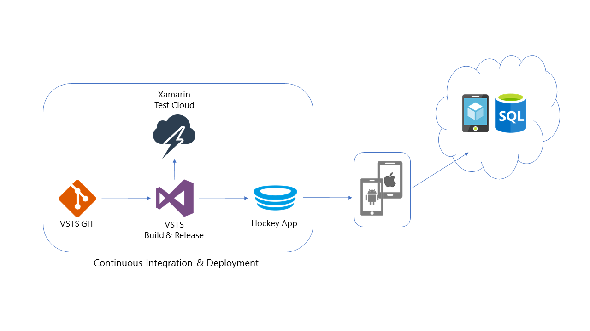


### 2. Building the application package ###

#### Android build ####

We started with the Android build, that is the simple one because it is possible to use the Hosted Agent that are provided by VSTS:

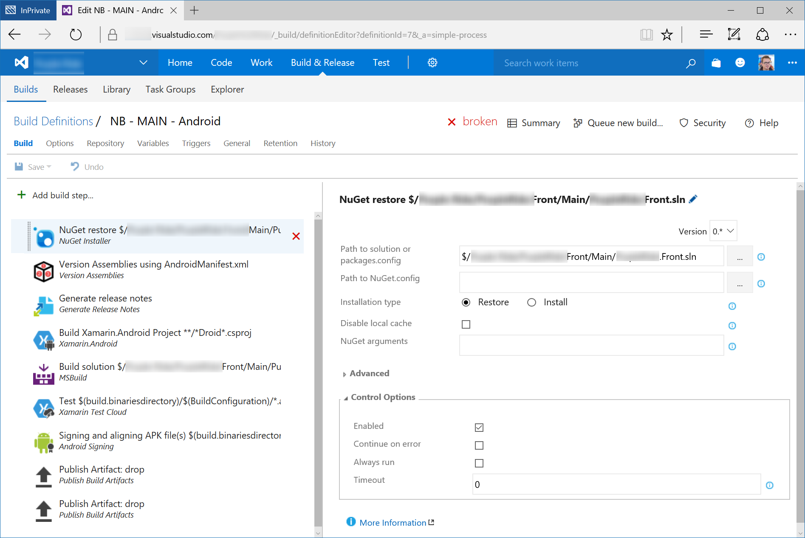


This is a very classical build workflow when you are working with Xamarin and Android. 
One thing that the customer wanted was to be able to generate release notes automatically, using the work items that were linked to the commit that triggered the build.

To make it working, we have used [this task from the Visual Studio Marketplace](https://marketplace.visualstudio.com/items?itemName=richardfennellBM.BM-VSTS-GenerateReleaseNotes-Task). Once installed, all you need to do is to indicate the path where you want the release note file generated and the path of the template that should be used:

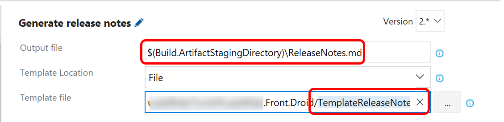


Here is the release notes template that we have created with the customer:

```
#Release notes for build $defname  
**Build Number**  : $($build.buildnumber)    
**Build started** : $("{0:dd/MM/yy HH:mm:ss}" -f [datetime]$build.startTime)     
**Source Branch** : $($build.sourceBranch)  
###Associated work items  
@@WILOOP@@  
* **$($widetail.fields.'System.WorkItemType') $($widetail.id)** [Assigned by: $($widetail.fields.'System.AssignedTo')]     $($widetail.fields.'System.Title') 
@@WILOOP@@  
###Associated change sets/commits  
@@CSLOOP@@  
* **ID $($csdetail.changesetid)$($csdetail.commitid)** $($csdetail.comment)    
@@CSLOOP@@
```

As you can see, it is based on markdown and it uses a meta-language that allows to get information from the current build and from the related work items.
You can find some documentation about how to create templates on [this page](https://github.com/rfennell/vNextBuild/wiki/GenerateReleaseNotes%20-Tasks).

We have also configured the build to publish the generated release notes files as an artefact so it can be used in the release, when the application is published into Hockey App:

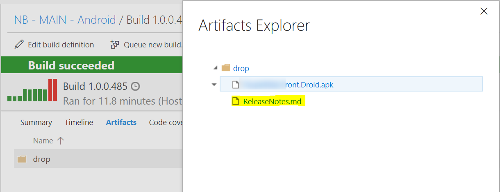


#### Building for iOS ####

For iOS, the process is really close to the one we have detailled previously, but the build cannot be executed on the Hosted agents as it is required to execute it on macOS.

They use a Mac Mini with Xamarin Studio installed on it to be able to build the application. Once the developpement environment is configured, making it working from Visual Studio Team Service is quite simple. Actually, Microsoft provides a small agent that you can install on a Mac and connect to your account.

In order to do that, you need to go in the Agent Queues settings of your team project, download and install the agent on your Mac:

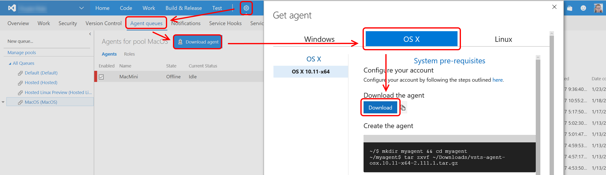


All you need to do is to follow the steps that are detailled on the download page. To be able to connect the agent to your account you need to create a Personnal Access Token. [This documentation](https://www.visualstudio.com/en-us/docs/build/actions/agents/v2-osx) will help you to get ready with that configuration.

Once the agent is up and running on the Mac, all you need to do is to create a new build definition and tell VSTS to use the queue with your new agent:

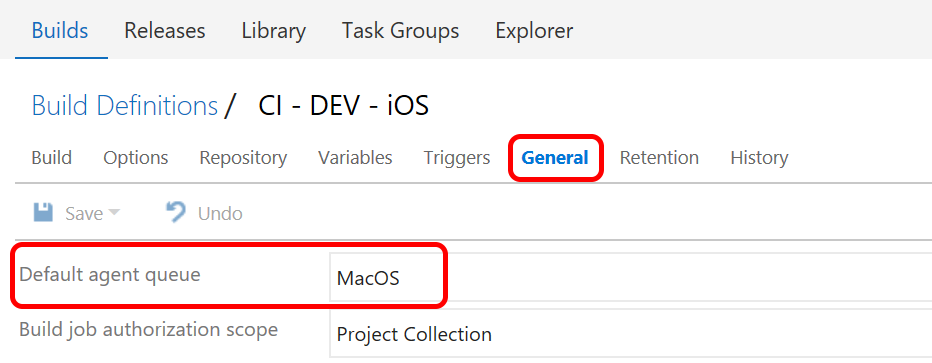

### 3. Using Xamarin Test Cloud ###

We use Xamarin Test Cloud to be able to do some basic UI integration test. With Xamarin Test Cloud, you can define a series of UI tests that will be automatically executed on several devices, during the continuous integration process.


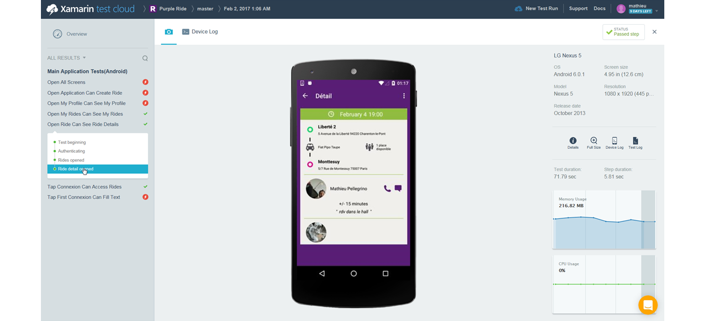


### 4. Using HockeyApp to distribute the application ###

As the customer is developing a internal mobile application for their employees, they are using HockeyApp to distribute and update the application automatically without having to deal with public stores. They choose to use Hockey App for the distribution.

Visual Studio Team Services release management can automatically publish new version of the application. 
HockeyApp integration with VSTS is really straightforward:

1. First, you need to go in the services settings of the team project and add a connection to your HockeyApp account. All you need is to provide an API token, as explained on [this page](https://support.hockeyapp.net/kb/third-party-bug-trackers-services-and-webhooks/how-to-use-hockeyapp-with-visual-studio-team-services-vsts-or-team-foundation-server-tfs).

2. Then, you can use the HockeyApp task available in the VSTS gallery to publish the application, using its identifier:

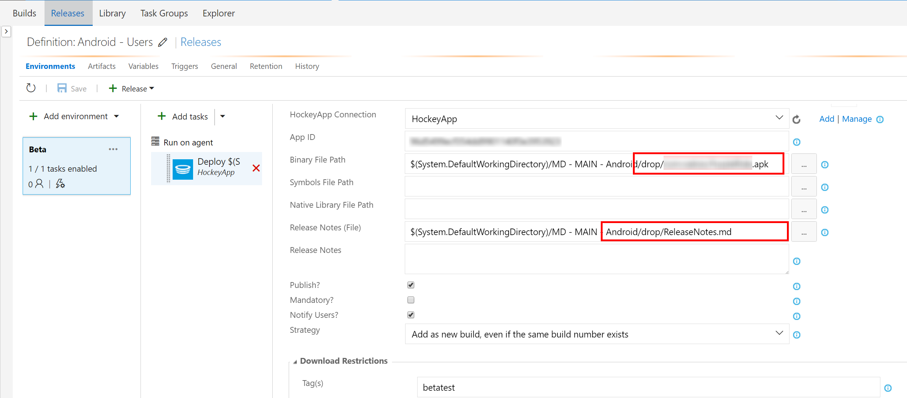


In this case, the release has been connected to the VSTS Android build output. Thanks to that, it is possible to get the application package (.apk) and the release notes file directly from the build artifacts, as you can see on the figure above. Now, each time a build is completed, a release starts a push the new version of the application into HockeyApp.

Users are automatically notified that a new version is available and can download this new version in a really simple way.


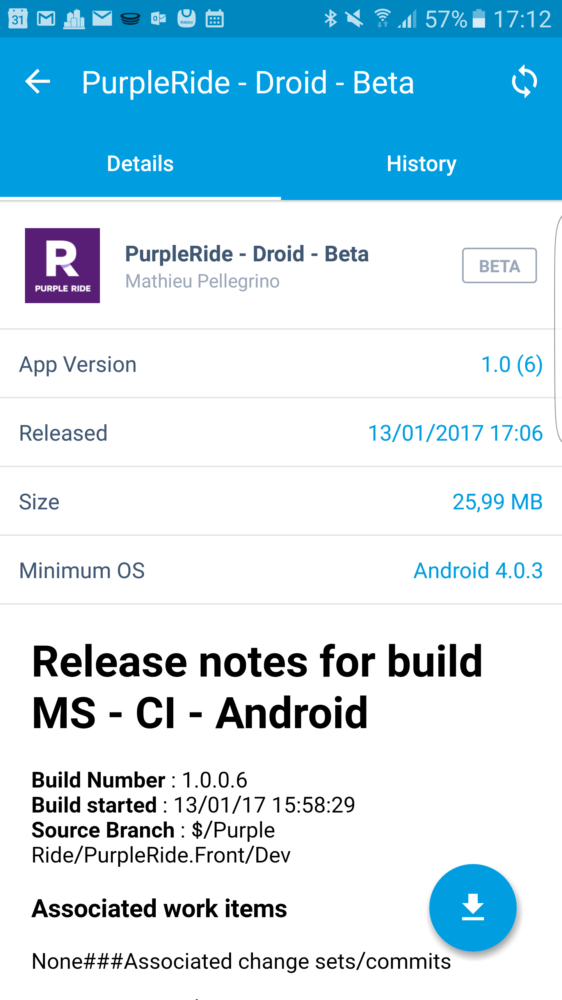


The other thing that the customer wanted was to be able to receive users' feedbacks continuously. It is possible to connect **HockeyApp** to **Visual Studio Team Services** in the application settings to make sure that all feedbacks and crashes that are collected in **HockeyApp** are also synchronized with **Visual Studio Teams Services**.

In that way, developers can directly get user's feedbacks:
 


## Conclusion ## 

One of the principal objective of the customer was to be able to reuse their own competencies (mostly .NET and C# language) to be able to deliver a mobile application on iOS, Android and Windows. They also wanted to be able to deliver this application continuously with a high level of quality testing on a rich panel of devices without having to execute all those tests manually.

Thanks to Xamarin Forms, Xamarin Tests Cloud and Hockey App they have been able to meet all their goals and build the mobile application in a very efficient way.

The customer was really convinced by Visual Studio Team Services and Hockey App to build and deliver continuously a mobile application wrote in Xamarin. They also really appreciated Xamarin Test Cloud for being able to test the application on thousands of devices automatically. 
As they are a really small team of developers, having all those tools working in the CI/CD pipeline allow them to keep focused on implementing new features that will be delivered automatically to their users. 

The next step for them is to be able to implement CI/CD on the Azure Mobile Apps backend and write more tests for the Xamarin application.